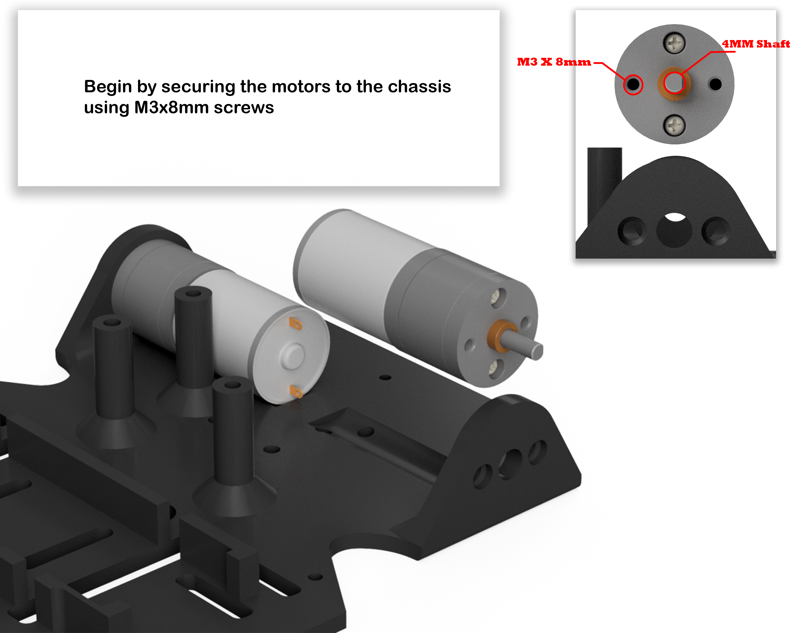
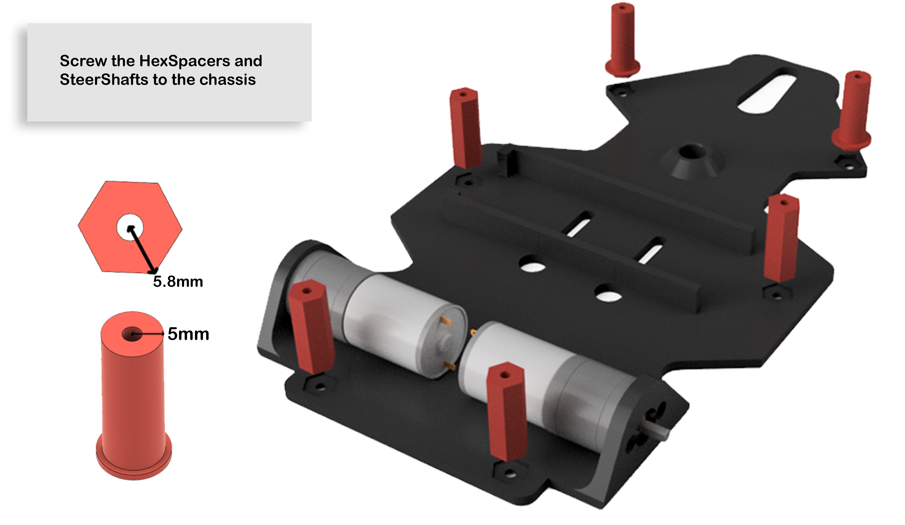
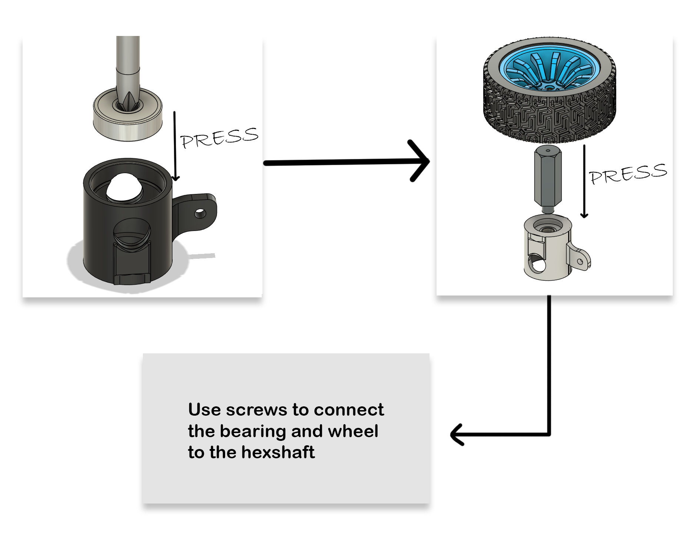
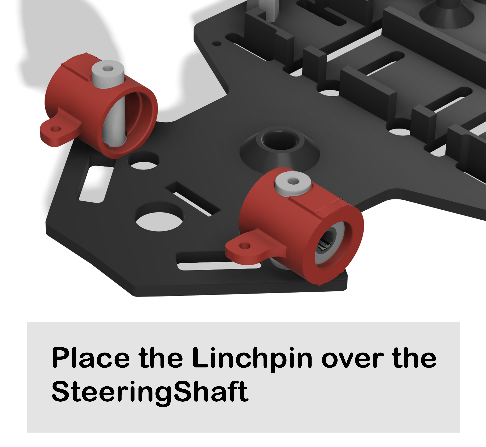
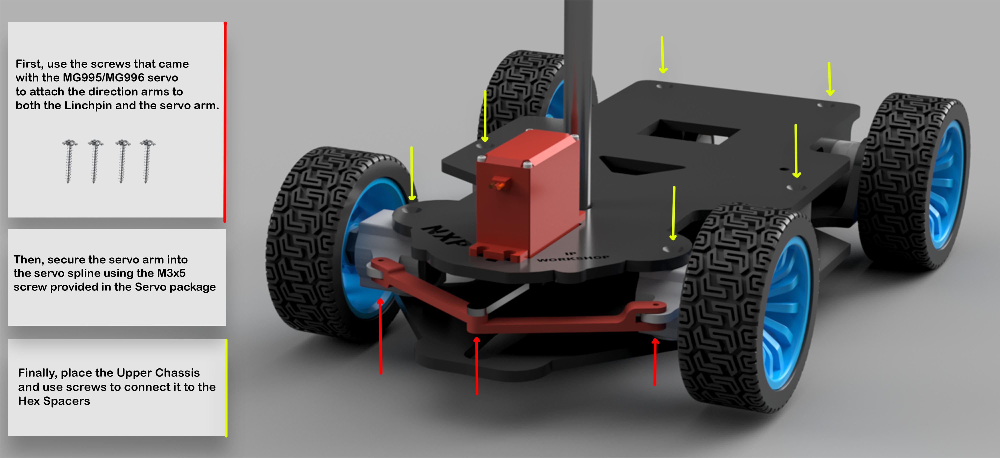
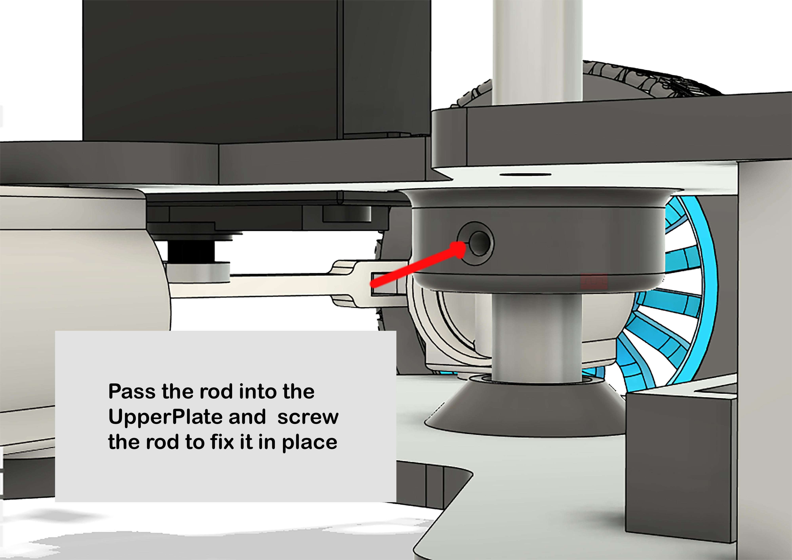
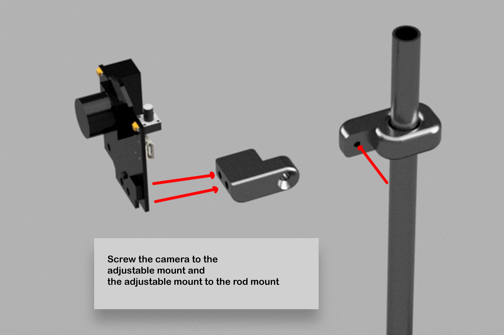

In this chapter, the steps for putting the kit together are described. The steps will also be explained live for you to follow.

Let's dive into them.

## Step 1. Motors

Begin by securing the motors to the chassis using M3x8mm screws.

## Step 2. HexSpacers and SteerShafts

Now screw the HexSpacers and SteerShafts to be chassis.

## Step 3. The bearing and wheels

Use screws to connect the bearing and wheel to the hexshaft.

## Step 4. Linchpin

Place the Linchpin over the SteeringShaft.

## Step 5. Putting the car together

First, use the screws that came with the MG995/MG996 servo to attach the direction arms to both the Linchpin and the servo arm.

Then secure the servo arm into the servo spline using the M3x5 screw provided in the Servo package.

Finally, place the Upper Chassis and use screws to connect it to the Hex Spacers.

Pass the rod into the UpperPlate and screw the rod to fix it in place.

Screw the camera to the adjustable mount and the adjustable mount to the rod mount.

