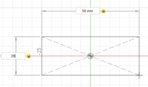
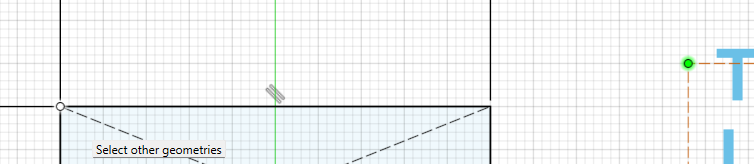

# Course: Introduction to Autodesk Fusion 360

## 🎯 Objective:
Become familiar with Autodesk Fusion 360 as a platform and learn how to create a 3D model.

---

## 🔍 What is Autodesk Fusion 360?

Autodesk Fusion 360 is an all-in-one, cloud-based 3D modeling platform that combines:
- **CAD (Computer-Aided Design)**
- **CAM (Computer-Aided Manufacturing)**
- **CAE (Computer-Aided Engineering)**

It is widely used in mechanical design, product design, and rapid prototyping.

<video width="640" height="360" class="vjsalt-tech" data-video-id="7de08f70-d748-11ee-a984-d93fb1b1d7cd" data-video-platform="avm" crossorigin="anonymous" data-wat-content-id="0b5db2e2-a4c2-4460-8b1e-c8a05dd78aef" data-wat-content-type="asset" data-wat-content-name="video" data-resizing-policy="cover" data-cc-on="false" muted="muted" hidecontrolsduringplayback="" target="inline" modal-autoplay="" autoplay="1" preload="metadata" poster="https://help.autodesk.com/videos/7de08f70-d748-11ee-a984-d93fb1b1d7cd/poster" data-video-processed="true" id="vjs_video_488_html5_api" tabindex="-1" data-wat-video-id="vjs_video_488_html5_api" data-wat-video-found="true" loop="1">
        <source type="video/mp4" src="https://help.autodesk.com/videos/7de08f70-d748-11ee-a984-d93fb1b1d7cd/video.mp4"/>
        <source type="video/webm" src="https://help.autodesk.com/videos/7de08f70-d748-11ee-a984-d93fb1b1d7cd/video.webm"/>
</video>

---

## 🧩 Installation and System Requirements

- Download from: [https://www.autodesk.com/products/fusion-360](https://www.autodesk.com/products/fusion-360)
- Educational licenses are **free** for students and educators: [Link](https://www.autodesk.com/education/edu-software/overview#FSN)
- Minimum requirements:
  - Windows 10/11 or macOS
  - 4+ GB RAM (8+ GB recommended)
  - Graphics card with DirectX 11 support
  - Internet connection (for cloud sync)

---

## 🖥️ Interface Overview

When you open Fusion 360, you’ll see:

- **Toolbar**: Contains modeling tools depending on the workspace.
- **Browser**: A tree view of your components and features.
- **Canvas**: The main modeling window.
- **Timeline**: History of all modeling operations.
- **Projects**: Project management panel.

---

## 🧭 3D Navigation Basics

You can navigate the 3D space using:

- **Orbit**: Rotate the view – _Hold Shift + Middle Mouse Button_
- **Pan**: Move the view – _Hold Middle Mouse Button_
- **Zoom**: Scroll the mouse wheel

Also, use the **ViewCube** in the top-right corner to switch views.

---

# ✏️ Creating a 3D Logo for Your Team in Fusion 360

## 🧱 Main Steps
- **Sketching**: The starting point for most 3D modeling tasks. Create a 2D profile on a plane.
- **Extruding**: Turn the 2D sketch into a 3D solid by pulling it in a specific direction.

---

## 🔹 Step 1: Create a New Design File
- Open Fusion 360.
- Go to **File > New Design** or press `Ctrl + N`.
- Save the file (`Ctrl + S`) with a meaningful name like `Sketch_Extrude_Example`.

---

## 🔹 Step 2: Create the Logo Body

### 1. **Create a New Sketch**
1. Click on the **“Create Sketch”** button in the toolbar.
2. Select a **plane** to draw on:
   - XY (top view)
   - XZ (front view)
   - YZ (side view)

---

### 2. **Drawing the Base Shape (Rectangle)**
Use the sketch tools from the **Sketch menu** to create the base shape:
- From the **Sketch** menu, select the **Rectangle** tool.

- Choose the **Center Rectangle** option.

- Draw a rectangle with dimensions **50 x 20 mm**.

### 3. **Adding the Logo Text**
- Select the **Text** tool from the **Create** menu.

- Type the desired text and choose your preferred font and style.

- Position the text inside the rectangle.

### 4. **Centering and Applying Constraints**
To keep the logo in place even if the rectangle is resized:
- Use the **Constraints** tool to center the logo inside the rectangle.
- Apply corner constraints to align the logo with the rectangle.

- Final constrained sketch result:

### 5. **Exit Sketch Mode**
Once the sketch is complete, exit sketch mode by clicking **Finish Sketch**.

### 6. **Extrude the Text**
- Select the **Extrude** tool from the **Create** menu.

- Select the text to extrude.

### 7. **Extrude the Base (Rectangle)**
- Extrude the rectangle to create a 3D plate for the text.

### 8. **Final Logo Body**
- This is how the logo body should look.

---

## 🔹 Step 5: Create the Pipe Clamp

### 1. **Open Sketch1**
- Double-click **Sketch1** in the Browser.

### 2. **Draw Clamp Rectangle**
- Place a rectangle centered within the logo rectangle.

### 3. **Extrude the Clamp Rectangle**
- Exit sketch mode.
- Use the **Extrude** tool and set the depth to 20 mm.

### 4. **Create Sketch for the Pipe Hole**
- Create a sketch on the top face of the clamp.
- Draw a circle 8 mm from the logo, centered left-to-right.
- Add two parallel lines from the circle to the rectangle edge (to allow pipe insertion and locking).

### 5. **Extrude the Hole**
- Exit the sketch.
- Use **Extrude**, select the circle and area between the lines.
- Set **Extent Type** to "To Object" and select the opposite face of the clamp.

### 6. **Create a Clamp Locker**
- Create a sketch on the right side of the clamp.
- Draw two circles (2 mm and 4 mm diameter), 5 mm from the back, vertically centered.

### 7. **Extrude the Clamp Locker**
- Use **Extrude** to create the 4 mm hole. Set **Extent Type** to "To Object".

- Use **Extrude** to create the 2 mm hole. Set **Start** to "Object" (the inside face), and **Extent Type** to "To Object".

### 8. **Use Fillet to Smooth Edges**
- Select the **Fillet** tool from the **Create** menu.
- Choose the edges to smooth and set the radius to 9 mm (or any value).

- Repeat for other edges as desired:

### 9. **Create Chamfer for the Locker Screw**
- Select **Chamfer** from the **Create** menu.

- Select the hole edge and set the chamfer value to 2 mm.

---

## 🔹 Final: Logo Body Finished

