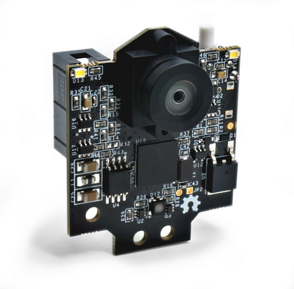
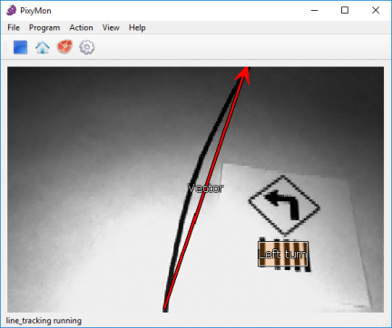
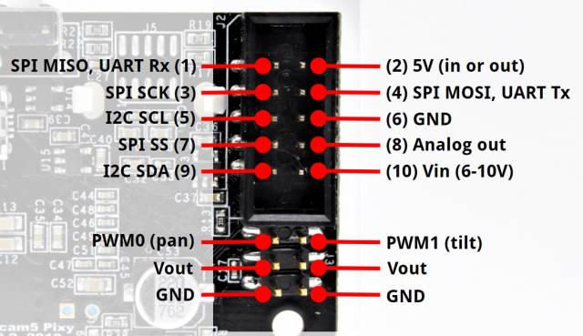
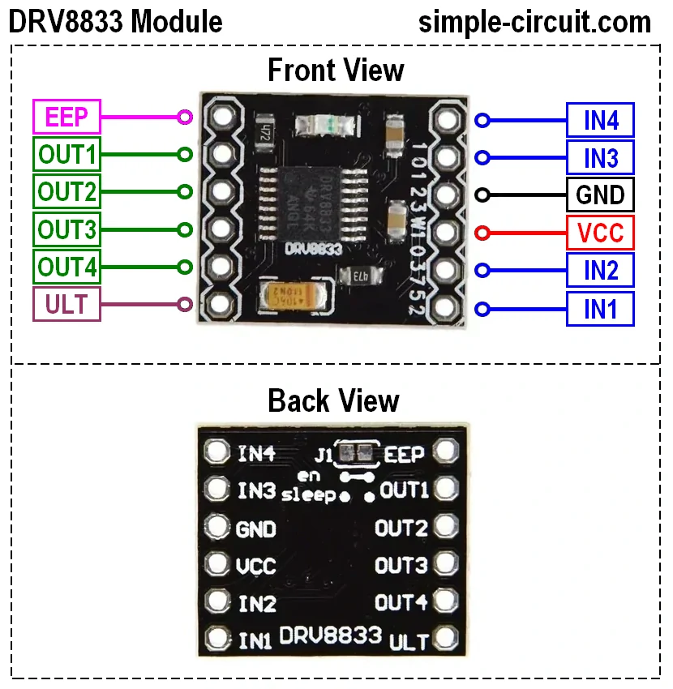
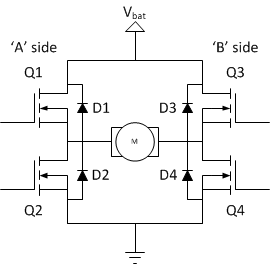
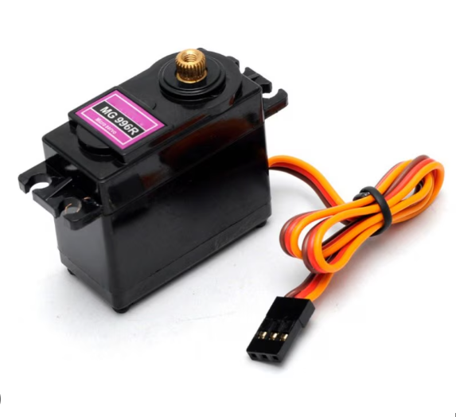
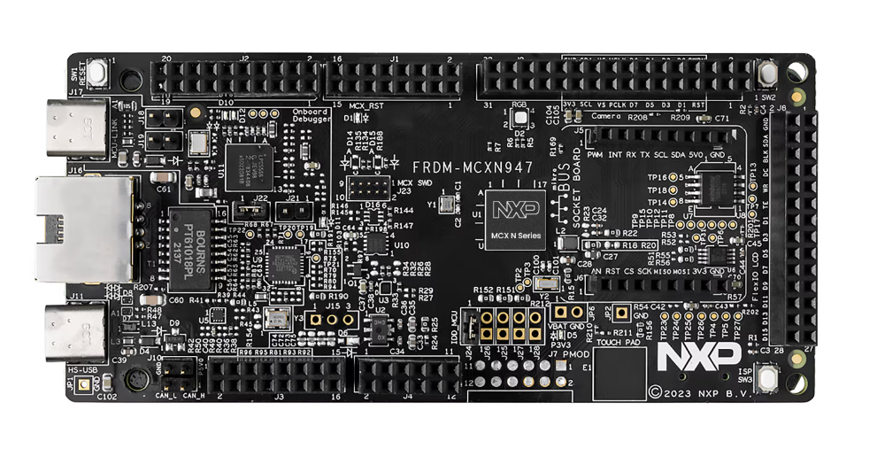
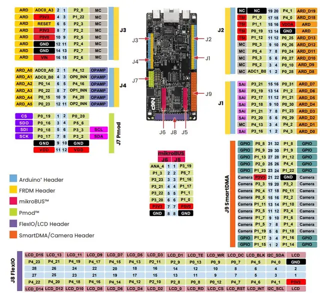

## Components

The main components of the car are:

- Camera
- Motor driver
- Servo
- FRDM MCXN947 Development Board
- Two brushed DC motors
- Battery

### Camera

The Pixy (also known as the Pixy2) is a compact, fast vision sensor designed for embedded applications. Rather than streaming raw image data, Pixy processes frames on-board to detect objects based on color signatures, then outputs only the relevant information (e.g., object type, position, size). This makes it ideal for robotics projects where low latency and minimal host-processor load are critical.

<div align="center">

</div>


When configured for line tracking, the Pixy camera leverages its on-board algorithms to detect and follow high-contrast (typically black-on-white) lines at up to 60 FPS. This mode is perfect for guiding our car along a predefined track without burdening the main processor with pixel-level image analysis.

<div align="center">

</div>

#### Key Features for Line Detection
- **High-Speed Processing**  
  Processes up to 60 frames per second, ensuring smooth, responsive line following.  
- **Adaptive Thresholding**  
  Automatically adjusts to varying ambient light to maintain robust line contrast.  
- **Blob & Edge Detection**  
  Identifies contiguous line segments (blobs) and computes their centroids and angles.  
- **Centroid & Angle Output**  
  Provides `(x, y)` centroid position of the line within the frame and the line’s orientation angle relative to the camera.

#### How Line Detection Works
1. **Contrast Calibration**  
   PixyMon lets you set the threshold so Pixy isolates the line (e.g., black tape) against the background (e.g., white surface).  
2. **Blob Extraction**  
   In each frame, Pixy finds contiguous dark regions (blobs) matching the threshold.  
3. **Line Fitting**  
   Pixy fits a straight line to the blob cluster and calculates its orientation and center position.  
4. **Data Output**  
   Sends a small packet containing the blob’s centroid `(x, y)`, width, height, and the fitted line’s angle.

#### Wiring & Integration

<div align="center">

</div>

- **Power**  
  5 V supply (150 mA typical).  
- **Interfaces:**  
  - **SPI:** Connect MISO/MOSI/SCK/SEL → MCU SPI pins  
  - **I²C:** SDA/SCL with pull-ups to match MCU logic level  
  - **UART:** TX/RX at 115200 baud  
- **USB (for setup):**  
  Use Mini-USB to connect to PixyMon for threshold tuning and firmware updates.

#### Resources
- You can find the documentation [here](https://docs.pixycam.com/wiki/doku.php?id=wiki:v2:start).
- Downloads [here](https://pixycam.com/downloads-pixy2/).


### Motor driver

A motor driver serves as the interface between your microcontroller and the DC motors. It provides the necessary current amplification, voltage switching, and direction control that small logic pins cannot supply directly. In our car project, we use a dual H-bridge MOSFET driver to independently control two brushed DC motors.

<div align="center">

</div>

#### What It Does
- **Current Amplification:** MOSFETs switch high currents (up to several amps) with low voltage drop, delivering sufficient power to the motors.  
- **Voltage Switching:** Allows the motors to run forward, backward, brake, or coast by switching the polarity of the supply voltage.  
- **Direction Control:** Two input pins per motor control its rotation direction.  
- **Speed Control:** PWM on the input pins modulates the effective voltage, enabling precise speed regulation.

#### H-Bridge Basics
An H-bridge is a circuit of four MOSFET switches arranged in an “H” pattern around the motor:

<div align="center">

</div>

- **Q1/Q4 ON:** Current flows left-to-right → motor spins forward.  
- **Q2/Q3 ON:** Current flows right-to-left → motor spins backward.  
- **Q1/Q3 or Q2/Q4 ON (both same side):** Dynamic braking by shorting the motor terminals.  
- **All OFF:** Motor coasts.

#### Pinout & Signal Mapping
| Input Pin | Function            | Output Pin |
|-----------|---------------------|------------|
| IN1       | Motor A direction   | OUT1       |
| IN2       | Motor A direction   | OUT2       |
| IN3       | Motor B direction   | OUT3       |
| IN4       | Motor B direction   | OUT4       |

- **INx = HIGH:** Turns ON the corresponding high-side MOSFET (Q1 or Q2).  
- **INx = LOW:** Turns ON the corresponding low-side MOSFET (Q3 or Q4).  
- **PWM on INx:** Modulates switching speed for speed control.

#### Example Operation for Motor A
- **Forward:**  
  ```text
  IN1 = PWM signal
  IN2 = LOW 
  Current flows through motor for forward rotation
  ```


- **Reverse:**  
  ```text
  IN1 = LOW
  IN2 = PWM signal
  Current reversed for backward rotation
  ```

- **Brake:**  
  ```text
  IN1 = HIGH
  IN2 = HIGH
  Both MOSFETs conduct, shorting motor terminals for rapid stop
  ```

- **Coast:**  
  ```text
  IN1 = LOW
  IN2 = LOW
  Both MOSFETs off, motor spins down freely
  ```


#### Wiring & Integration

1. **Power Connections**  
   - **Vₛ (Motor Supply):** 6–12 V (depending on motor rating) to the driver’s VIN pin  
   - **GND:** Common ground between driver, battery, and MCU  

2. **Control Lines (to FRDM MCXN947)**  
   - **IN1/IN2 (Motor A):** Connect to two PWM-capable GPIOs  
   - **IN3/IN4 (Motor B):** Connect to two PWM-capable GPIOs  

3. **Motor Outputs**  
   - **OUT1/OUT2:** To Motor A terminals  
   - **OUT3/OUT4:** To Motor B terminals  

4. **Logic Supply**  
   - **VCC:** 3.3 V or 5 V (matches MCU logic level) to the driver’s logic-level input pin  

### Servomotor

The 996R is a high-torque, digital hobby servomotor commonly used in robotics and RC applications. Its robust metal-geared design and precise PWM control make it ideal for steering and positioning tasks in an autonomous car project.

<div align="center">

</div>

#### Key Specifications

- **Operating Voltage:** 4.8 – 7.4 V (nominal 6 V)  
- **Stall Torque:** ~12 kg·cm @ 6 V  
- **Speed:** ~0.12 s/60° @ 6 V  
- **Gear Type:** Metal (reinforced for durability)  
- **Control:** Digital PWM, 0.5 µs resolution  
- **Deadband:** 3 µs (high precision)  
- **Dimensions:** 40 × 20 × 38 mm  
- **Weight:** ~60 g  

#### How It Works

1. **PWM Signal Input**  
   - A pulse every 20 ms (50 Hz), with pulse width between 1 ms (0°) and 2 ms (180°).  
2. **Internal Controller**  
   - Measures incoming pulse width and compares to potentiometer feedback from the output shaft.  
   - Drives the motor (via metal gears) to minimize error.  
3. **Position Feedback**  
   - Built-in potentiometer provides continuous position feedback for tight, jitter-free control.

#### Wiring & Integration

| Servo Pin     | Function           | Connection                          |
|---------------|--------------------|-------------------------------------|
| Red           | V<sub>CC</sub>     | 5 – 6 V regulated power supply      |
| Black/Brown   | GND                | Common ground with MCU & battery    |
| White/Orange  | PWM signal         | PWM-capable GPIO on FRDM MCXN947    |

1. **Power**  
   - Use a stable 5–6 V supply (separate from logic regulator if possible).  
2. **Ground**  
   - Tie servo GND to the MCU’s GND to ensure common reference.  
3. **Control**  
   - Connect the signal line to a timer/PWM output pin on the FRDM MCXN947 and configure for a 20 ms period with a 1–2 ms pulse width.

#### Use Case in the Car Project

The 996R servo is used for steering control. By reading the line-detection data from the Pixy camera, the FRDM MCXN947 computes the desired steering angle and updates the servo position accordingly, enabling smooth, accurate cornering and line-following behavior.  


### FRDM MCXN947 Development Board

A versatile microcontroller platform for embedded projects.

<div align="center">

</div>

The FRDM MCXN947 features:

- **Core MCU:** Dual Arm® Cortex® -M33 cores @150MHz each 
- **Memory:** Up to 2MB dual-bank flash with optional full ECC RAM, External flash
- **On-board Debugger:** USB-to-SWD (OpenSDA) for programming and realtime tracing  
- **Expansion:** Arduino™ Uno-compatible headers
- **Power:** USB-powered or external 3.3 V supply  
- **SDK Support:** MCUXpresso SDK with drivers, RTOS examples, and CLI demos  

Ideal for rapid prototyping of sensor, motor-control, and communication applications.  

#### Pinout

<div align="center">

</div>
