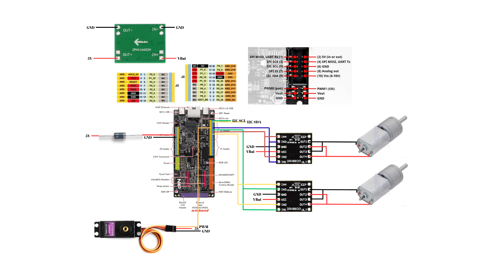

## Soldering tutorial

A quick start-up guide to soldering techniques and good practices can be found [here](https://www.youtube.com/watch?v=Qps9woUGkvI).

## Wiring

### Motor Drivers

| Connection     | Pin Mapping              |
|----------------|--------------------------|
| Vbat           | VCC                      |
| GND            | GND                      |
| Motor 1 Pin1   | Driver 1 OUT1 & OUT2     |
| Motor 1 Pin2   | Driver 1 OUT3 & OUT4     |
| Motor 2 Pin1   | Driver 2 OUT1 & OUT2     |
| Motor 2 Pin2   | Driver 2 OUT3 & OUT4     |
| P0_25          | Driver 1 IN1 & IN3       |
| P0_24          | Driver 1 IN2 & IN4       |
| P0_26          | Driver 2 IN1 & IN3       |
| P0_27          | Driver 2 IN2 & IN4       |

---

### Pixy Cam

| Connection | Pin Mapping |
|------------|-------------|
| 5V         | VCC         |
| GND        | GND         |
| P4_1       | SCL         |
| P4_0       | SDA         |

---

### Servo Motor

| Connection | Pin Mapping              |
|------------|--------------------------|
| 5V         | VCC (red wire)           |
| GND        | GND (black wire)         |
| P1_12      | SIG (yellow wire)        |

## Schematic

