## Get started with the board

The FRDM-MCXN947 board comes pre-programmed with an LED blinky demo. This built-in example serves as a quick sanity check to confirm that the board is functioning correctly right out of the box.

#### Let’s walk through the setup process step by step.

### Step 1: Plug in the board

Connect a USB Type-C cable from connector J17 on the FRDM-MCXN947 board to your host computer or a USB power supply. This will power up the board and automatically run the pre-programmed demo application.

#### What to expect:
The onboard RGB LED should start blinking at a steady rhythm. This indicates that the board is functioning correctly and the demo firmware is running as expected.

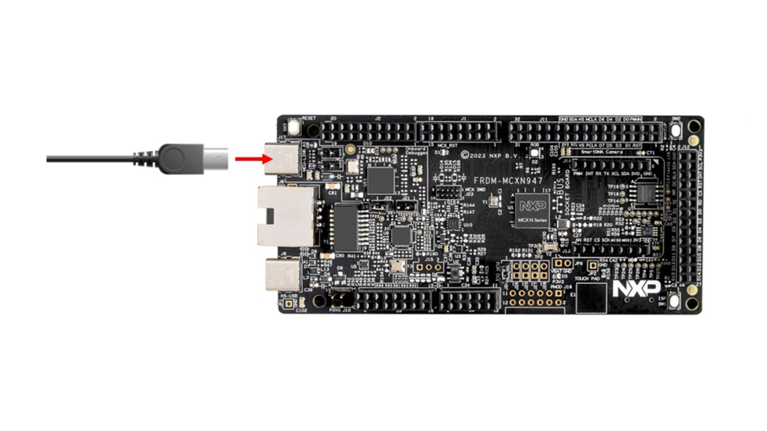

### Step 2: Get needed tools

To access the tools required for this project, you’ll need to create an NXP account. You can use either your personal or student email address. 

Create your account by [visiting this page](https://www.nxp.com/mynxp/home).

#### Get MCUXpresso IDE

Download the latest version of the MCUXpresso IDE from the [NXP website](https://www.nxp.com/design/design-center/software/development-software/mcuxpresso-software-and-tools-/mcuxpresso-integrated-development-environment-ide:MCUXpresso-IDE?&tid=vanMCUXPRESSO/IDE).
Make sure to select the installer that matches your operating system (Windows, Linux, or macOS).

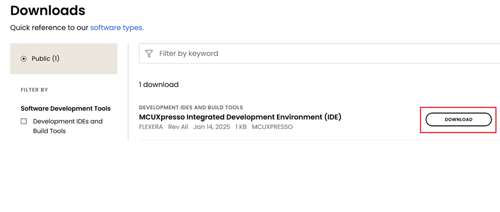

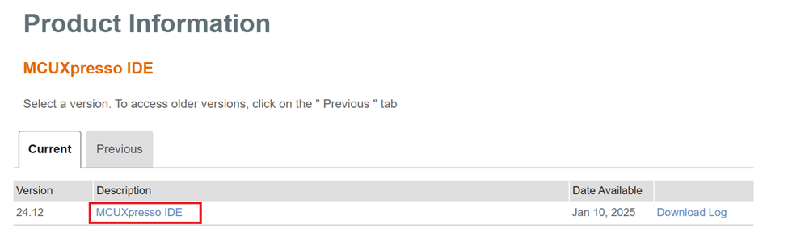

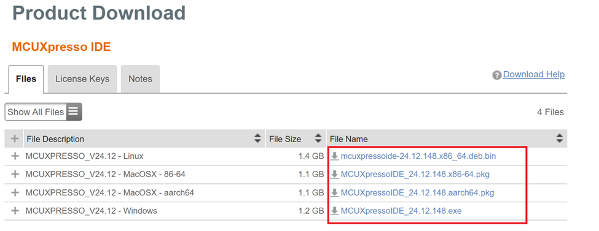

Now let's dive into the installation process. 

Continue clicking "Next" until you reach the install window.

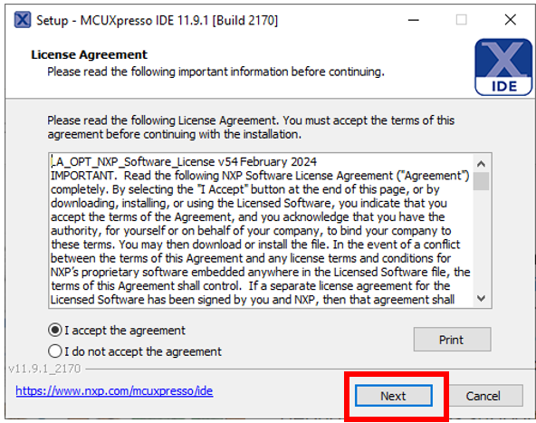

In this step, you may be prompted to install additional drivers during the installation process, allow these to be installed. 

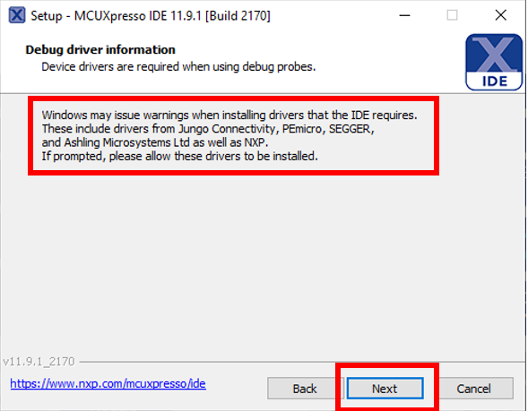

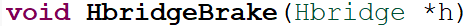

Now launch the MCUXpresso IDE and install the SDK. On the IDE Welcome page, click “Download and Install SDKs”.

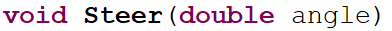

Search for “mcxn947” and click “install”. 

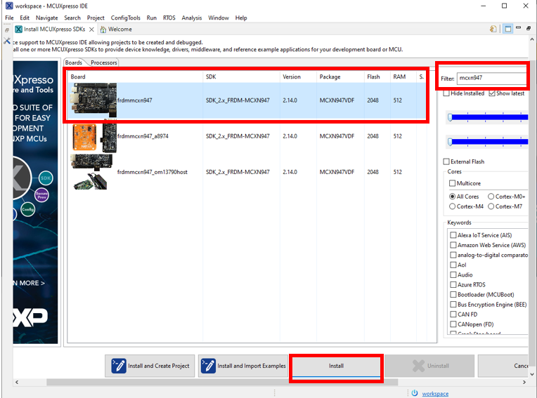

#### Get MCUXpresso Config Tools

Next you will get the  [MCUXpresso Config Tools](https://www.nxp.com/design/design-center/software/development-software/mcuxpresso-software-and-tools-/mcuxpresso-config-tools-pins-clocks-and-peripherals:MCUXpresso-Config-Tools?tab=Design_Tools_Tab&ticket=ST-4323-Qmwtn3ubbT9FY0GemUx-wSxRs6U-nxp), which is suite of utilities that simplifies the configuration of pins, peripherals, and clocks for your project.

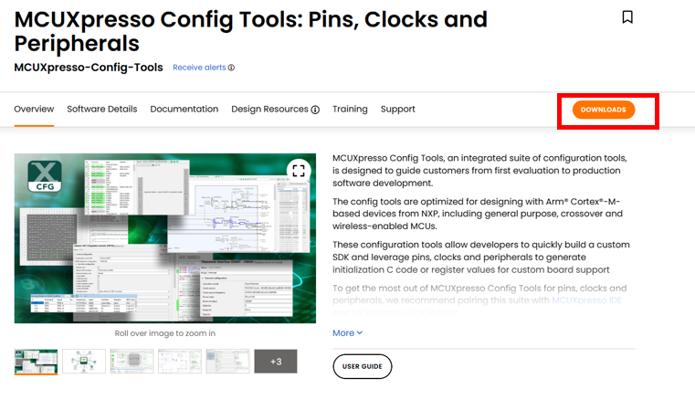

Get the correct installation for the machine you are using. 

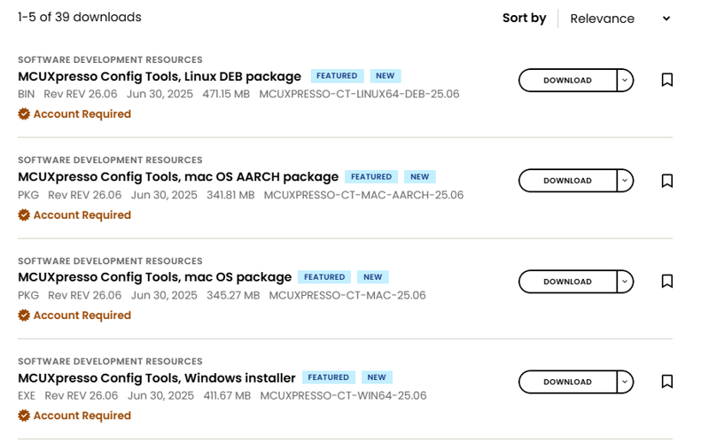

Accept the "License Agreement" and press "Next" until you get to the installation window.

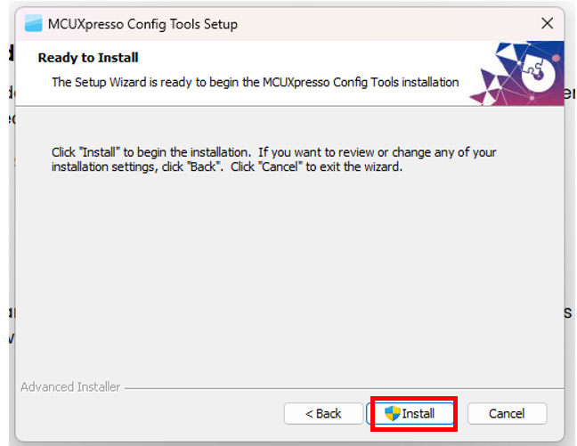

Congratulations! You have successfully tested the board and installed the needed tools!

### Step 3: Dive into the LED blinky demo

First let's create a Workspace Folder. Launch workspace where you want to locate it. Keep in mind that workspace switching restarts IDE.

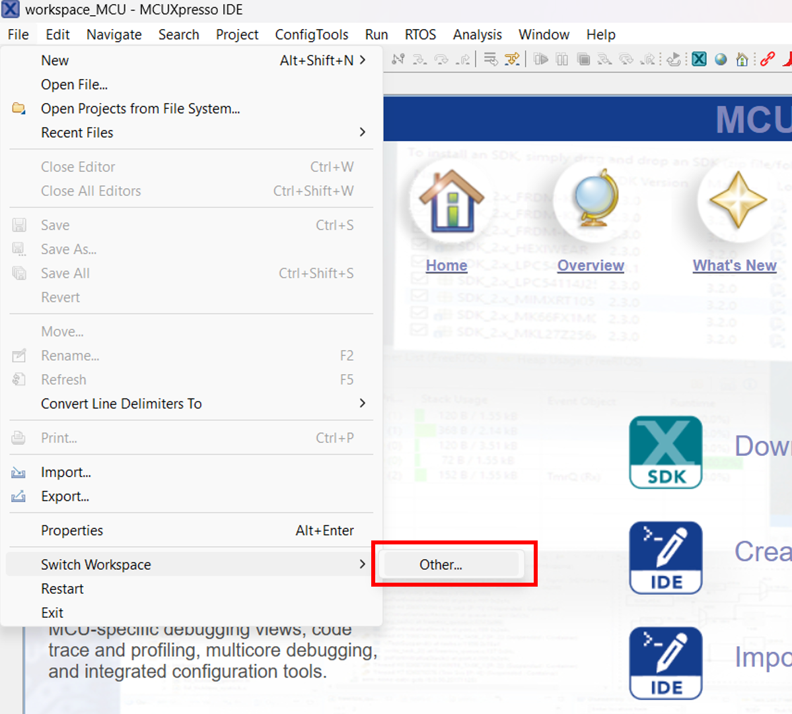

Close the Welcome page and select "Import SDK example(s)...". Select the correct MCXN947 board and press "Next".

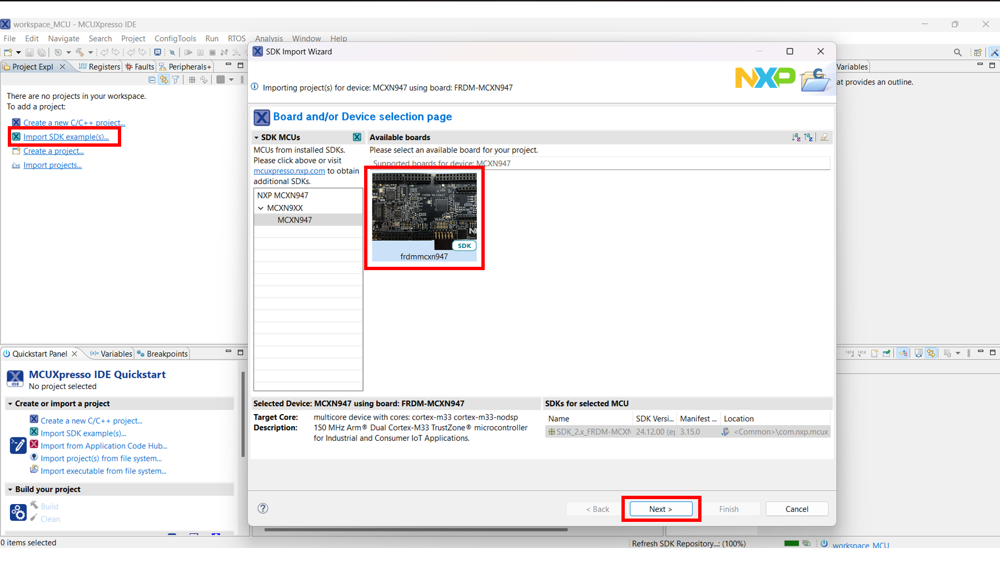

Now from the Import Wizard, drop down on the demo_apps section and select the "led_blinky" application. Then press "Finish" and wait for the project to open.

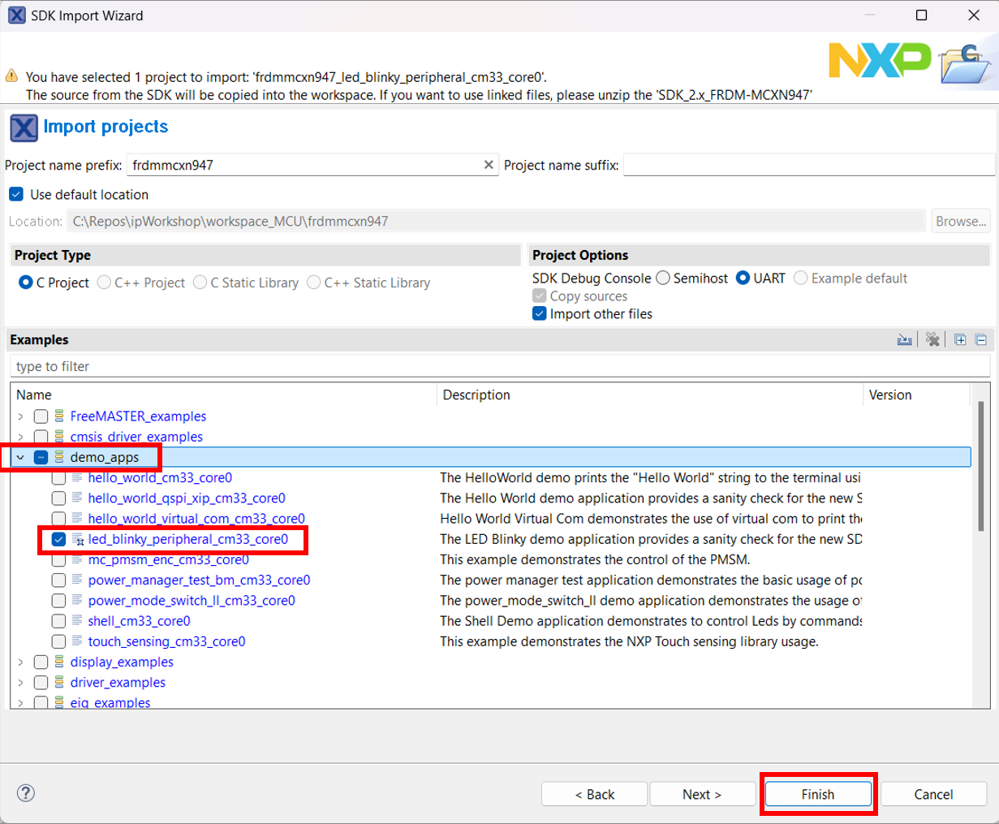

You can see what the project window is split into.

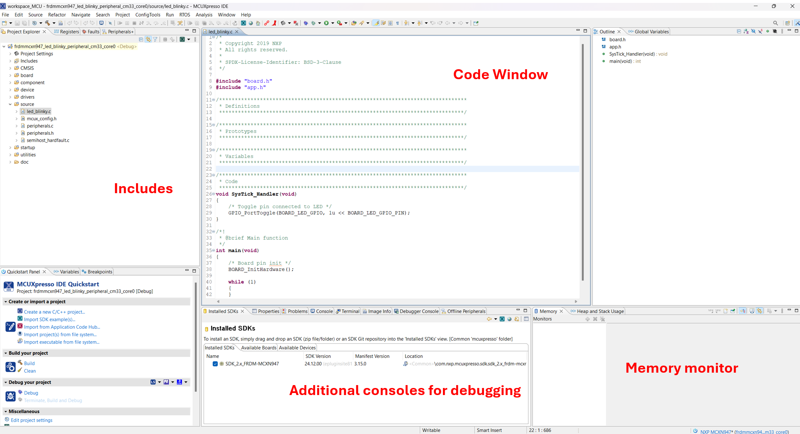

Let's take a look at the code. The top part of the code contains the includes files present in the project tree and visible in the Project Explorer tab.

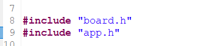

The next section is the SysTick_Handler function that toggles the red LED on the board. 

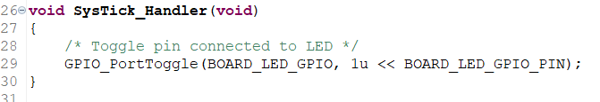

This function will be periodically called to switch ON and OFF the LED. Ctrl + click on the GPIO_PortToggle function opens the declaration present in fsl_gpio.h header file. 

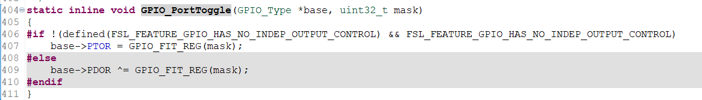

The main function starts by calling the initialization function. 

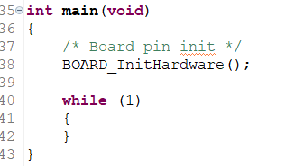

The initialization function can be found in the hardware_init.c file.

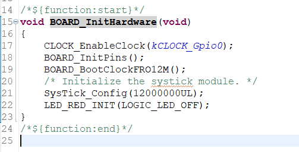

This function enables a clock and initializes the board pinds. Then the BOARD_BootClockFRO12M() sets the clock frequency to 12 MHz. SysTick_Config(12000000UL) sets a counter with a value of 12.000.000 that makes the LED blink once per second. More on timers will be covered later.
Changing the counter value will increase/decrease the blinking frequency but note that it needs to be slow enough for the human eye to notice it.
LED_RED_INIT(LOGIC_LED_OFF) calls GPIO_PinWrite() that changes the output of the GPIO (in this case to the OFF state).

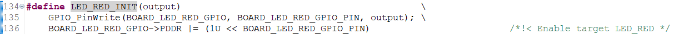

Now let's divo into how to build and download the code on your board.

In order to build a project, have it selected and then either click on the "build icon" in the shortcuts provided above or by clicking "Build" in the Quickstart Panel.

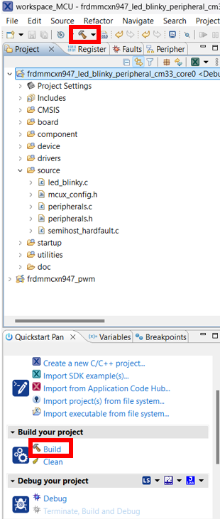

The project should finish the build without any errors or warnings in the console.

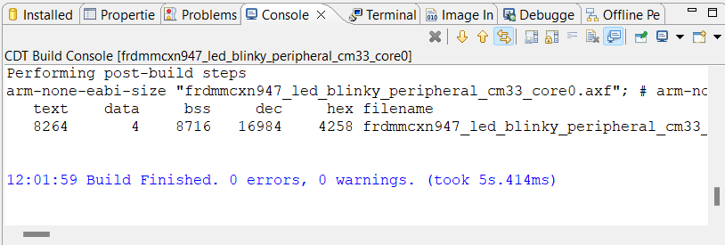

For the download step, make sure your board is connected to the computer through the J17 'MCU-LINK' port.

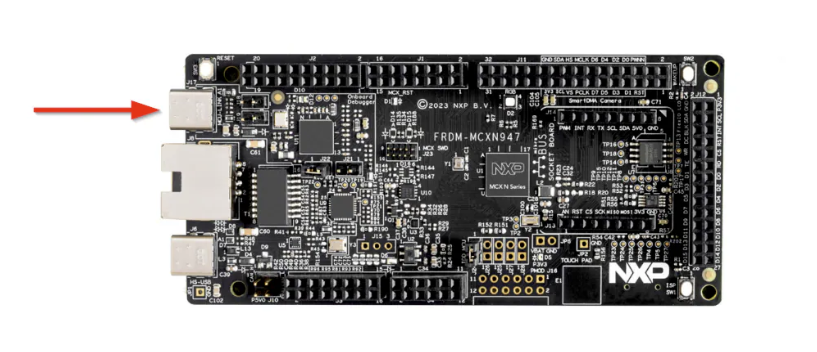

Download the application to your board by either cliking on the "debug" icon above or clicking "Debug" in the Quickstart Panel.

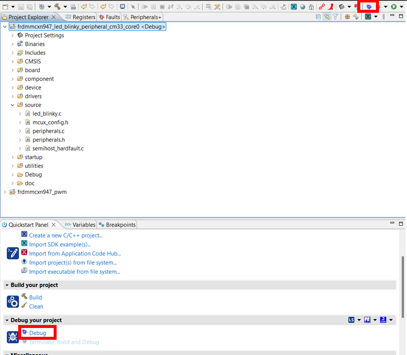

In the next window, select the MCU-LINK CMSIS-DAP debug probe.

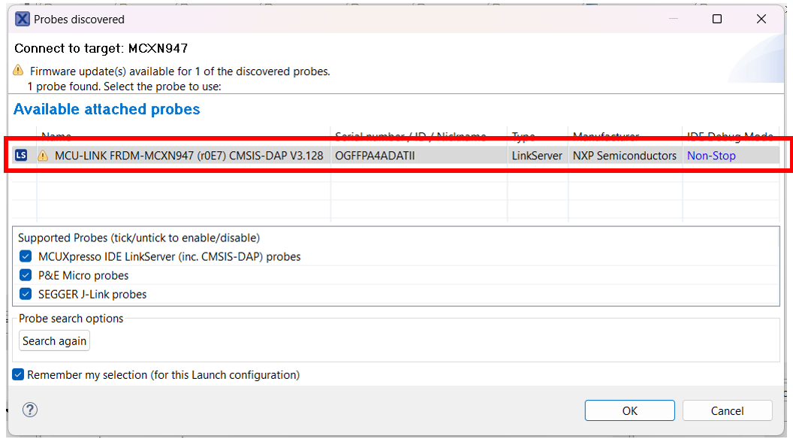

To run the application, press the "run" icon. 

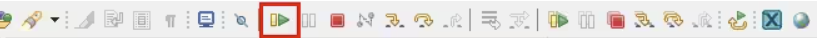

