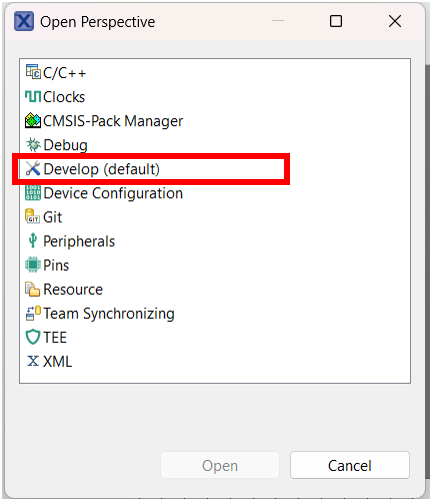
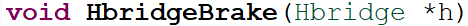
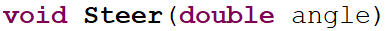

In this section, we will explore the main functions used in the car application. 

### Download the Project Archive

To begin working on the actual application, download the provided project archive. This archive contains the source code.

Download the project archive from [here](https://github.com/ipworkshop/autonomous-cars.git)

### Import the archive into the MCUXpresso IDE

Inside the MCUXpresso IDE, go to File and choose the import option.

In the popup window that will open, dropdown the "General" menu and choose the "Existing Projects into Workspace" option and then go "Next".

In the next opopup window, select "Select Archive File" and choose the downloaded zip. Then press "Finish".

### Generate the configuration of the drivers

To generate the configuration of the drivers, go to the Peripherals Tab. Click on the icon in the top right and in the "Open perspective" popup, select "Pins".

In the new perspective, choose the right project and wait for the configuration to be completed. 

To return to the previous perspective, clik again on the "Open Perspective" icon on the top right, and choose the "Develop (default)" option.

## Drivers description and usage

## 1. Hbridge

### HbridgeSpeed() 

This function sets both the speed and direction of the car's motors.
It takes two inputs: speed1 and speed2, one for each motor. Each value can range from -100 to +100.
The sign determines the direction the motor spins, where positive values make the motor spin forward,while negative values make it spins backwards. 
The higher the number the faster the motor spins.

### HbridgeBrake()

This function stops the motors by setting their PWM duty cycle to 0%, which means no power is sent to them. It also sets the direction control pins to a safe state, ensuring the motors remain stopped.

## 2. Servo

### Steer()

This function tells the steering servo which way to turn.
It takes an angle value between -100 and +100, where -100 means full turn in one direction, +100 means full turn in the opposite direction and 0 keeps the wheels straight.

Based on this value, it calculates the PWM duty cycle needed to position the servo as requested. Then it reads the current timer period (periodTicks) and uses it in order to calculate the number of timer ticks (pulseTicks) that will produce the correct duty cycle.

In the end, it updates the timer's register with this value so the servo received the new command.

## 3. Pixy Camera

The Pixy camera communicates with the board using the I2C protocol.
When the board needs information from the camera, such as detected lines, the process is: 
1. Build a request packet: a sequence of bytes starting with a special header, followed by a command number, the message length and any extra data.
2. Send the packet to the Pixy.
3. Receive the response packet from the Pixy.
4. Interpret the received data (eg. converting a series of bytes into coordinates for the detected lines).

In this communication, DMA (Direct Memory Access) acts as a helper inside the microcontroller that transfers data between peripherals and memory without the CPU handling each byte.
This allows the CPU to perform other tasks while the transfer is in progress, making communication faster and more efficient.

## 4. Main function

Here the main logic of the car is implemented.

### Steps:
#### 1. Start-up and setup
The main components, such as the motors, steering servo and Pixy camera, are initialized. Then the Pixy camera's LED is turned to red to show it is ready.

#### 2. Main loop
Here the main algorithm is implemented. These steps are repeated by the car over and over.

    1. Pixy camera sends coordinates for lines as vectors, each vector representing the start and end coordinates of a line segment.
    2. The algorithm looks for intersections. When two lines seems to be almost perpendicular, there is an assumption that there is an intersection. The program picks the line that best represents the lane to follow.
    3. If there is no intersection, the program combines the angles of all visible lines in order to find the general direction of the road.
    4. It calculates the steering angle. The angle is limited so the wheels never turn more than 45 degrees in either direction.
    5. The calculated angle is sent to the steering servo so the wheels turn to follow the road.
    6. The two drive motors are set to the same speed so the car keeps moving ahead.

#### Main idea:

In this algorithm, the car is constantly asking the Pixy for the latest view of the lines, deciding the road it continues on and acting based on the previous informations by steering toward the road's direction, all while keeping the motors running.