# PWM Control with CTIMER on the FRDM–MCXN947 Board

## 🎯 Objective:

Learn how to configure and generate PWM signals using the CTIMER peripheral in MCUXpresso IDE on the FRDM–MCXN947 development board.

---

## 🔍 What are CTIMER and PWM?

**CTIMER (Counter/Timer)** is a versatile on-chip peripheral found in NXP microcontrollers that can operate as a timer, counter, or PWM generator.
**PWM (Pulse-Width Modulation)** is a technique to encode analog values using a digital signal by varying the duty cycle. It is widely used for motor control, LED dimming, and signal generation.

---

## 🖥️ Tools and Requirements

* **IDE**: MCUXpresso IDE (v11.5.0 or later)
* **Board**: FRDM–MCXN947 development kit
* **Compiler**: GNU Arm Embedded Toolchain (bundled with IDE)
* **Connectivity**: USB cable for board programming and debugging

---

## 🧭 Workspace Overview

When you open your project in MCUXpresso IDE:

* **Peripherals Perspective**: Configure on-chip peripherals visually.
* **Problems View**: Displays configuration errors and quick-fix suggestions.
* **Pins Perspective**: Assign and route physical pins to peripheral functions.
* **Project Explorer**: Browse source files and configuration.

---

# ✏️ Step-by-Step PWM Configuration

## 🧱 Main Steps

* **Enable CTIMER Driver** in Peripheral Drivers section.
* **Set Mode to PWM** and configure clock prescaler.
* **Define PWM Channels** and default duty cycles.
* **Route Pins** in Pins Perspective or via quick-fix.
* **Generate Code** and call the PWM update function in your application.

---

## 🔹 Step 1: Open Peripherals Perspective

1. In MCUXpresso IDE, click the **Peripherals** tab or switch via the perspective icon.
2. Expand **Peripheral Drivers (Device specific)** and click **+** to add a new driver.

<!-- <div align="center"> -->
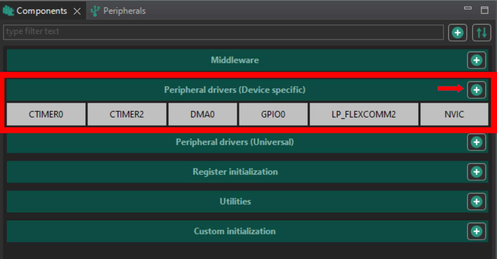
<!-- </div> -->

## 🔹 Step 2: Enable CTIMER and Set Mode

1. Search for **ctimer** in the drivers list and press **OK**.
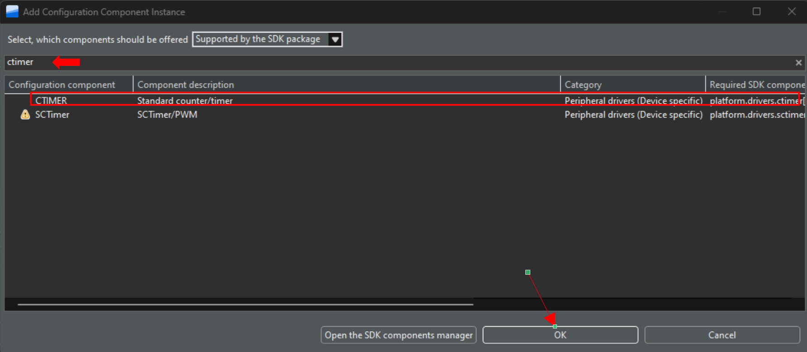

2. In the CTIMER instance list, select the desired timer (e.g., CTIMER1).
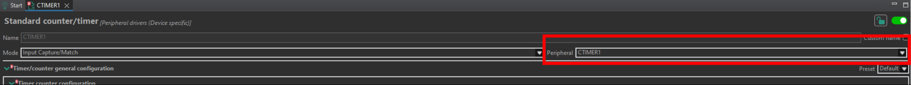

3. Under **Mode**, choose **PWM**.
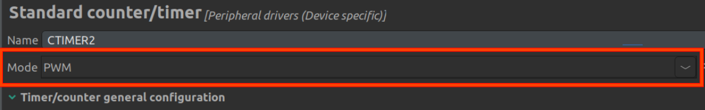

---

## 🔹 Step 3: Resolve Clock Errors

* Go to the **Problems** tab (right corner).
* Right-click any CTIMER_clock error (bulb icon) and apply the suggested fix to enable its clock.
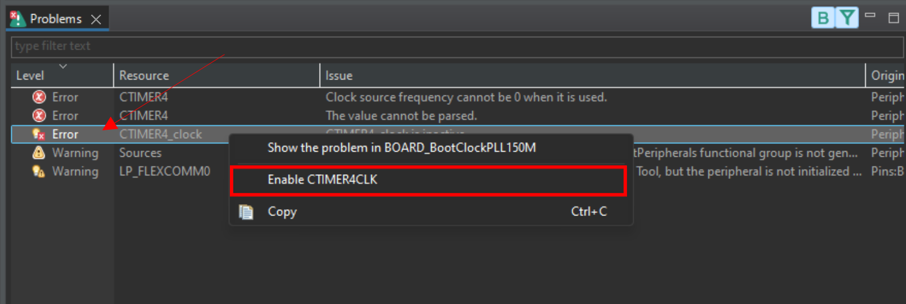

---

## 🔹 Step 4: Configure Timer Frequency and Prescaler

1. In the CTIMER settings, set the **Input Clock Frequency** or **Prescaler** so that the timer base frequency supports your desired PWM frequency.

   * *Explanation*: The prescaler divides the bus clock to achieve a timer tick rate matching the PWM period requirements.

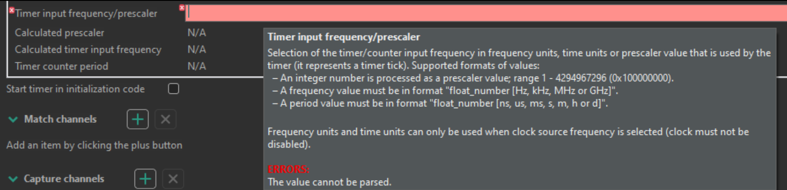

2. **Start the timer in initialization code.**

   * *Explanation*: The CTIMER counter must be running for PWM outputs to be generated. Check “Start the timer in initialization code” so the timer starts automatically during peripherals initialization—no manual CTIMER_StartTimer(...) call needed.
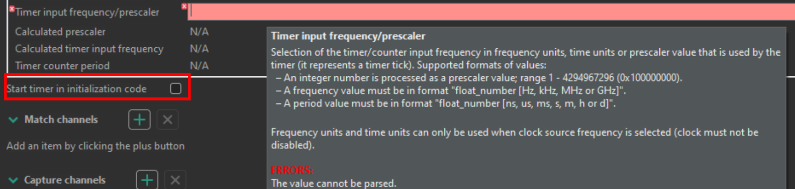

3. Enter the **PWM Frequency** for the selected CTIMER channel.
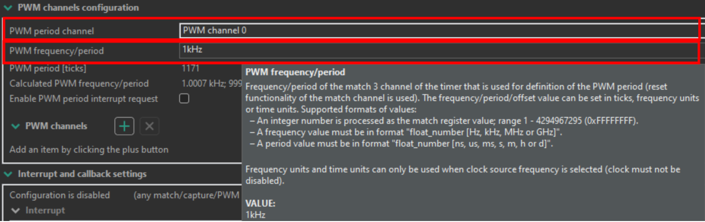


---

## 🔹 Step 5: Add and Configure PWM Channels

1. In the **PWM Channels** section, click **+** to add a channel.
2. Choose a channel number (1‒n, avoid channel 0) and set the **Default Duty Cycle** (applied at initialization before runtime updates).
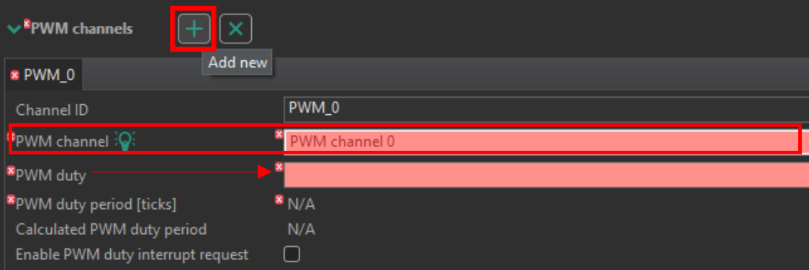

---

## 🔹 Step 6: Route the PWM Pin

* **Quick-Fix Method**: In the **Problems** view, right-click the PWM pin assignment error and accept the suggested route.
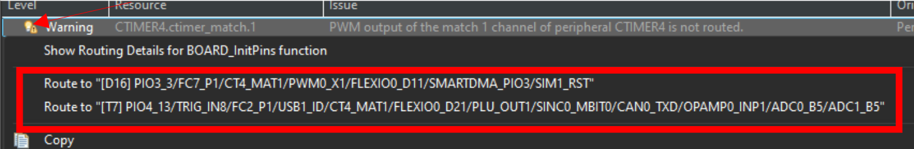

* **Pins Perspective Method**: Switch to **Pins**, search for `ctimer<no>:match<pwm_channel_no>`, enable the pin, and set **Direction** to **Output** (Routing Details - bottom section).
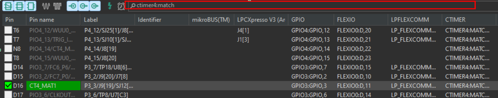

> **Tip**: Verify the routed pin is available on a board header by consulting the FRDM–MCXN947 schematic.

---

## 🔹 Step 7: Generate Code

* After completing configuration, click **Update Code** to regenerate driver initialization based on your configuration.
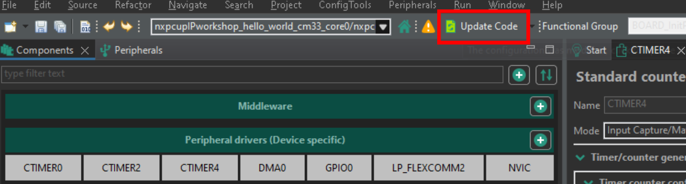

---

## 🔹 Step 8: Using PWM in Application Code

Call the generated driver function to update duty cycle at runtime:

```c
CTIMER_UpdatePwmDutycycle(
    CTIMER<no>_PERIPHERAL,                      // e.g., CTIMER1_PERIPHERAL
    CTIMER<no>_PWM_PERIOD_CH,                   // the period channel defined in config
    CTIMER<no>_PWM_<pwm_channel_no>_CHANNEL,    // the channel index
    dutyPercent                                // new duty cycle in percent (integer)
);
```

---

## ⚙️ Advanced: Using Match Registers for Precise Duty Control

When you need more precise control—for example, fractional duty cycles for servos or fine-grained LED brightness—you can calculate and write directly to the timer's match registers.


```c
uint32_t periodTicks = CTIMER<no>_PERIPHERAL->MR[CTIMER<no>_PWM_PERIOD_CH];
uint32_t pulseTicks  = (uint32_t)((periodTicks * dutyPercent) / 100.0);
CTIMER<no>_PERIPHERAL->MR[<channelIndex>] = pulseTicks;
```

### Explanation of Ticks and Duty Translation

* **`periodTicks`**: Total number of timer ticks for one full PWM period. It is read from the match register `MR[CTIMER<no>_PWM_PERIOD_CH]` which defines the period channel.
* **Timer Tick Duration**: With a bus clock of, say, 48 MHz and a prescaler value `P`, each tick occurs every `P / 48 000 000` seconds.
* **`dutyPercent`**: Desired duty cycle as a percentage (0–100).
* **Calculating `pulseTicks`**:

  1. Multiply `periodTicks` by `dutyPercent / 100.0` to get the fractional portion of the period.
  2. Cast to `uint32_t` to obtain an integer tick count.
* **Writing to `MR[channelIndex]`**: Setting this register tells the timer when (in ticks) to toggle the PWM output from high to low, achieving the specified duty cycle.


This method translates your percentage-based duty into concrete timer ticks, leveraging the full resolution of the CTIMER peripheral for precise PWM control.

---

# 🎉 Congratulations!

You have successfully configured and generated PWM signals on the FRDM–MCXN947 board using the CTIMER peripheral. Explore varying frequencies, multiple channels, and advanced timer features to build complex control applications.
