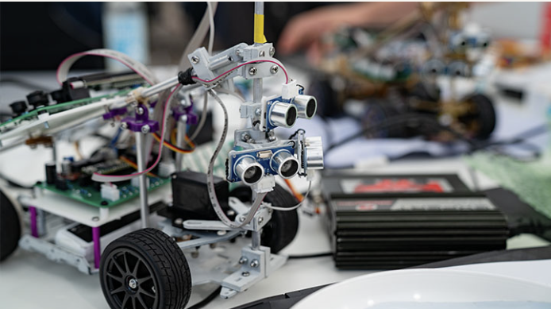
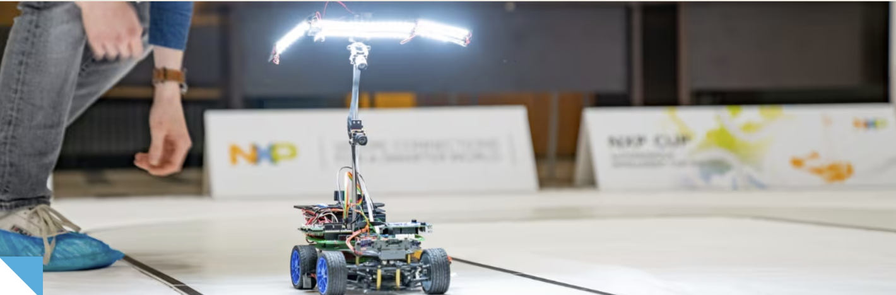

# Autonomous Cars Course

### Course team:

- Cristian Pătru    cristian.patru@nxp.com
- Teodor Dicu   teodor.dicu@wyliodrin.com
- Cristina Grosu    cristina.grosu@nxp.com
- Sebastian Matei   sebastian.matei@nxp.com
- Cezar Băluță  cezar.baluta@nxp.com

This hands-on, interdisciplinary course aims to guide participants in building their own autonomous vehicle, capable of following a line-marked path. During this course, students gain skills in: 3D design for custom parts, hardware assembly and soldering, basic electronics and microcontrollers, embedded programming and control algorithms for navigation. 

The final part of the course consists of a timed competition where teams test their vehicles on a designated track.

The course has a duration of 8 days during which the students have a chance of developing skills and sharing experiences.

The course takes inspiration from the [NXP Cup Competition](https://nxp.gitbook.io/nxp-cup).

# NXP Cup: An Autonomous Vehicle Challenge

The NXP Cup is a hands-on autonomous car competition designed to give students a unique opportunity to explore the world of self-driving vehicles. Participants work with small, affordable model cars equipped with real NXP automotive components, similar to those used in actual vehicles on the road today.

Just like a full-scale autonomous vehicle, your car will be able to sense, think, and act. Using a camera sensor integrated with a motor control system, the vehicle detects its surroundings and navigates the race track entirely on its own.

The entry kit is budget friendly and includes everything you need to get started. All that’s required is a basic understanding of embedded software programming and electronics, and a strong desire to learn and innovate.
