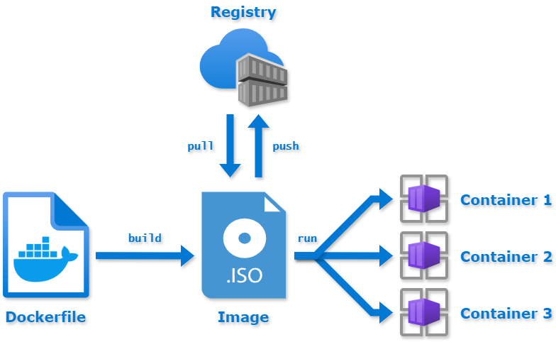

## Starting a container

:::warning

Make the distinction between a **docker image** and a **docker container**. We can see the docker
image as the template, containing a set of instructions, used for creating and running a container.
A docker container is the running instance of an image. This is similar to the distinction between
a program and a process (i.e. a process is a running instance of a program). You can read more
about this difference [here](https://aws.amazon.com/compare/the-difference-between-docker-images-and-containers/#:~:text=A%20Docker%20container%20is%20a%20self%2Dcontained%2C%20runnable%20software%20application,containers%20over%20an%20application's%20lifecycle.).

:::

In order to start a Docker container we use the following command:

```bash
testing$ docker run -it ubuntu:24.04 bash
Unable to find image 'ubuntu:24.04' locally
24.04: Pulling from library/ubuntu
4b987da45db4: Pull complete 
5ba1b3e1daa0: Download complete 
Digest: sha256:4fbb8e6a8395de5a7550b33509421a2bafbc0aab6c06ba2cef9ebffbc7092d90
Status: Downloaded newer image for ubuntu:24.04
root@7b02a8f3d2e9:/# ls
bin  boot  dev  etc  home  lib  media  mnt  opt  proc  root  run  sbin  srv  sys  tmp  usr  var
```

:::info

If the above command requires superuser privileges, (i.e. run with **sudo**), then follow these
[steps](https://docs.docker.com/engine/install/linux-postinstall/) to avoid prefixing every command
with **sudo**.

:::

Let's break down the arguments of the `docker` command:

- `run`, starts the container
- `-i`, the container is started in **interactive** mode, which means that it can accept keyboard
input
- `-t`, associates a terminal to the run command
- `ubuntu:24.04` is the name of the **image** : **version** we want to use. Keep in mind that if we
do not explicitly specify the version, than the latest image will be pulled from
[Dockerhub](https://hub.docker.com/)
- `bash`, the command we want to run in the container

:::info

Dockerhub is a public image repository that contains prebuilt images that we can download.

:::

If we want to see the local images we have downloaded from Dockerhub or created locally, we can do
`docker image ls`.

```bash

testing$ docker image ls

i Info →   U  In Use
IMAGE                      ID             DISK USAGE   CONTENT SIZE   EXTRA
ubuntu:24.04               4fbb8e6a8395        139MB         30.8MB    U 
```

:::tip

If you do not know what an argument does or what is the purpose of a command, use `man docker` or
 `docker help`.

:::

We can also run non-interactive commands in containers:

```bash
testing$ docker run ubuntu:24.04 ls
bin
boot
dev
etc
home
lib
media
mnt
opt
proc
root
run
sbin
srv
sys
tmp
usr
var
```

:::note

This time, the command just shows us the output of **ls** and the container exits immediately. This
is because we have run this command in the **foreground**.

:::

:::tip

Try to also run the `sleep 5` command and see what happens!

:::

Sometimes, however, running commands in the foreground is not ideal, especially if the command
takes a long time to run/output something. During that time, our terminal input is basically
blocked and we have to open another terminal tab if we want to do something else. This is why, when
we are required to run a command or a script that takes a long time, it is better to run the
command in the background.

In order to start a container in the background, we use the `-d` option for the `docker run`
command as follows:

```bash
testing$ docker run -d ubuntu:24.04 sleep 100
601909a9366d1c159a3546befe77966ceb6ee7572660f778a03bf18c6551d314
testing$ docker ps
CONTAINER ID   IMAGE          COMMAND       CREATED          STATUS          PORTS     NAMES
601909a9366d   ubuntu:24.04   "sleep 100"   11 seconds ago   Up 11 seconds             sharp_noether
```

The breakdown of the columns in the `docker ps` output are:

- `CONTAINER ID` - a unique id assigned by docker to each container.
- `IMAGE` - the name of the image that served as a template for this container
- `COMMAND` - the command we have issued when starting the container
- `PORTS` - ports the container exposes for communication with the outside world
- `NAMES` - a name which is randomly assigned by Docker

:::tip

You can change the name of the container when you are starting it. Do `docker run --help`, find the
option and then restart the ubuntu container with a new name! Do `docker ps` to see if the name
changed. Also, whenever you are in doubt about what a command is supposed to do or what options it
takes, the general form is `docker <command_name> --help` to list all of the available options.

:::

Observe the fact that this time the container did not exit, and is running in the background. The
container will stop after the provided command, in our case, `sleep 100`, finishes its execution.
Running `docker ps` after 100 seconds confirms this:

```bash

testing$ docker ps
CONTAINER ID   IMAGE     COMMAND   CREATED   STATUS    PORTS     NAMES
```

:::tip

Run the `docker ps` command after starting a container in the foreground! You need to open another
terminal tab in order to do this.

:::

After starting a container in the background using the `-d` option, we can also connect to it
interactively with the `docker exec` command.

```bash

testing$ docker run -d ubuntu:24.04 sleep 1000
c1efcf61967b8b5e04f868115c21e4f2c3cf19686708e0bbfb529977be758710
testing$ docker ps
CONTAINER ID   IMAGE          COMMAND        CREATED          STATUS          PORTS     NAMES
c1efcf61967b   ubuntu:24.04   "sleep 1000"   12 seconds ago   Up 12 seconds             determined_robinson
testing$ docker exec -it c1efcf61967b /bin/bash
root@c1efcf61967b:/# ls
bin  boot  dev  etc  home  lib  media  mnt  opt  proc  root  run  sbin  srv  sys  tmp  usr  var
root@c1efcf61967b:/#    
```

The format of the `docker exec` command is similar to that of `docker run`. We have used the `-it`
flags to start an interactive session with an attached terminal and we have chosen to run the
`/bin/bash` command. It is important to note that the container is uniquely identified via its
**ID** or assigned name in the **NAMES** column.

Now, we want to stop the running container because it's no fun to wait 1000 seconds to exit
automatically. In order to do this, we use the `docker stop` command with the container's **ID** or
**NAME**.

```bash

testing$ docker ps
CONTAINER ID   IMAGE          COMMAND        CREATED              STATUS              PORTS     NAMES
c1efcf61967b   ubuntu:24.04   "sleep 1000"   About a minute ago   Up About a minute             determined_robinson
testing$ docker stop c1efcf61967b
c1efcf61967b
testing$ docker ps
CONTAINER ID   IMAGE     COMMAND   CREATED   STATUS    PORTS     NAMES
testing$ docker ps -a
CONTAINER ID   IMAGE                COMMAND                  CREATED         STATUS                       PORTS                                         NAMES
c1efcf61967b   ubuntu:24.04         "sleep 1000"             2 minutes ago   Exited (137) 8 seconds ago                                                 determined_robinson
601909a9366d   ubuntu:24.04         "sleep 100"              4 minutes ago   Exited (0) 2 minutes ago                                                   sharp_noether
5a1f3b26732c   ubuntu:24.04         "ls"                     4 minutes ago   Exited (0) 4 minutes ago                                                   pensive_cartwright
7b02a8f3d2e9   ubuntu:24.04         "bash"                   8 minutes ago   Exited (130) 4 minutes ago                                                 elastic_engelbart

```

We can see that the container is no longer running. Sometimes the stop command takes a while, so
do not abort it. We can see that the first container, **determined_robinson** is the one
we stopped earlier.

## Exercise 1

- Start a container of your choice in background. Name it 'IPW-ROCKS'.
- Once started, connect to the container and install the `fzf` tool.
- Disconnect from the container.
- **NEW!** Try to pause and unpause the container. After each command, do a `docker ps`.
- Stop the container.
- **NEW** Completely remove the stopped container.

:::tip

You must start your container with a long running command or script, otherwise it will exit
immediately.

Also, **you are not allowed** to use Google to search how to do the pause/unpause/container removal.
💀 Use `docker help` and `grep` in order to find what you need. 😉
:::

## Let's create our own docker image

### Why would we want to create multiple images for multiple containers?

So far, we have used the containers interactively. Most of the times, however, this is not the case.
A container is a separate unit of computing with a well defined purpose. That is, it should do one
single thing, and do it well.

For example, we might have a web application with multiple components, and we have decided to split each component in its own docker container. That is:

- a database container
- a backend container
- a frontend container

Each of the above containers does one thing, and in the case of a backend or frontend change, the
rest of the containers remain unaffected and running. Even if one container crashes, we can easily
restart it without affecting the rest of the components.

### Building an image

The flow of building an image and deploying a container looks like this:



In order to create our custom container, we need to create a custom template, that is, a custom
docker image. To accomplish this, we will create a `Dockerfile`.

```text

FROM ubuntu:24.04

ARG DEBIAN_FRONTEND=noninteractive
ARG DEBCONF_NONINTERACTIVE_SEEN=true

ENV HELLO="hello"

RUN apt-get update
RUN apt-get install -y firefox

```

Let's break down each line of the above document:

- `FROM` - the first instruction in each Dockerfile, specifies the base container image, which means
that subsequent modifications will add/remove from this image.
- `ARG` - represents a variable that is available only when the container is built and can be
referenced throughout the Dockerfile.
- `ENV` - sets an environment variable that will be available in the resulting container at
runtime.
- `RUN` - runs a command when building the image. In this case, the resulting image will have
`firefox` pre-installed.

:::info

You can read more about the differences between **ARG** and **ENV**
[here](https://vsupalov.com/docker-arg-vs-env/).

:::

Once we have created the `Dockerfile`, we can build our image using the following command:
`docker build -t my-container .`

```bash

testing$ docker build -t my-container .
[+] Building 127.9s (7/7) FINISHED                                                                                                                                         docker:orbstack
 => [internal] load build definition from Dockerfile                                                                                                                                  0.4s
 => => transferring dockerfile: 201B                                                                                                                                                  0.0s
 => [internal] load metadata for docker.io/library/ubuntu:24.04                                                                                                                       0.2s
 => [internal] load .dockerignore                                                                                                                                                     0.3s
 => => transferring context: 2B                                                                                                                                                       0.0s
 => [1/3] FROM docker.io/library/ubuntu:24.04@sha256:4fbb8e6a8395de5a7550b33509421a2bafbc0aab6c06ba2cef9ebffbc7092d90                                                                 0.4s
 => => resolve docker.io/library/ubuntu:24.04@sha256:4fbb8e6a8395de5a7550b33509421a2bafbc0aab6c06ba2cef9ebffbc7092d90                                                                 0.1s
 => [2/3] RUN apt-get update                                                                                                                                                          9.0s
 => [3/3] RUN apt-get install -y firefox                                                                                                                                            108.4s 
 => exporting to image                                                                                                                                                                8.6s 
 => => exporting layers                                                                                                                                                               6.6s 
 => => exporting manifest sha256:980fe383aca0a86245d2020cd6df024d135f17084291d5925f70fb667b9d74ed                                                                                     0.1s 
 => => exporting config sha256:51c8700ae436e3ffb4fc03cef25a4504f8ea2ab597dbdc32f0762d064784cc25                                                                                       0.1s 
 => => exporting attestation manifest sha256:ddaecfe5582b5f185d047385982d77f6372c883c4dae90a450491ad9c7f9862f                                                                         0.1s 
 => => exporting manifest list sha256:23f61fab77183b6fc4dea68f35918760a3820cd04cb2daa10653a96865a2a887                                                                                0.1s 
 => => naming to docker.io/library/my-container:latest                                                                                                                                0.0s
 => => unpacking to docker.io/library/my-container:latest

```

Let's break down the arguments to the `docker build` command:

- `-t` - specifies the tag of the image.
- **my-container** is the assigned tag.
- **.** - specifies that the Dockerfile is located in the current directory

:::note

In larger projects, we may have multiple Dockerfiles, each specifying the recipe for another image.
It is useful, then, to name them differently. However, by default, Docker recognizes only files
named `Dockerfile`. In order to have files named `Dockerfile.backend` or `Dockerfile.frontend` or
any other name we may come up with, we need to specify this to the `docker build` command via the
`-f` parameter. See `docker build --help` for more info.

:::

Now that we have built our image, let's run `docker image ls`:

```bash

testing$ docker image ls
                                                               i Info →   U  In Use
IMAGE                      ID             DISK USAGE   CONTENT SIZE   EXTRA    
my-container:latest        23f61fab7718        645MB          171MB      
ubuntu:24.04               4fbb8e6a8395        139MB         30.8MB    U 

```

This is the confirmation that the build was successful. Let's create a brand new container from this
image and verify if the environment variable has been correctly set up:

```bash

testing$ docker run -it my-container bash
root@6ebbfa721d34:/# echo $HELLO
hello
root@6ebbfa721d34:/# 

```

Nice! We did it. We could have also checked that the image had the **HELLO** environment variable
set by using the `docker image inspect` command.

```bash
testing$ docker image inspect my-container
[
    {
        "Id": "sha256:23f61fab77183b6fc4dea68f35918760a3820cd04cb2daa10653a96865a2a887",
        "RepoTags": [
            "my-container:latest"
        ],
        "RepoDigests": [
            "my-container@sha256:23f61fab77183b6fc4dea68f35918760a3820cd04cb2daa10653a96865a2a887"
        ],
        "Comment": "buildkit.dockerfile.v0",
        "Created": "2026-08-02T15:59:30.946160563+03:00",
        "Config": {
            "Env": [
                "PATH=/usr/local/sbin:/usr/local/bin:/usr/sbin:/usr/bin:/sbin:/bin",
                "HELLO=hello"
            ],
            "Cmd": [
                "/bin/bash"
            ],
            "Labels": {
                "org.opencontainers.image.version": "24.04"
            }
        },
        "Architecture": "arm64",
        "Os": "linux",
        "Size": 170612144,
        "RootFS": {
            "Type": "layers",
            "Layers": [
                "sha256:2c042ab36ee22da5e09730c3dce27e9d84ff1cc8af8e5a8ed2275c05f0133445",
                "sha256:3f937fb6a9308fdfbec41287ca027d3635b9646313d4c1ae2d74c39fc67a3d1f",
                "sha256:cde187a798856c66a1fe225287a882f91e42659ffbce3c138db028886fb871a0"
            ]
        },
        "Metadata": {
            "LastTagTime": "2026-08-02T12:59:38.147297006Z"
        },
        "Descriptor": {
            "mediaType": "application/vnd.oci.image.index.v1+json",
            "digest": "sha256:23f61fab77183b6fc4dea68f35918760a3820cd04cb2daa10653a96865a2a887",
            "size": 855
        },
        "Identity": {
            "Build": [
                {
                    "Ref": "pd4z4gjiajagln24tqxpk7wlb",
                    "CreatedAt": "2026-08-02T15:59:39.662606468+03:00"
                }
            ]
        }
    }
]
```

We can see that in the `Env` section we have our **HELLO** env variable.

:::info

Each Docker image is comprised of layers. Each command in the Dockerfile basically adds a new layer
that can be cached and later be used in other builds. Talking about the very inner workings of
Docker is beyond the scope of this workshop, but you can read more information here:

- [Docker storage driver](https://docs.docker.com/storage/storagedriver/)
- [Docker image optimization](https://cloudyuga.guru/blogs/understanding-docker-image-optimization-techniques-for-effective-deployment/#:~:text=Minimize%20The%20Number%20Of%20Layers,-In%20this%20technique&text=Each%20instruction%20like%20FROM%2C%20COPY,size%20of%20the%20resulting%20image.)
- [Number of docker layers](https://stackoverflow.com/questions/47079114/should-i-minimize-the-number-of-docker-layers)

:::

:::tip

With time, a system can accumulate lots of local images, containers and build caches. That means
that a user may end up with 0 space left on its laptop/PC. So, it is useful to see how much storage
Docker occupies. In order to do this, run the `docker system df` command. Ask one of the course
instructors for more details about the output and how you can free up disk space.

:::

## Exercise 2

- Write a `Dockerfile.image` file containing the instructions for generating a container image
based on `ubuntu`. The image should have the `24.04` version.
- **NEW** Create a file called `test.txt` in the same folder with `Dockerfile.image`. Copy this file
inside the container with some content inside.
- Set an environment variable called **MESSAGE** to whatever message you want.
- **NEW** Using `echo`, append the output of the environment variable to the copied file.
- Using a specific command, create the image such as, when running it non-interactively, it
outputs the contents of the file. Basically, add a default for executing the container.

:::tip

Have a look on the [Dockerfile reference](https://docs.docker.com/reference/dockerfile/) for the
required commands.

:::

## Docker networking

The Docker networking subsystem is plugable and uses a variety of drivers in order to offer implicit
behavior for network components. Why do we care about the networking subsystem? Because in order to
build useful apps, we need to make the containers communicate with each other. Moreover, we may
even want to isolate the traffic between certain containers and create sub-networks.

:::info

You can read about docker networking [here](https://docs.docker.com/network/).

:::

Containers residing in the same network can communicate with each other using **named DNS**. This
means that we can access a container using its name, and not necessarily its IP. In order to
communicate with the outside world (the host machine, containers which are outside the network),
you must expose [ports](https://www.mend.io/blog/how-to-expose-ports-in-docker/).

Moving forward, we are going to demonstrate how the `bridge` networks work in Docker. You can read
more about them [here](https://docs.docker.com/network/drivers/bridge/). We are going to start two
containers and try to send pings from one another to see if anything happens. In order to do this,
it is easier if you open two separate terminal tabs.

```bash

testing$ docker container run --name first -it alpine ash
/ # 


```

```bash

testing$ docker container run --name second -it alpine ash
/ # 

```

This time, we have started two alpine containers, because they are more lightweight than the ubuntu
ones. `ash` is the default shell for the `alpine` containers. Now, if we try to ping from the `first`
container the `second` container, we see that this does not work. Same story if we try the same
thing from the `second` container.

```bash

testing$ docker container run --name first -it alpine ash
/ # ping second
ping: bad address 'second'
/ # 

```

```bash

testing$ docker container run --name second -it alpine ash
/ # ping first
ping: bad address 'first'
/ # 

```

If we do an `ifconfig` inside one of the containers, we see that there are only two networks
available to us right now:

- lo
- eth0

You can ask the course instructors about more information about these two networks.

```bash

/ # ifconfig
eth0      Link encap:Ethernet  HWaddr 22:35:23:26:1C:01  
          inet addr:192.168.215.2  Bcast:192.168.215.255  Mask:255.255.255.0
          UP BROADCAST RUNNING MULTICAST  MTU:1500  Metric:1
          RX packets:19 errors:0 dropped:0 overruns:0 frame:0
          TX packets:6 errors:0 dropped:0 overruns:0 carrier:0
          collisions:0 txqueuelen:0 
          RX bytes:1514 (1.4 KiB)  TX bytes:300 (300.0 B)

lo        Link encap:Local Loopback  
          inet addr:127.0.0.1  Mask:255.0.0.0
          inet6 addr: ::1/128 Scope:Host
          UP LOOPBACK RUNNING  MTU:65536  Metric:1
          RX packets:0 errors:0 dropped:0 overruns:0 frame:0
          TX packets:0 errors:0 dropped:0 overruns:0 carrier:0
          collisions:0 txqueuelen:1000 
          RX bytes:0 (0.0 B)  TX bytes:0 (0.0 B)

/ # 


```

Let's make these containers communicate! First, create a docker network object:

```bash

testing$ docker network create -d bridge my-bridge
ee64c96afe1f20050c02723d6766c695da56757b50a4d8a4fe14ddedcc6614bf
testing$ docker network ls
NETWORK ID     NAME                    DRIVER    SCOPE
79b4e9ec9c06   bridge                  bridge    local
4226c6f0f2cc   host                    host      local
ee64c96afe1f   my-bridge               bridge    local
eea878851ad3   none                    null      local

```

:::tip

Use `docker network --help` to find out more about the command. Ask one of the course instructors
for more information if necessary.

:::

Listing the available networks with `docker network ls` shows the newly created `my-bridge` network
of type `bridge`. Now, let's connect the two containers to the network. Keep in mind we are adding
the containers to the network while they are still running. We could have also added them at creation.

```bash

testing$ docker network connect my-bridge first
testing$ docker network connect my-bridge second

```

It was that easy! Running an `ifconfig` now yields:

```bash

/ # ifconfig
eth0      Link encap:Ethernet  HWaddr 22:35:23:26:1C:01  
          inet addr:192.168.215.2  Bcast:192.168.215.255  Mask:255.255.255.0
          UP BROADCAST RUNNING MULTICAST  MTU:1500  Metric:1
          RX packets:19 errors:0 dropped:0 overruns:0 frame:0
          TX packets:6 errors:0 dropped:0 overruns:0 carrier:0
          collisions:0 txqueuelen:0 
          RX bytes:1514 (1.4 KiB)  TX bytes:300 (300.0 B)

eth1      Link encap:Ethernet  HWaddr 2A:63:09:C6:D2:2E  
          inet addr:192.168.117.2  Bcast:192.168.117.255  Mask:255.255.255.0
          UP BROADCAST RUNNING MULTICAST  MTU:1500  Metric:1
          RX packets:19 errors:0 dropped:0 overruns:0 frame:0
          TX packets:3 errors:0 dropped:0 overruns:0 carrier:0
          collisions:0 txqueuelen:0 
          RX bytes:1782 (1.7 KiB)  TX bytes:126 (126.0 B)

lo        Link encap:Local Loopback  
          inet addr:127.0.0.1  Mask:255.0.0.0
          inet6 addr: ::1/128 Scope:Host
          UP LOOPBACK RUNNING  MTU:65536  Metric:1
          RX packets:0 errors:0 dropped:0 overruns:0 frame:0
          TX packets:0 errors:0 dropped:0 overruns:0 carrier:0
          collisions:0 txqueuelen:1000 
          RX bytes:0 (0.0 B)  TX bytes:0 (0.0 B)

```

We have one extra network interface, `eth1`. Let's ping again the `second` container from `first`.

```bash

/ # ping -c2 second
PING second (192.168.117.3): 56 data bytes
64 bytes from 192.168.117.3: seq=0 ttl=64 time=0.668 ms
64 bytes from 192.168.117.3: seq=1 ttl=64 time=0.223 ms

--- second ping statistics ---
2 packets transmitted, 2 packets received, 0% packet loss
round-trip min/avg/max = 0.223/0.445/0.668 ms
/ # 

```

Nice! This time everything works as expected. Observe the fact that we have used the container's
name and not the IP. You can stop and remove the containers now.

## Exercise 3

- Create a network called `ipw` of type `bridge`.
- **NEW** Create two containers and assign them to the `ipw` network at creation.
- Check if the containers can communicate.
- **NEW** In another terminal tab, do `docker network inspect ipw` and comment on the output with
one of the course instructors.
- **NEW** Do a `cat /etc/hosts` in each container and comment on the output with one of the course
instructors.
- Stop the containers, remove them and also remove the newly created network.

:::warning

You are not allowed to use Google! Use `docker <command_name> --help` whenever you can to get more
information, or ask one of the course instructors.

:::

## Docker persistence

In Docker, data we create or edit inside a container is not persisted in the outside world. This is
due to the way Docker works and the particularities of its filesystem. Let's illustrate this:

:::info

You can read more about this here:

- [MobyLab](https://mobylab.docs.crescdi.pub.ro/docs/softwareDevelopment/laboratory1/persistence)
- [OverlaysFs](https://www.kernel.org/doc/Documentation/filesystems/overlayfs.txt)
- [AuFs](https://www.kernel.org/doc/Documentation/filesystems/overlayfs.txt)

:::

### Volumes

In order to persist data from a container, Docker uses a mechanism called **volumes**. These volumes
represent a mapping between files in the container and files on the host system. The major advantage
of Docker volume is the fact that they are not tied to the lifetime of the container they are
attached to. This means that even if a container crashes, stops or is deleted, its data will still
persist in the outside world, because volumes are an outside abstraction that are just linked to
container, but have a standalone lifetime. Other advantages of volumes include:

- easy migration between containers and machines
- can be configured via the CLI or Docker API
- can be shared between multiple container, which means that volumes represent a way of
*communication* via storage
- by employing different storage drivers, volumes can be used to persist data on remote machines,
cloud environments, network drives etc.

Volumes managed by the Docker engine are also called **named volumes**. There are multiple ways of
defining volumes:

- by using the **VOLUME** command inside the Dockerfile when creating the image, see the
[Docker reference](https://docs.docker.com/reference/dockerfile/#volume)
- at runtime, when creating a volume
- with a docker compose file (more on that later) and the docker volume API: `docker volume create`,
`docker volume ls`, etc.

Let's see how we can create a volume a runtime with the following command:

```bash

testing$ docker container run --name ipw -d -v /test alpine sh -c 'ping 8.8.8.8 > /test/ping.txt'
02159b8baf1ab329f5cb97675392cf27a95c6914e8d0de0b0681e0330c26ba6a
testing$ docker ps
CONTAINER ID   IMAGE     COMMAND                  CREATED              STATUS              PORTS     NAMES
02159b8baf1a   alpine    "sh -c 'ping 8.8.8.8…"   About a minute ago   Up About a minute             ipw

```

The `-v` argument followed by the volume name defines a volume at the `/test` path inside the
container. Every file we create or modify in that folder will basically alter the volume. Also note
that we are using a long running command, `sh -c 'ping 8.8.8.8 > /test/ping.txt'`, in order to
continuously append data to the file.

Now, if we do a `docker volume ls` we should see:

```bash

testing$ docker volume ls         
DRIVER    VOLUME NAME
local     e95a6799435b2b33c2f8d2ec61ec17ab3d7dd25c28ef71de469fb87926e911ea

```

Let's see if we can get more information about our newly created volume:

```bash

testing$ docker volume inspect e95a6799435b2b33c2f8d2ec61ec17ab3d7dd25c28ef71de469fb87926e911ea 
[
    {
        "CreatedAt": "2026-08-02T16:14:39+03:00",
        "Driver": "local",
        "Labels": {
            "com.docker.volume.anonymous": ""
        },
        "Mountpoint": "/var/lib/docker/volumes/e95a6799435b2b33c2f8d2ec61ec17ab3d7dd25c28ef71de469fb87926e911ea/_data",
        "Name": "e95a6799435b2b33c2f8d2ec61ec17ab3d7dd25c28ef71de469fb87926e911ea",
        "Options": null,
        "Scope": "local"
    }
]

```

The `Mountpoint` label specifies the location on the host machine where the volume data is stored. If
we list the contents of that folder then we would get the following output:

```bash

testing$ sudo ls ~/OrbStack/docker/volumes/e95a6799435b2b33c2f8d2ec61ec17ab3d7dd25c28ef71de469fb87926e911ea/
[sudo] password for: 
ping.txt

```

:::warning Where is this folder on Windows and macOS?

`/var/lib/docker/...` is a **Linux path**. It only exists directly on your machine if you run
Docker natively on Linux. On Windows and macOS, Docker actually runs inside a hidden Linux virtual
machine, and this path exists *inside that VM*, not in Explorer/Finder. If the `sudo ls` above
fails for you with "No such file or directory", this is why.

The portable way to look inside any volume, on any OS, is to mount it into a small throwaway
container:

```bash
docker run --rm -it -v VOLUME_NAME:/vol alpine ls -la /vol
```

You can also copy the whole volume contents to your current directory:

```bash
docker run --rm -v VOLUME_NAME:/vol -v "$PWD":/out alpine cp -r /vol /out/volume-data
```

If you do want to reach the raw files on the host:

- **Linux (native Docker Engine)**: the path is real, `sudo ls /var/lib/docker/volumes/<name>/_data`
  works as shown above.
- **macOS with Docker Desktop**: the data lives inside a VM disk image, so there is no Finder path.
  Use the Docker Desktop GUI (Volumes tab lets you browse and export files), or enter the VM:

  ```bash
  docker run -it --rm --privileged --pid=host justincormack/nsenter1
  # you are now inside the VM:
  ls /var/lib/docker/volumes/<name>/_data
  ```

- **macOS with OrbStack**: OrbStack exposes the VM filesystem to Finder, so volumes are directly at
  `~/OrbStack/docker/volumes/<name>/`.
- **macOS with colima**: `colima ssh`, then `sudo ls /var/lib/docker/volumes/<name>/_data` inside
  the VM.
- **Windows with Docker Desktop (WSL2 backend)**: open in Explorer, depending on your Docker
  Desktop version:

  ```text
  \\wsl$\docker-desktop-data\data\docker\volumes                       (older versions)
  \\wsl$\docker-desktop\mnt\docker-desktop-disk\data\docker\volumes    (newer versions)
  ```

- **Windows with Docker Engine installed inside a WSL distro**: the data is inside that distro,
  e.g. `\\wsl$\Ubuntu\var\lib\docker\volumes`.

:::

Doing a `cat` on the file we get the output below. The exact path depends on your OS (see the
warning box above): on **Linux** it is the `Mountpoint` from `docker volume inspect`, so
`sudo cat /var/lib/docker/volumes/<volume-name>/_data/ping.txt`; on **Windows** it is the `\\wsl$`
path in Explorer (or the same `/var/lib/docker/...` path if you run Docker inside a WSL distro,
since WSL is Linux); this example is from **macOS with OrbStack**, where the volume sits right in
your home folder, no `sudo` needed:

```bash

testing$ cat ~/OrbStack/docker/volumes/e95a6799435b2b33c2f8d2ec61ec17ab3d7dd25c28ef71de469fb87926e911ea/ping.txt 
PING 8.8.8.8 (8.8.8.8): 56 data bytes
64 bytes from 8.8.8.8: seq=0 ttl=111 time=64.463 ms
64 bytes from 8.8.8.8: seq=1 ttl=111 time=63.274 ms
64 bytes from 8.8.8.8: seq=2 ttl=111 time=63.388 ms
64 bytes from 8.8.8.8: seq=3 ttl=111 time=63.646 ms
64 bytes from 8.8.8.8: seq=4 ttl=111 time=62.394 ms
64 bytes from 8.8.8.8: seq=5 ttl=111 time=63.054 ms
64 bytes from 8.8.8.8: seq=6 ttl=111 time=62.651 ms
64 bytes from 8.8.8.8: seq=7 ttl=111 time=64.966 ms
64 bytes from 8.8.8.8: seq=8 ttl=111 time=63.276 ms
64 bytes from 8.8.8.8: seq=9 ttl=111 time=60.692 ms
64 bytes from 8.8.8.8: seq=10 ttl=111 time=62.603 ms

```

Now, if we stop and remove the container, with

- `docker container stop ipw`
- `docker container rm ipw`

we see that the volume data is still intact, event though the container was destroyed:

```bash

testing$ cat ~/OrbStack/docker/volumes/e95a6799435b2b33c2f8d2ec61ec17ab3d7dd25c28ef71de469fb87926e911ea/ping.txt 
PING 8.8.8.8 (8.8.8.8): 56 data bytes
64 bytes from 8.8.8.8: seq=0 ttl=111 time=64.463 ms
64 bytes from 8.8.8.8: seq=1 ttl=111 time=63.274 ms
64 bytes from 8.8.8.8: seq=2 ttl=111 time=63.388 ms
64 bytes from 8.8.8.8: seq=3 ttl=111 time=63.646 ms
64 bytes from 8.8.8.8: seq=4 ttl=111 time=62.394 ms
64 bytes from 8.8.8.8: seq=5 ttl=111 time=63.054 ms
64 bytes from 8.8.8.8: seq=6 ttl=111 time=62.651 ms
64 bytes from 8.8.8.8: seq=7 ttl=111 time=64.966 ms
64 bytes from 8.8.8.8: seq=8 ttl=111 time=63.276 ms
64 bytes from 8.8.8.8: seq=9 ttl=111 time=60.692 ms
64 bytes from 8.8.8.8: seq=10 ttl=111 time=62.603 ms

```

This proves the fact that the volume and container have separate lifetimes.

### Bind mounts

Besides volumes, we also have the concept of a **bind mount**. These are somewhat similar, the main
difference being that bind mounts are not managed by Docker, but by the file system of the host
machine and can be accessed by any external process which does not belong to Docker. A bind mount is,
in its purest form, a path to a location in the host machine, while a volume is a Docker abstraction
that behind the scenes uses bind mounts. All in all, bind mounts allow us to **import** and access
folders, files and paths from the host machine in our Docker container and persist any modification.

:::info

You can read more about volumes and bind mounts [here](https://docs.docker.com/storage/bind-mounts/).

:::

We can add a bind mount to a container in a similar fashion, when we are creating it.

```bash

testing$ docker container run --name first -d --mount type=bind,source=/Volumes/ssd2tb/ipw/testing/ping.txt,target=/root/ping.txt alpine sh -c 'ping 8.8.8.8 > /root/ping.txt'
2bd4174be5554db0cb6f4204df68b3290ca94038347fa616f812c19f25a8e395
testing$ cat ping.txt
PING 8.8.8.8 (8.8.8.8): 56 data bytes
64 bytes from 8.8.8.8: seq=0 ttl=111 time=59.500 ms
64 bytes from 8.8.8.8: seq=1 ttl=111 time=59.656 ms
64 bytes from 8.8.8.8: seq=2 ttl=111 time=63.486 ms
64 bytes from 8.8.8.8: seq=3 ttl=111 time=62.149 ms
64 bytes from 8.8.8.8: seq=4 ttl=111 time=62.620 ms
64 bytes from 8.8.8.8: seq=5 ttl=111 time=58.470 ms
64 bytes from 8.8.8.8: seq=6 ttl=111 time=59.493 ms
64 bytes from 8.8.8.8: seq=7 ttl=111 time=58.334 ms
64 bytes from 8.8.8.8: seq=8 ttl=111 time=60.148 ms
64 bytes from 8.8.8.8: seq=9 ttl=111 time=58.879 ms
64 bytes from 8.8.8.8: seq=10 ttl=111 time=63.309 ms
64 bytes from 8.8.8.8: seq=11 ttl=111 time=61.285 ms
64 bytes from 8.8.8.8: seq=12 ttl=111 time=59.424 ms
64 bytes from 8.8.8.8: seq=13 ttl=111 time=58.130 ms
64 bytes from 8.8.8.8: seq=14 ttl=111 time=58.794 ms
64 bytes from 8.8.8.8: seq=15 ttl=111 time=62.338 ms
64 bytes from 8.8.8.8: seq=16 ttl=111 time=63.404 ms
testing$ docker container stop first
first
testing$ docker container rm first
first
testing$ cat ping.txt               
PING 8.8.8.8 (8.8.8.8): 56 data bytes
64 bytes from 8.8.8.8: seq=0 ttl=111 time=59.500 ms
64 bytes from 8.8.8.8: seq=1 ttl=111 time=59.656 ms
64 bytes from 8.8.8.8: seq=2 ttl=111 time=63.486 ms
64 bytes from 8.8.8.8: seq=3 ttl=111 time=62.149 ms
64 bytes from 8.8.8.8: seq=4 ttl=111 time=62.620 ms
64 bytes from 8.8.8.8: seq=5 ttl=111 time=58.470 ms
64 bytes from 8.8.8.8: seq=6 ttl=111 time=59.493 ms
64 bytes from 8.8.8.8: seq=7 ttl=111 time=58.334 ms
64 bytes from 8.8.8.8: seq=8 ttl=111 time=60.148 ms
64 bytes from 8.8.8.8: seq=9 ttl=111 time=58.879 ms
64 bytes from 8.8.8.8: seq=10 ttl=111 time=63.309 ms
64 bytes from 8.8.8.8: seq=11 ttl=111 time=61.285 ms
64 bytes from 8.8.8.8: seq=12 ttl=111 time=59.424 ms
64 bytes from 8.8.8.8: seq=13 ttl=111 time=58.130 ms
64 bytes from 8.8.8.8: seq=14 ttl=111 time=58.794 ms
64 bytes from 8.8.8.8: seq=15 ttl=111 time=62.338 ms
64 bytes from 8.8.8.8: seq=16 ttl=111 time=63.404 ms
64 bytes from 8.8.8.8: seq=17 ttl=111 time=62.814 ms
64 bytes from 8.8.8.8: seq=18 ttl=111 time=59.909 ms
64 bytes from 8.8.8.8: seq=19 ttl=111 time=63.479 ms
64 bytes from 8.8.8.8: seq=20 ttl=111 time=63.331 ms
64 bytes from 8.8.8.8: seq=21 ttl=111 time=58.099 ms
64 bytes from 8.8.8.8: seq=22 ttl=111 time=67.067 ms
64 bytes from 8.8.8.8: seq=23 ttl=111 time=58.947 ms
64 bytes from 8.8.8.8: seq=24 ttl=111 time=62.170 ms
64 bytes from 8.8.8.8: seq=25 ttl=111 time=62.545 ms
64 bytes from 8.8.8.8: seq=26 ttl=111 time=62.965 ms
64 bytes from 8.8.8.8: seq=27 ttl=111 time=64.499 ms
64 bytes from 8.8.8.8: seq=28 ttl=111 time=58.626 ms
64 bytes from 8.8.8.8: seq=29 ttl=111 time=58.853 ms
64 bytes from 8.8.8.8: seq=30 ttl=111 time=59.763 ms
64 bytes from 8.8.8.8: seq=31 ttl=111 time=57.901 ms
64 bytes from 8.8.8.8: seq=32 ttl=111 time=59.385 ms
64 bytes from 8.8.8.8: seq=33 ttl=111 time=60.341 ms
64 bytes from 8.8.8.8: seq=34 ttl=111 time=62.991 ms
64 bytes from 8.8.8.8: seq=35 ttl=111 time=61.916 ms
64 bytes from 8.8.8.8: seq=36 ttl=111 time=63.404 ms
64 bytes from 8.8.8.8: seq=37 ttl=111 time=62.129 ms
64 bytes from 8.8.8.8: seq=38 ttl=111 time=63.078 ms
64 bytes from 8.8.8.8: seq=39 ttl=111 time=62.141 ms

```

This is a lot to take in, so let's break it down. We are creating a mount by specifying the `--mount`
argument, of `type=bind`, we specify the source file from the host system that we want to share with
our container, and the target file in the container, which does not necessarily need to exist.

:::info

Two practical notes. First, with `--mount type=bind` the **source** path must already exist on the
host, otherwise Docker refuses to start the container (the older `-v` syntax would silently create
a directory instead - a classic source of confusion). So create the file first, e.g.
`touch ping.txt`, and use your own path as `source=` - the one above is from the instructor's
machine. Second, on Windows and macOS with Docker Desktop, the source must be under a folder that
is shared with Docker (Settings → Resources → File sharing; on macOS `/Users` and `/Volumes` are
shared by default).

:::

We see that the running ping command outputs into the file on our local system, and even if we delete
the container and remove it, the data persists.

### Exercise 4

- Using a container image of your choice, create a container which has a volume that will contain
the output of the `ps -aux` command inside.
- **NEW** Mount a read-only bind mount into the container which contains an image of your choice.

## Exercise 5 (wrapping things up)

- Inspect the source code in [this repository](https://github.com/IPW-CloudOps/simple-node-app) and
create a Dockerfile that builds a container image for that application.
- Run the newly created container image to make sure everything works.

:::info

This task is intentionally written ambiguous in order to make you search the official documentation,
ask the course instructors questions and familiarize yourself with what a DevOps engineer has to do
on a day-to-day basis. So do not feel bad if, at first, the task seems hard. Do your best, solve it
at your own pace, collaborate with your colleagues, and, most importantly, have fun while learning
new things!

:::

:::note

This course borrows many things, as well as its structure from:

- [SCGC Pages UPB](https://scgc.pages.upb.ro/cloud-courses/docs/security/containers)
- [Mobylab Pages UPB](https://mobylab.docs.crescdi.pub.ro/docs/softwareDevelopment/laboratory1/)

This note is here then to give credits to the teams that created the above resources. For more
information on Docker and other things, feel free to check them out!

:::

## Example Dockerfile

```text

FROM python:3.13.6-alpine

WORKDIR /application

COPY server.py /application

COPY requirements.txt /application

RUN pip install -r requirements.txt

EXPOSE 5000

CMD [ "python3", "server.py"]

# 1. Plecam de la o imagine care are cat mai multe dependinte din ce ne trebuie noua
# 2. Copiem fisierele necesare aplicatiei noastra
# 3. Instalam eventuale dependinte
# 4. Realizam eventuale configurari pentru a porni aplicatia
# 5. Specificam comanda default care porneste aplicatie in momentul in care containerul este up and
# running

```

```text

The hierarchy where the Dockerfile is located looks like this:

.
├── Dockerfile
├── requirements.txt
├── server.py
└── venv (for testing purposes)
    ├── bin
    ├── include
    ├── lib
    └── pyvenv.cfg

```
