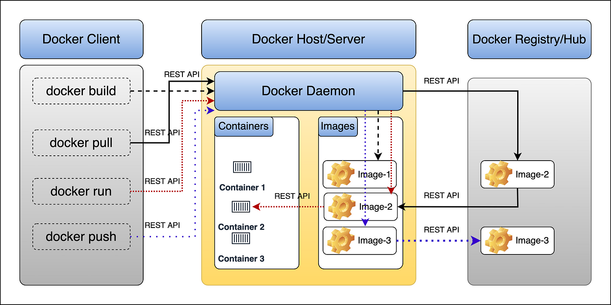

## What is Docker?

Docker is a software containerization platform used to package and run applications both locally
and on cloud systems, eliminating "it works on my machine" problems. It provides an environment for
running containers on any platform, based on containerd.

Key benefits of Docker include:

- Faster building, testing, deployment, updating, and error recovery compared to standard
application deployment methods.
- A uniform development and production environment, eliminating compatibility issues with operating
systems and conflicts between library/package versions on the host system.
- Ephemeral containers, meaning the failure or shutdown of one container doesn't crash the entire
system.
- Consistency between development and production environments.
- Maximum flexibility for large-scale projects, allowing easy integration of new software tools as
requirements change.
- Easy replication of infrastructure in different environments using saved Docker images from a
registry.
- Simple updates of components by rewriting images, ensuring the latest versions are always
deployed as containers.

Docker thus provides a versatile and efficient solution for modern software development and
deployment challenges.

## Docker architecture

Above picture taken from [Medium](https://medium.com/@basecs101/understanding-docker-architecture-latest-c7a165571d89).

## Docker Setup

- [Linux setup](https://docs.docker.com/engine/install/debian/)
- [Windows setup](https://docs.docker.com/desktop/install/windows-install/)
- [Mac setup](https://docs.docker.com/desktop/install/mac-install/)

If you get stuck or do not know what steps need to be taken, please ask the course instructors to
help you. It is very important that you have your Docker engine properly set-up as this is the basis
for the Kubernetes tutorial, also.

## Overview of docker concepts that will be discussed in this course

- Containers
- Images
- Dockerfile
- Docker Hub
- Docker Compose
- Volumes
- Networks
- Docker Registry
- Container orchestration (basic concept)
- Multi-stage builds
- Docker security best practices
- Docker CLI commands
- Container lifecycle management
- Image layering and caching
- Environment variables in Docker
- Port mapping and exposure
- Docker logging and monitoring
- Container resource management (CPU, memory limits)
- Docker healthchecks
- Docker build context
- Docker image tagging strategies
- Docker networking modes
- Docker storage drivers
- Containerization of different application types (web, database, etc.)