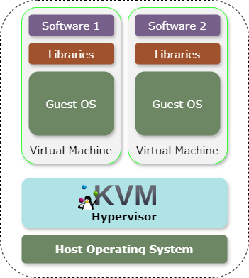
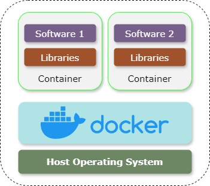

# Container Basics

## Containerization in a nutshell

To understand containerization let's first take a look at what *virtualization* is. In short, if you
ever wanted to run Linux inside your Windows computer, or Mac OS inside Linux, or any other
combination - you can through the use of **Virtual Machines**! As their name implies, you can fully
simulate any operating system that is isolated from your own PC's OS. Usually, a tool like
[VirtualBox](https://www.virtualbox.org/), or
[KVM](https://www.redhat.com/en/topics/virtualization/what-is-KVM) can run multiple virtual machines
at once, being limited only by how powerful your hardware is.

  

Virtual machines are very useful if you want to accurately simulate an entire machine. This is often
useful in cybersecurity where you want to analyze some malware to see its behaviour, or in education
where you want all students to have the same setup. However, if all you want is to have a
**consistent** environment in which you can run your application, simulating an entire operating
system could be a bit overkill. This is where **containers** come in.

**Containers**, compared to VMs, are friendlier with the host operating system, sharing resources in
a more streamlined manner. They don't require you to run an entire operating system, just the
underlying libraries necessary for your application to run, and your application code. The
industry-standard application to manage containers is [Docker](https://www.docker.com/).

  

Another neat advantage of containers, due to their lightweight nature they start extremely fast.
This is extremely helpful when managing widely popular applications due to their ability to create
more containers to respond to a sudden surge in new users.

## Why would someone care about containerization?

Imagine that you have built your billion-dollar application - the software which will revolutionize
the world as we know it 💰! Now, all you need to do is to put it on a server so it can be accessed
by everybody. You install all of your dependencies, `node`, `python`, etc., and your program
crashes. You tracked down the culprit and there was a slight change in `node` that introduced a
small bug. No worries, you change the version to one that works before.

Then, after some weeks, you notice that your website keeps going down. After some investigation, you
notice that there is a small bug in a mini-game you introduced as an easter egg. That small bug
crashes the mini-game, but more importantly, it takes down the whole application with it. You fix it
and move on.

Your website is now getting thousands of users, and your database cannot handle that many users at
once. Not to worry, you just rent out a bigger computer. Then, your app goes popular in America, and
Australia and now you are getting complaints that your app is slow due to the massive delay between
your server in Europe and their location. Now you have to rent out multiple servers, in multiple
locations, but then you forgot that you had to specify a `node` version, and you have to shut down
your service to re-engineer everything.

All of these headaches could have been avoided by using containers. They offer an **isolated and
reproducible environment**. This means that you have to specify your dependencies once, and each
time a new container for your application is created it is guaranteed to work. More so, you can
split up your application into multiple containers - for example, a container handles the database,
one handles the user interface, and another handles that buggy mini-game. If one fails, the others
will continue running. And, after you learn about **Kubernetes**, you will also understand how to
start multiple instances of the same application to better handle bigger workloads.

However, as a word of caution, don't start creating your application with the idea that it will have
millions of users on the first day. Even some popular applications with millions of users [used
Google Sheets as a placeholder for their
database](https://youtu.be/zcu9EaLP-aM?si=Ach8bAEg3xnR3Zsa&t=41) and got away with it. It's best to
use a few containers at the start and design your software in such a way that if it does go popular
you don't have to work too hard.
