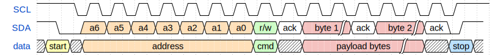

# Introduction

[Embassy](https://github.com/embassy-rs/embassy) is a modern, `async` embedded framework for Rust. It provides efficient, non-blocking abstractions for microcontrollers.

First, clone the `embassy-rs` repository.

```shell
git clone git@github.com:embassy-rs/embassy.git
cd embassy
```

## Environment setup

For those of you working in Visual Studio Code, the Embassy project has support for `rust-analyzer`. In order to properly set it up, make sure you correctly open the project's root folder (`embassy`), and modify the workspace settings according to the example bellow.

```json title=".vscode/settings.json"
{
  // ...

  // Uncomment the target of your chip.

  // highlight-start
  //"rust-analyzer.cargo.target": "thumbv6m-none-eabi",
  "rust-analyzer.cargo.target": "thumbv7m-none-eabi",
  //highlight-end
  // "rust-analyzer.cargo.target": "thumbv7em-none-eabi",
  //"rust-analyzer.cargo.target": "thumbv7em-none-eabihf",
  //"rust-analyzer.cargo.target": "thumbv8m.main-none-eabihf",
  "rust-analyzer.cargo.features": [
    // Comment these features
    // highlight-start
    // "stm32f446re",
    // "time-driver-any",
    // "unstable-pac",
    // "exti",
    // "rt",
    // highlight-end
  ],
  "rust-analyzer.linkedProjects": [
    // highlight-next-line
    "examples/stm32f4/Cargo.toml",
    // To work on the examples, comment the line above and all of the cargo.features lines,
    // then uncomment ONE line below to select the chip you want to work on.
    // This makes rust-analyzer work on the example crate and all its dependencies.
    // "examples/mspm0c1104/Cargo.toml",
    // "examples/mspm0g3507/Cargo.toml",
    // ...
  ],
}

```

## Blink an LED

Fortunately, Embassy provides a variety of examples implemented for a multitude of hardware platforms, our **STM32F429ZI** included. Examples for our board can be found in the `examples/stm32f4` crate. Multiple examples can be found in the `src` folder, organized as separate *binaries*. To flash one of the examples, simply run:

```shell
cd examples/stm32f4
cargo run --bin <EXAMPLE>
```

Go ahead and run the `blinky` example. You should get an output similar to this.

```shell
cargo run --bin blinky
    Compiling proc-macro2 v1.0.97
    Compiling unicode-ident v1.0.18
    ...
    Compiling embassy-net v0.7.0 (/Users/danut/Work/eurotock/ipw-repos/embassy/embassy-net)
    Finished `dev` profile [unoptimized + debuginfo] target(s) in 12.33s
     Running `probe-rs run --chip STM32F429ZITx target/thumbv7em-none-eabi/debug/blinky`
      Erasing ✔ 100% [####################] 128.00 KiB @  44.41 KiB/s (took 3s)
  Programming ✔ 100% [####################]  81.00 KiB @  31.50 KiB/s (took 3s)                         Finished in 5.46s
0.000000 [TRACE] BDCR ok: 00008200 (embassy_stm32 src/rcc/bd.rs:221)
0.000000 [DEBUG] flash: latency=0 (embassy_stm32 src/rcc/f247.rs:264)
0.000000 [DEBUG] rcc: Clocks { hclk1: MaybeHertz(16000000), hclk2: MaybeHertz(16000000), hclk3: MaybeHertz(16000000), hse: MaybeHertz(0), lse: MaybeHertz(0), lsi: MaybeHertz(0), pclk1: MaybeHertz(16000000), pclk1_tim: MaybeHertz(16000000), pclk2: MaybeHertz(16000000), pclk2_tim: MaybeHertz(16000000), pll1_q: MaybeHertz(0), plli2s1_p: MaybeHertz(0), plli2s1_q: MaybeHertz(0), plli2s1_r: MaybeHertz(0), pllsai1_q: MaybeHertz(0), rtc: MaybeHertz(32000), sys: MaybeHertz(16000000) } (embassy_stm32 src/rcc/mod.rs:71)
0.000152 [INFO ] Hello World! (blinky src/bin/blinky.rs:13)
0.000915 [INFO ] high (blinky src/bin/blinky.rs:18)
0.302062 [INFO ] low (blinky src/bin/blinky.rs:22)
```

### 3-bit Counter

For this task, you will have to implement a 3-bit counter, using the 3 on-board LEDs and the `USER` button on board.

You will need to create a new binary in the `src/bin` folder you can name `counter-3bit.rs`, starting from the `blinky.rs` example.

```rust title="src/bin/counter-3bit.rs.rs"
#![no_std]
#![no_main]

use defmt::*;
use embassy_executor::Spawner;
use embassy_stm32::gpio::{Level, Output, Speed};
use embassy_time::Timer;
use {defmt_rtt as _, panic_probe as _};

#[embassy_executor::main]
async fn main(_spawner: Spawner) {
    let p = embassy_stm32::init(Default::default());
    info!("Hello World!");

    let mut led = Output::new(p.PB7, Level::High, Speed::Low);

    loop {
        info!("high");
        led.set_high();
        Timer::after_millis(300).await;

        info!("low");
        led.set_low();
        Timer::after_millis(300).await;
    }
}
```

The first step is figuring out the pins the other two LEDs are connected to. To do so, you can consult the board's [User Manual](https://www.st.com/resource/en/user_manual/um1974-stm32-nucleo144-boards-mb1137-stmicroelectronics.pdf).

```rust title="src/bin/counter-3bit.rs.rs"
#[embassy_executor::main]
async fn main(_spawner: Spawner) {
    let p = embassy_stm32::init(Default::default());
    info!("Hello World!");

    let mut led0 = todo!("Replace me");
    let mut led1 = Output::new(p.PB7, Level::High, Speed::Low);
    let mut led2 = todo!("Replace me");

    loop {
        // ...
    }
}
```

Next, you will have to instantiate the button. We will want to use one of the external interrupt lines, in order to use the asynchronous methods for the user button.

```rust
let button = ExtiInput::new(p.PC13, p.EXTI13, Pull::Down);
```

Make sure to fix all the import errors.

Now, inside the main `loop`. Await for the button to be pressed in order to update the *"3-bit display"*.

```rust title="src/bin/counter-3bit.rs.rs"
let mut counter = 0;
loop {
    button.wait_for_high().await;
    counter = (counter + 1) % 7;

    // Depending on the value of each of the three bits,
    // set the LEDs high or low
}
```

### Improved `BinaryCounter`

With everything in place, here comes the question of extending the functionalities. We would like for this display mechanism to be painlessly extensible to work with any number of LEDs. The quick and painless answer to this problem is generics. We must define a generic `BinaryCounter`.

```rust title="src/bin/binary-counter.rs"
struct BinaryCounter<'a, const N: usize> {
    inner_counter: usize,
    leds: [Output<'a>; N],
}

impl<'a, const N: usize> BinaryCounter<'a, N> {
    fn new(leds: [Output<'a>; N]) -> Self {
        Self {
            inner_counter: 0,
            leds,
        }
    }
}
```

Next, we will define the API for interacting with our display. We will have two methods, `increment` which will increase the inner counter's value by one unit and `display`, which will update the LEDs state.

```rust title="src/bin/binary-counter.rs"
impl<'a, const N: usize> BinaryCounter<'a, N> {
    fn new(leds: [Output<'a>; N]) -> Self {
        Self {
            inner_counter: 0,
            leds,
        }
    }

    /// This function increases the inner counter
    fn increment(&mut self) {
        core::todo!()
    }

    /// This function updates the state of the LEDs
    /// according to the `inner_counter` value
    fn display(&mut self) {
        core::todo!()
    }
}
```

With the interface in place, we can write the `main` function.

```rust title="src/bin/binary-counter.rs"
#[embassy_executor::main]
async fn main(_spawner: Spawner) {
    let p = embassy_stm32::init(Default::default());
    info!("Binary Demo!");

    // TODO: `Output` definition

    let mut bc = BinaryCounter::new([led0, led1, led2]);

    let mut button = ExtiInput::new(p.PC13, p.EXTI13, Pull::Down);

    loop {
        bc.display();
        button.wait_for_high().await;
        bc.increment();
    }
}
```

### I2C

The Inter-Integrated Circuit (I2C) is a synchronous, multi-controller/multi-target communication protocol. Similarly to the SPI, it allows data transfer between a controller and one or more peripheral ICs, but it uses only 2 wires (1 data line and 1 clock line, making it half-duplex) and has a different way of addressing the peripherals: using their unique *addresses*.

#### Configuration


I2C transmission uses 2 lines:

- **SCL** - **S**erial **CL**ock line - clock is generated by the controller - used to synchronize communication between the controller and the targets
- **SDA** - **S**erial **DA**ta line - carries data between the controller and the addressed target
  - targets read data from SDA **only** when the clock is *low*
  - targets write data to SDA **only** when the clock is *high*

:::info Half duplex
The communication is *half-duplex*. This means that data is transmitted only in one direction at a time, since there is only *one* data line that can be used both for sending data to the target and receiving data from the target.
:::

:::info I2C inner works
The `SDA` and `SCL` wires are never actually driven (set to `LOW`/`HIGH`) by the controller/peripherals. The line is controlled by either pulling the line low or releasing the line high.

When the line is *pulled down*, this means that it is connected directly to `GND`. This electronically translates to `LOW`.

When the line is *released*, or *pulled up*, this means that it connects back to `3V3` (which we can consider as being the "default" state of the wire) through a pull-up resistor. This electronically translates to `HIGH`.

This is called *open-drain connection*. You can read more about how it works [here](https://www.ti.com/lit/an/sbaa565/sbaa565.pdf?ts=1712891793335#:~:text=I2C%20is%20a%20two%2Dwire,and%20receive%20commands%20and%20data.), at section 2.2.
:::

#### Data transmission

Each target is associated with a unique *address*. The controller uses this address to initiate communication with that target. This address can either be 7 or 10 bits.

##### Initiation

Before the transmission, both the `SCL` and `SDA` lines are set to `HIGH`. First thing the controller does is to signal a `start` condition by pulling the `SDA` line to `LOW`. All targets understand that the communication is about to commence and listen on the `SDA` line. Next, the controller starts the clock and begins to write the address of the target it wants to talk to, followed by a command bit that signifies whether the controller wants to *read* from the target or *write* to it. Whichever target recognizes its address, responds with an `ACK` (acknowledged), by pulling the `SDA` to `LOW`. If no target responds and the `SDA` stays `HIGH`, then it is considered a `NACK` (not acknowledged). Afterwards, the data transmission can begin.

##### Transmission

Depending on the command bit (R/W), either the controller or the target begins to send data over the `SDA` line. Data is sent one byte at a time, and then acknowledged by the receiver. One sequence of a data byte and `ack` is called a *frame*. 

During the communication, data can be:

- written to the `SDA` line *only* when `SCL` is `LOW` or
- read from the `SDA` line *only* when `SCL` is `HIGH`.

##### End

To end the transmission, the controller signals a `stop` condition. This is done by releasing the `SCL` line to `HIGH`, and then also releasing the `SDA` line. Since data can be written *only* when `SCL` is `LOW`, the target understands that this is a special event, that means that the communication has ended.



:::note 10-bit addresses
For 10-bit addresses, the controller first issues a specific sequence of bits. This sequence is reserved, therefore targets with 7-bit addresses are prohibited from having addresses that start with this sequence. These bits mark the fact that the controller is attempting to initiate communication with a target with a 10-bit address, so all 7-bit targets ignore the `SDA` line once they recognize this sequence. After the special sequence, the controller sends the upper 2 bits of the address and the command bit, then waits for an `ack` from the target(s) that have an address that begins with these 2 bits. Afterwards, it sends the rest of the address, and waits for an acknowledgement from the target.


:::

#### I2C in Embassy

These are the I2C imports we will be using. We will use the functions provided by the `embedded_hal_async` crate, since these are standard and used by most frameworks.

```rust
use embassy_stm32::i2c::I2c;
use embassy_stm32::{bind_interrupts, i2c, peripherals};
```

:::info `I2c` trait importing
We use `I2c as _` from `embedded_hal_async` because in order to use the trait methods, we need to import it.
:::

We start by initializing the peripherals.

```rust
let peripherals = embassy_stm32::init(Default::default());
```

Next, we declare the pins we will be using for the SDA and SCL lines. We can find which pins of the Raspberry Pi Pico have these functions by looking at the pinout.

```rust
let sda = peripherals.PIN_X;
let scl = peripherals.PIN_Y;
```

We then initialize our I2C instance, using the pins we defined earlier and a default configuration. It's recommended to use the asynchronous version, since it won't block the executor.

```rust
/// I2C
let mut i2c = I2c::new_async(peripherals.I2CX, scl, sda, Irqs, peripherals.DMAX_CHX, peripherals.DMAX_CHX, Default::default());
```

The first argument of the `new` function is the I2C channel that will be used. Each has multiple sets of pins that can be used for and you can find them marked in blue on the pinout diagram. 

The `Irqs` variable refers to the interrupt that the I2C driver will use when handling transfers. We also need to bind this interrupt, which depends on the I2C channel we are working with.

```rust
bind_interrupts!(struct Irqs {
    I2C1_EV => i2c::EventInterruptHandler<peripherals::I2C1>;
    I2C1_ER => i2c::ErrorInterruptHandler<peripherals::I2C1>;
});
```

:::warning `I2cConfig` and `I2cInterruptHandler` are renamed imports
Because of the Embassy project naming convention, multiple `Config`s and `InterruptHandler`s can exist in one file. To solve this without having to prefix them with their respective module in code every time we use them (i.e use `i2c::Config` and `i2c::InterruptHandler`), in the code examples above `I2cConfig` and `I2CInterruptHandler` are renamed imports:
```rust
use embassy_stm32::i2c::{I2c, InterruptHandler as I2CInterruptHandler, Config as I2cConfig};
```
:::

#### Reading from a target

To read from a target, we will be using the `read` **async** function of the I2C driver. 

The function takes 2 parameters:
- the address of the target we are attempting to receive the data from
- the *receiving* buffer in which we will store the data received from the target

The following example reads two bytes from the target of address `0x44`.

```rust
const TARGET_ADDR: u16 = 0x44;
let mut rx_buf = [0x00u8; 2];
i2c.read(TARGET_ADDR, &mut rx_buf).await.unwrap();
```

#### Writing to a target

To write data to a target, we will be using the `write` **async** function of the I2C driver.

This function also takes 2 parameters:

- the address of the target we are attempting to transmit the data to
- the *transmitting* buffer that contains the data we want to send to the target

The following example writes two bytes to the target of address `0x44`.

```rust
const TARGET_ADDR: u16 = 0x44;
let tx_buf = [0x01, 0x05];
i2c.write(TARGET_ADDR, &tx_buf).await.unwrap();
```

:::info
We can also use `write_read` if we want to perform both a write and a read one after the other.

```rust
i2c.write_read(TARGET_ADDR, &tx_buf, &mut rx_buf).await.unwrap();
```
:::

### AT24C256 EEPROM

The AT24C256 is a 256-kilobit **Electrically Erasable Programmable Read-Only Memory** (EEPROM) device that communicates using the I2C protocol. It is commonly used for storing non-volatile data, such as configuration settings or calibration data, which need to persist even when the device is powered off.

#### Device Addressing

The AT24C256 uses a 7-bit I2C address, with the most significant 5 bits fixed as `10100`. The remaining 2 bits are configurable by connecting the `A1` and `A0` pins to either `GND` or `VCC`, allowing up to 4 devices to be connected on the same I2C bus. Knowing the state of the pins, you can determine the address using the formula: `0x50 | (A1 << 1) | A0`. To determine the address of the EEPROM used by our board, you can check the [schematic](https://gitlab.cs.pub.ro/pmrust/pm-ma-pcb/-/blob/main/Schematic/MA.pdf?ref_type=heads) or perform an I2C scan.

#### Memory Organization

The memory is organized into 32,768 bytes, divided into 512 pages of 64 bytes each. Each byte can be accessed individually, or multiple bytes can be written/read in a single operation using page addressing.

##### Reading from the AT24C256

To read data from the EEPROM, you first need to write the memory address you want to read, then read the byte at that memory location. Because we are working with 32,768 bytes of memory (which is 2<sup>15</sup> bytes), we are working about 2-byte addresses that need to be sent **High byte** first (big endian).

```rust
let mem_addr: u16 = 0xCAFE; // 16 bit address
let memory_address: [u8; 2] = mem_addr.to_be_bytes(); // `be` stands for big endian
let mut data: [u8; 1] = [0];

i2c.write_read(EEPROM_ADDR, &memory_address, &mut data).await.unwrap();
```

:::note Sequential read
The AT24C256 supports sequential reads. After the EEPROM sends a data word (byte), if the microcontroller sends a responds with an **ACK** instead of a **Stop Condition** the memory will continue to increment the internal data word address and serially clock out sequential data words. When the memory address limit is reached, the data word address will *"roll over"* (begin writing from the beginning) and the sequential read will continue.

This means that we can read multiple consecutive bytes:

```rust
let mem_addr: u16 = 0xBABE; // 16 bit address
let mem_buff: [u8; 2] = mem_addr.to_be_bytes(); // `be` stands for big endian
let mut data: [u8; 10] = [0; 10];

i2c.write_read(EEPROM_ADDR, &mem_buff, &mut data).await.unwrap();
```
:::

##### Writing to the AT24C256

The EEPROM supports the writing of up to 64 bytes (one page) in a single transaction. The microcontroller performs a write transaction where the first two bytes are the 16-bit memory location in big endian format, followed by a number of bytes that should be written, starting from that respective address. The particularity of this memory module is that, for a write within a **page** when reaching the upper page boundary, the internal data word address would do a *"roll over"* to the address of the first byte of the same page.

```rust
let mem_addr: u16 = 0xBABE; // 16 bit address
let mem_buff: [u8; 2] = mem_addr.to_be_bytes(); // `be` stands for big endian
let data: [u8; 8] = [0xCA, 0xFE, 0xBA, 0xBE, 0xDE, 0xAD, 0xBE, 0xEF];

let mut tx_buf = [0x00; 8 + 2];
tx_buf[..2].copy_from_slice(&mem_buff);
tx_buf[2..].copy_from_slice(&data);

i2c.write(EEPROM_ADDR, &tx_buf).await.unwrap();
```

:::danger Write delay
After each complete memory write transaction, the EEPROM an internally-timed write cycle of roughly **5ms**. If you have to perform a series of consecutive writes, make sure to space them out appropriately.
:::

#### `eeprom24x` crate

To simplify the interfacing with the non-volatile memory for your **project**, you can use the [`eeprom24x`](https://crates.io/crates/eeprom24x) crate. It is a is a platform agnostic Rust driver for the 24x series serial EEPROM, based on the [`embedded-hal`](https://docs.rs/embedded-hal/1.0.0/embedded_hal/) traits. This means that you will not be able to harness the power of the async executor, and you will need to use the conventional **blocking** API.

## Asynchronous basics

Until now you've only worked with simple (almost) serial programs. However, not all programs can be designed to run serially/sequentially. Handling multiple I/O events concurrently usually requires separate parallel tasks. For example, reading a button press while blinking an LED. A single loop would block the button reading event while waiting for the timer to finish.

To address this issue, we would need to spawn a new task in which we would wait for the button press, while blinking the LED in the `main` function.

The signature of the task that toggles the LED when the button is pressed would need to receive both an `Input` and `Output` as arguments.

```rust title="src/bin/button_task.rs"
#[embassy_executor::task]
async fn button_task(mut led: Output<'static>, mut btn: ExtiInput<'static>) {
    loop {
        //  TODO:
        //  * `await` button rising edge
        //  * print message with `info!`
        //  * toggle LED
    }
}
```

In the main function, tasks can be spawned using the `Spawner` provided as an argument.

```rust title="src/bin/button_task.rs"
#[embassy_executor::main]
async fn main(spawner: Spawner) {
    let p = embassy_stm32::init(Default::default());
    
    // TODO: initialize LEDs and button

    spawner.must_spawn(button_task(led, btn));

    loop {
        // Handle other LED blink
    }
}
```

To periodically blink and LED, you will need to be able to introduce a delay. You can do so manually, by introducing a `for` loop with a number of steps that takes into account the frequency of the processor. The issue with this method is that it would do a *"busy loop"* where the processor spends both time and energy doing unproductive instructions.

This approach does not benefit from the underlying `async` that could schedule another task with available work to be executed. If you want to introduce delays the *`embassy`* way, you can do it using the `Timer` interface, specifically the `Timer::after()` function which takes a `Duration`, or the more direct `after_milis`, `after_secs`, etc.

:::note Shield schematic

Schematic for the OxidOS shield that you can use in the project:


:::
