# Electronics

In this course, we'll cover a few topics related to electronics and hardware. We'll touch on some laws of physics, examples of components used in the world of embedded systems, as well as some information about datasheets and how to “decipher” them.

## Resources
1. **Charles Platt and Fredrik Jansson** Encyclopedia of Electronic Components Volume 1, 2 & 3

2. [MIT 6.622 Power Electronics, Spring 2023](https://youtube.com/playlist?list=PLUl4u3cNGP62UTc77mJoubhDELSC8lfR0&si=dXp3xzqAtS1J0qbd)

3. **Cathleen Shamieh** Electronics For Dummies

## Basic electronics

### Definitions

#### Electric voltage

Electrical voltage is the potential difference between two points in a circuit and is proportional to the energy required to move an electric charge between those two points.

$$
V = \frac{W}{Q}
$$

V = Electromotive voltage (U in romanian);  
W = Mechanical work of the electric force (L in romanian);  
Q = Electric charge;

The unit of measurement for electrical voltage in the SI system[^si] is the **volt** (V)

$$
[V]_{SI} = V(Volt)
$$
$$
[W]_{SI} = J(Joule)
$$
$$
[Q]_{SI} = C(Coulomb)
$$

:::info

Electrical voltage is always measured between two points in a circuit. Generally, voltages are measured relative to a reference point called the circuit ground **(GND)**. Circuit ground is a convention and represents the point whose potential is considered to be zero.

:::

#### Electrical resistance

Electrical resistance is a physical quantity that expresses a material's property of opposing the flow of electric current. The SI unit[^si] of resistance is the **ohm**, denoted by &ohm;.

$$
[R]_{SI} = \Omega(Ohm)
$$

#### Intensity of electric current

Electric current, also known as electric flow, is a scalar physical quantity equal to the change in electric charge passing through the cross-sectional area of a conductor per unit of time. The unit of measurement in the SI system[^si] is the **ampere** (A).

$$
[I]_{SI} = A(Ampere)
$$

#### Electrical Power

Electric power is the rate at which electrical energy is converted into another form of energy such as heat, light, or motion. It indicates how much “work” a circuit performs and is calculated by multiplying the voltage by the flow of electrons (current).

$$
P = V * I
$$

:::info

If we know the current and the resistance, we can derive the following formula:

$$
P = I^2 * R 
$$

This formula helps us understand a real-life situation that we encounter very frequently. When we double the intensity of the electric current, we actually quadruple it, and this can be catastrophic for our projects.
:::

Electrical power is measured in watts (W) in the SI, which is denoted as follows:

$$
[P]_{SI} = W(Watt)
$$

### Ohm's laws

The current (I) flowing through a resistor is directly proportional to the voltage (V) applied to the resistor and inversely proportional to its resistance (R).

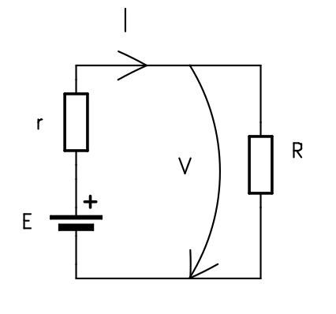

$$
I = \frac{V}{R};
$$

I = intensity of electric current(A)   
V = electric voltage(V)   
R = circuit's resistance(&ohm;)

### Kirchhoff's First law

The sum of the currents entering a node is always equal to the sum of the currents leaving that same node.

$$
\sum_{k=1}^{n} I_k = 0
$$

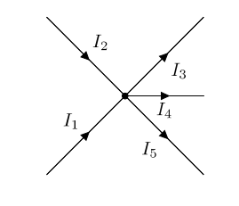

$$
I_1 + I_2 = I_3 + I_4 + I_5
$$
$$
I_1 + I_2 - I_3 - I_4 - I_5 = 0
$$

### Kirchhoff's Second law

Around any closed loop in a circuit, the directed sum of the potential differences between the components is equal to zero.

$$
\sum_{k=1}^{n} V_k = 0
$$

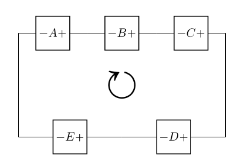

$$
-V_A - V_B - V_C + V_D + V_E = 0
$$

### Series vs Parallel Circuits

When multiple components are connected in a circuit, the way they are arranged affects the behavior of the voltage and current within the circuit.

**Series (Shared Current)**: Components are connected end-to-end in a single line. Because there is only one path for the electrons to flow, every component shares the exact same current ($I_1 = I_2 = I_3$). However, they split the total voltage among them.

**Parallel (Shared Voltage)**: Components are connected side-by-side across the same two points. Because they are tied directly to the same source rails, every component shares the exact same voltage ($V_1 = V_2 = V_3$). However, the total current splits down the different paths.

:::info

In order to remember easier this definitions we can have a "Golden Rule":

$ Series = Same Current. Parallel = Same Voltage. $

:::

### Voltage divider

There are numerous types of voltage dividers, named according to the type of components they are made of: resistive divider, capacitive divider, compensated divider, etc.
**A resistive voltage divider** is created by applying a voltage $$E$$ to a group of resistors connected in series, thereby producing a fraction of the voltage applied to one of the resistors in the group.

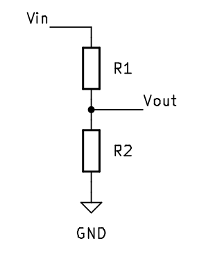

$$
V_{out} = V_{in} * \frac{R_{2}}{R_{1} + R_{2}};
$$

:::warning
A voltage divider can be considered a power supply only if it operates in an open-circuit condition. **It is not recommended** to use a voltage divider to power a circuit, because its internal resistance is high and energy is lost due to heating. It can be used to provide reference voltages.
:::

### The Loading Effect & Input Impedance

When learning about voltage dividers, we use a simple formula to calculate the output voltage: 

$V_{out} = V_{in} \cdot \frac{R_2}{R_1 + R_2}$.

However, this formula contains a hidden assumption: it assumes that the load (the circuit you connect to the output) has infinite resistance and draws absolutely no current.

In reality, every circuit has an input impedance, an internal resistance it presents to the voltage source. When you connect a circuit to a voltage divider, its input impedance acts as a third resistor connected in parallel with $R_2$.

Since connecting resistors in parallel reduces the total resistance, the lower half of the voltage divider suddenly exhibits a lower resistance than calculated, which causes the output voltage you carefully planned to “drop” or decrease. This phenomenon is called the “load effect.”

#### What happens if we use the voltage divider to supply a circuit.

We consider a voltage divider that provides $$3V3$$ from a $$5V$$ power source $$E$$ and a load resistance, $$R_s$$, representing the current consumption of a sensor or a circuit that needs to be supplied at $$3V3$$.

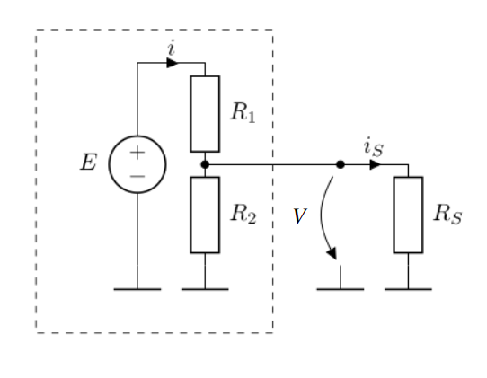

From Kirchhoff's First Law, the current through $$R_1$$ must be equal to the sum of the current through $$R_2$$ and $$R_s$$. 

$$
I_{R_1} = I_{R_2} + I_{R_S}
$$
$$
V = V_{E} * \frac{R_2 || R_S}{R_1 + R_2 || R_S};
$$

:::note
Equivalent resistor value
- series

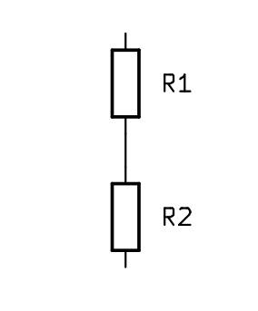

$$
R_{series} = R_1 + R_2
$$

- parallel 

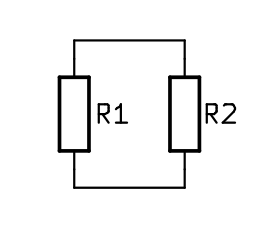

$$
R_{parallel} = R_1 || R_2
$$
$$
\frac{1}{R_{parallel}} = \frac{1}{R_1} + \frac{1}{R_2} 
$$
:::

The output voltage depends on the current intensity through $$R_s$$, on the current consumption of the circuit that needs to be supplied at $$3V3$$. This is not a viable power supply solution.

Beside the instability of the voltage divider with a load, the power rating for the $$R_1$$ must be suitable.

$$
P_{R_1} = V_{R_1} * I_{R_1}
$$

The power dissipation on the resistor is directly proportional with the current through the resistor. Resistor are fabricated with predefined power ratings, most common $$1/4W$$, $$1/2W$$, $$1W$$. 

:::note
For a better understanding, please read the chapter 10 of *Encyclopedia of Electronic Components*, Volume 1
:::

:::info
In case we want to use the voltage divider between two chosen voltage values, we can use the generalized formula:

$$
V_{out} = ( V_{1} - V_{2} ) * \frac{R_{2}}{R_{1} + R_{2}};
$$

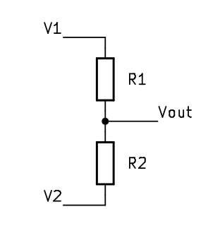

:::

### Power Rails and Ground

In electrical schematics and on physical test boards, tracing each individual wire all the way to the battery quickly turns into a tangled mess. Instead, we use power lines, common connection points that distribute current throughout the entire circuit.

You will frequently encounter these designations on circuit diagrams and on component pins:

* **VCC or VDD**: The main positive supply voltage. (In the past, these letters referred to specific transistor pins(collectors and drains) but today they simply mean “this is where the positive supply is connected.”)

* **3V3 and 5V**: The exact supply voltages required by the component (3.3 volts and 5.0 volts)
* **VBUS**: The power line specifically derived from a USB connection (usually 5V).

* **GND (ground)**: The 0V reference point and the return path to the negative terminal of the power supply.

:::note
“3V3” uses the letter “V” as a decimal point, because a small dot is easily lost or blurred on printed circuit boards!
:::

#### Why Must Devices Share a Common Ground?

If you connect two different modules together, for example, an Arduino (powered via USB) and a motor driver (powered by a 12-volt battery) you must connect their GND pins together.

Why? Because voltage is a relative measure. It represents the difference in electrical potential between two points. The reference point is simply the arbitrary point in our circuit that we define as “0 volts.”

In electronics, if two circuits do not share a common ground, they do not have the same reference point for the 0 V value. If your Arduino sends a 5 V “start” signal to a motor driver without a common ground, the motor driver has no reference point against which to measure that 5 V. The signal will be unreferenced, communication will fail, and the circuit will not work.

:::note

Whenever you connect two separate boards or circuits to communicate, their grounds must be tied together to establish a shared 0V reference.

:::

## Electronic Components  

### Actuators and sensors

In order to interface with the external environment, various electronic components are used, serving either as actuators (modifying the state of the external environment) or as transducers/sensors (influenced by the external environment and providing information to the microcontroller about various parameters).

Examples of actuators:
- Fans    
- Audible indicators (buzzers)
- Light indicators
- Heating resistors

:::tip
Sometimes, to activate an actuator, an actuating element is needed. For instance, to start a motor, the microcontroller simply sends a logical start command to a transistor that opens and allows a high current to pass through it (here, by "high current", we compare it to the maximum of a few milliamperes that a microcontroller can output).
:::

Examples of sensors:

- Buttons
- Photo resistors - their electrical resistance is influenced by the amount of light
- Thermistors - their electrical resistance is influenced by temperature

:::tip
Depending on the type of transducers, they may require signal processing before being taken in by the microcontroller (signal conditioning). For example, a photo resistor needs to be used in a circuit with a voltage divider or a current source. Alternatively, some sensors can be connected directly to the microcontroller, such as buttons.
:::

:::note
For a better understanding, please read *Encyclopedia of Electronic Components*, Volume 3
:::

### LEDs

LEDs - Light Emitting Diode - also called electroluminescent diodes - emit light when they are directly polarized. Not to be confused with light bulbs as they have radically different methods of operation.   

LEDs can be used as indicator lights (often used in various appliances to signal that the appliance is on and doing something), or for illumination, in which case power LEDs are used. In the lab, LEDs are used to indicate the status of a pin.

#### Calculation of current limiting resistor

To use an LED for the purpose of indicating the status of a pin (rather said to indicate the presence of voltage), the current through the LED must be limited. This can be done most simply by stringing a resistor with the LED.   

An LED is designed to operate at a nominal current (ex: 10mA). The voltage drop at this current across low power indicator LEDs is given by the chemistry of the LED (this also gives the color of the LED). In the lab, since we are using such a low current LED, we can power it directly from the logic pins of the MCU.

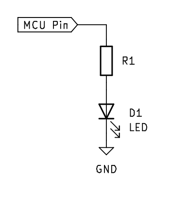

$$
R_{1} = \frac{(V_{pin} - V_{led})}{I_{led}}
$$

#### Example:

If the MCU has a pin voltage of 3.3V, also noted as 3V3, to light up an LED with a nominal current of 10mA and a voltage drop of 2V we need 
a resistance of 130 &ohm;.

:::tip
We can use a resistor with a higher resistance value. The nominal current will light up the LED at it's maximum brightness. For status LEDs we can pick a resistance even 10 times bigger and the LED will light up slightly. 
:::

:::danger
If there is no resistor in the circuit, the resistance will be almost 0 &ohm;, the current will tend to $$\infty$$, meaning a short circuit. This will absolutely burn the LED and make it unusable, but it can also burn the MCU. Most MCUs have short circuit protection, but is safer to not rely on that.  
:::

:::note
For a better understanding, please read the chapter 22 of *Encyclopedia of Electronic Components*, Volume 2
:::

### Buttons

The simplest way for the user to interact with a MCU is through the use of buttons.

There are various ways to connect a button to the MCU, but these are the most used versions:

:::warning[Incorrect]

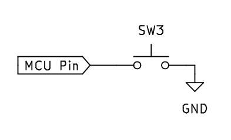   

This diagram shows a button connected to the MCU pin. When the button is pressed, the MCU input pin will be connected to GND, so it will be in the logic "0" state. This way of binding is **incorrect** because when the button is not pressed, the input is in **an undefined state** (as if left in the air), not being connected to either GND or Vcc! This state is called the **increased impedance state**. In practice, if we now read the value of the pin, it will produce a result of 1 or 0 depending on the environmental conditions. For example, if we bring our finger closer to that input, the reading will be 1, and if we move our finger away, the reading will be 0. 
:::

:::tip[Correct]

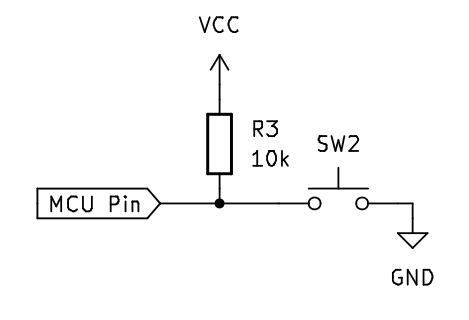   

 This is the correct way to connect the button, using a **pull-up resistor** between the input pin and Vcc. This resistance has the role of bringing the input to the logic "1" state when the button is free by "raising" the line potential to Vcc. Alternatively, a **pull-down resistor** (connected to GND) can be used, in which case the input is held in the logic "0" state while the button is not pressed.
::: 

:::info
To save external space, in most MCUs these resistors have been included inside the integrated circuit. Initially they are disabled and their activation can be done through software.
:::

:::note
For a better understanding, please read the chapter 5 of *Encyclopedia of Electronic Components*, Volume 1
:::

### Breadboard and jumper wires

#### Breadboard

A breadboard is a rectangular board with a grid of holes that allows you to create temporary electronic circuits without soldering. The board typically has metal strips underneath the surface, connecting the holes in certain patterns. These patterns follow a standard layout, facilitating circuit building. Breadboards are reusable and provide a convenient way to prototype circuits quickly and make changes easily by rearranging components.

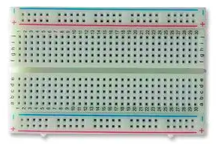   
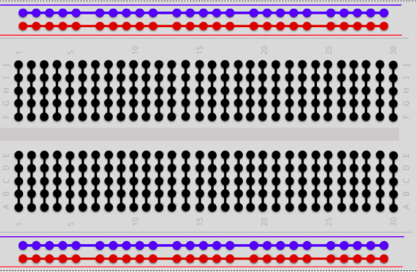   
Breadboard connection   
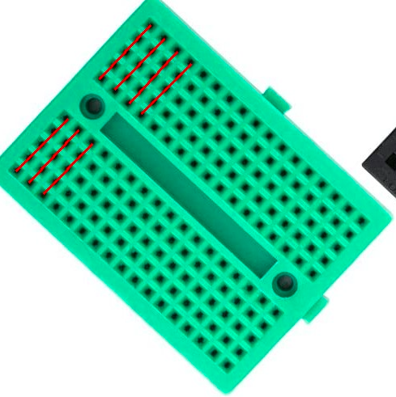   
Small breadboard connection

#### Jumper wires

Jumper wires are flexible wires with connectors at each end, typically male connectors (pins) or female connectors (sockets). They are used to create electrical connections on a breadboard by plugging one end into a hole on the breadboard and the other end into another hole, forming a connection between the two points.

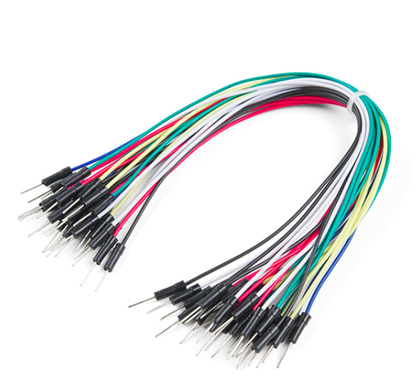   
Jumper wires

:::note
For a better understanding, please read the chapter 1 of *Encyclopedia of Electronic Components*, Volume 1
:::

### Using a Multimeter: The Electronics Stethoscope

The multimeter is the most important troubleshooting tool on your workbench. It allows you to “see” the invisible forces in your circuit. Here’s how to use its four essential modes:

* **Voltage (V)**: Voltage is measured in parallel. You do not need to disconnect anything or alter the circuit. Just touch the black probe to Ground (GND) and the red probe to the point you want to check. This tells you the electrical pressure at that exact location.

* **Resistance (Ω)**: Resistance is measured across a component, but the circuit must be completely powered OFF. To measure resistance, the multimeter sends a tiny pulse of its own battery power through the component to see how hard it pushes back. If the main circuit is on, the extra power will ruin the measurement and potentially damage the meter.

* **Continuity (Sound wave icon)**: This is the mode you will use most often. It simply tests if two points are electrically connected. If there is a clear path (very low resistance), the meter will beep continuously. It is perfect for finding broken wires, verifying solder joints, or ensuring two grounds are actually tied together.

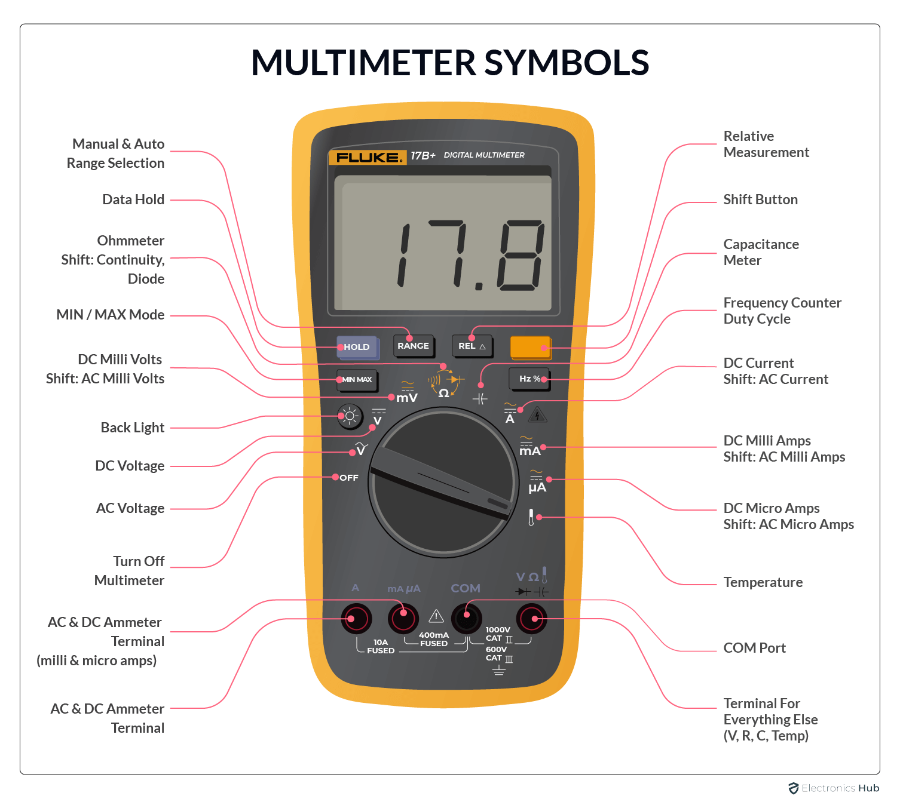

:::danger

To let current flow through it easily, a multimeter in current mode has almost zero internal resistance (it acts exactly like a bare piece of wire).

If you forget you are in current mode and try to measure voltage (by touching the probes across a battery or power rails in parallel), you will instantly create a dead short circuit. A massive amount of current will rush through the meter, instantly blowing its internal safety fuse with a loud POP and potentially melting your probe tips. Always double-check your dial and probe sockets before probing a live circuit!

:::

## Datasheets

### What is a datasheet

Technical data sheets, also known as data sheets or specification sheets, are documents that provide a concise overview of a product, piece of equipment, component (such as an electronic part), material, subsystem (such as a power supply), or software. Their purpose is to provide enough information for a buyer to understand the product and for a design engineer to understand the component’s role within the overall system.

Although technical data sheets are essential, they have certain limitations. Some are comprehensive, while others are concise. Certain technical data sheets include illustrative diagrams as a guide for using a component, but many do not contain such information. It is important to note that technical data sheets typically do not go into detail about a component’s internal workings, as their primary purpose is to convey essential information rather than provide in-depth explanations of functionality.

### How to read a datasheet

We will use a [presence sensor](https://ro.mouser.com/datasheet/2/365/GP2Y0A02YK0F_13May05_Spec_ED-05G127-1652666.pdf), a [voltage regulator](https://www.ti.com/lit/ds/symlink/tps74801-q1.pdf?ts=1709627122770&ref_url=https%253A%252F%252Fwww.mouser.at%252F) and a [microcontroller](https://www.st.com/resource/en/datasheet/stm32u535cb.pdf) datasheets for example.

#### Pin Configuration

For commonly used components, the pin configuration, or pinout, is specified directly on the board. 

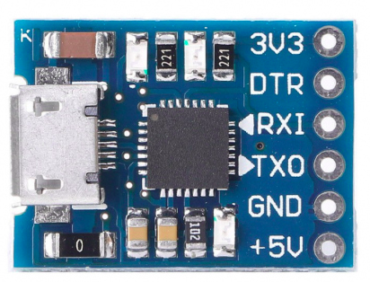   
C1202 USB to UART module

If the pinout is not present on the component, there is a sign, a dot on the case that indicates the perspective in which you need to look at the component.

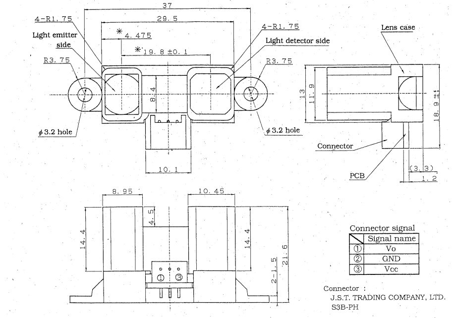   
Distance sensor - Sharp

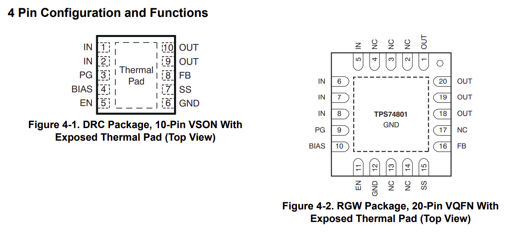   
Voltage regulator - Texas instruments

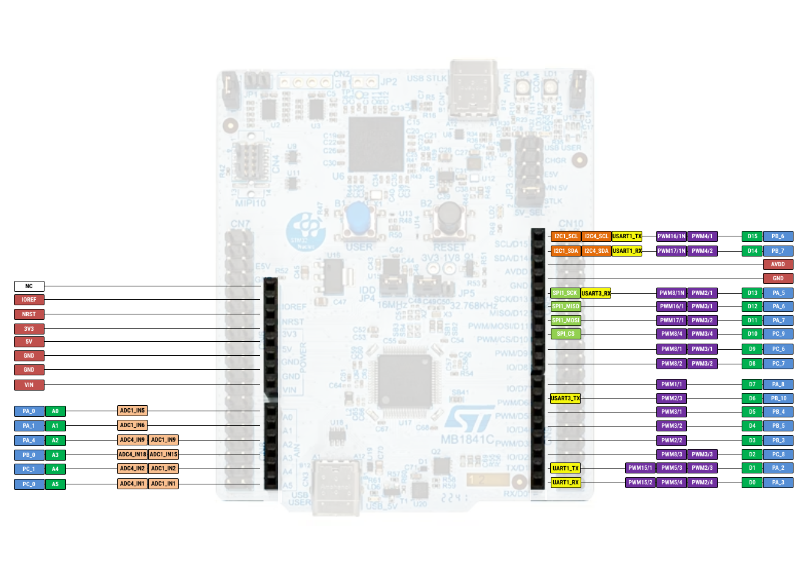   
STM32U545 MCU - STMicroelectronics

#### Operating conditions

Every electronic component has it's own characteristics and different operating conditions. The first thing tackled is the supply voltage.

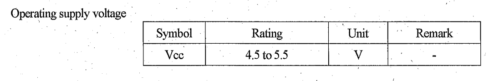   
Distance sensor - Sharp

There are two sections about the operating conditions: **absolute maximum ratings** and **recommended operating conditions**. Even if they are mentioned, you should never use your component at absolute maximum ratings as it will probably burn the component or have an undefined behavior.

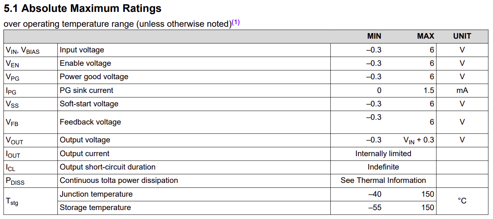
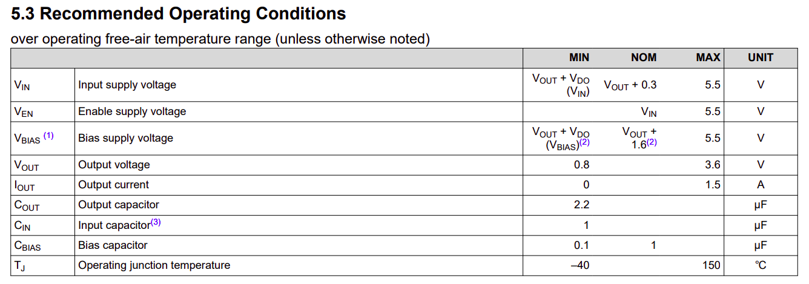
Voltage regulator - Texas Instruments

#### Output

Some components, like sensors, that are used to measure a value or to determine a condition, for simplicity, use analog output. This output is usually described in a graph.

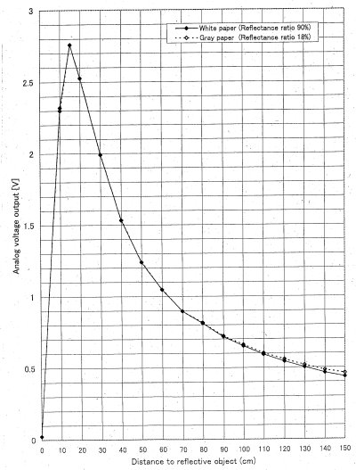   
Distance sensor - Sharp

:::tip

If your code is perfect, your wiring is correct, but your circuit still is not working, the answer is almost always hiding in the Electrical Characteristics table or a Timing Diagram.

:::

[^si]: The International System of Units, the world's most widely used system of measurement.
