# General-purpose Input/Output (GPIO)

The purpose of this lab is to understand how to start developing firmware in [Rust](https://www.rust-lang.org/) 
with [Embassy](https://embassy.dev) for the STM32U545 MCUs.

## Concepts

- How to setup an empty project that uses Embassy;
- How to use the lab board;
- How to use GPIO pins from Embassy;
- How to use the lab board's LEDs
- How to use the lab board's switches

## Resources

1. *[Embassy Book](https://embassy.dev/book/)* - an overview of the *Embassy* framework
   1. *For Beginners*
2. *[`embassy-stm32`'s Documentation](https://docs.embassy.dev/embassy-stm32/git/stm32u545re/index.html)* - the API for the STM32U545
3. *[`embassy-rp`'s Documentation](https://docs.embassy.dev/embassy-rp/git/rp2040/index.html)* - the API for the RP2040 and RP2350 
4. **The Rusty Bits**, *[Intro to Embassy : embedded development with async Rust](https://www.youtube.com/watch?v=pDd5mXBF4tY)*

### Extra Resources

4. **STMicroelectronics**, *[STM32U545 Datasheet](https://www.st.com/resource/en/datasheet/stm32u545ce.pdf)*
5. **Raspberry Pi Ltd**, *[RP2350 Datasheet](https://datasheets.raspberrypi.com/rp2350/rp2350-datasheet.pdf)*
6. **Raspberry Pi Ltd**, *[Raspberry Pi Pico 2 Datasheet](https://datasheets.raspberrypi.com/pico/pico-2-datasheet.pdf)*
7. **Raspberry Pi Ltd**, *[Raspberry Pi Pico 2W Datasheet](https://datasheets.raspberrypi.com/picow/pico-2-w-datasheet.pdf)*

## What is GPIO?

General-Purpose Input/Output, or GPIO, is an essential part of embedded systems that serves as a vital conduit between microcontrollers and microprocessors and the outside world. A microcontroller or microprocessor's group of pins that can each be set to operate as an input or an output is referred to as GPIO. The purpose of these pins is to interface external components, including actuators, displays, sensors, and other devices, so that the embedded system may communicate with its surroundings. Standardised communication protocols like SPI, I2C, PCM, PWM, and serial communication may be directly supported by some GPIO pins. There are two varieties of GPIO pins: digital and analog.

## Configuring GPIO Pins

GPIO pins can be used as outputs (LEDs, motors, buzzers) or as inputs (buttons, sensors).


Every pin of the MCU can perform multiple functions. Several peripherals need to use input and output pins.
It is the role of the *IO Bank0* to multiplex and connect the peripherals to the pins.

The STM32U545 controls the GPIO pins through several GPIO Ports (PortA, PortB, PortC, PortD, PortE, etc.). Using GPIOs implies configuring the:
1. *MODER* - connects the outer GPIO pin to one of the:
   * internal `GPIO` peripheral as `input`
   * internal `GPIO` peripheral as `output`
   * one of the alternate function peripheral (further selected by the *Alternate Function Multiplexer*)
   * the `ADC` peripheral
2. *Electrical Configuration* - manages the physical pin on the outside of the chip. It decides the electrical behavior of the pad, such as whether it has a pull‑up or pull‑down resistor, whether it drives strongly or weakly, and whether it is push‑pull or open‑drain.
3. *Alternate Function Multiplexer* - connects the internal peripherals to the outside pins. Each pin can be switched to different functions. For example, a single pin can be used as:
    * a `UART` transmit line
    * an `I2C` data line
    * an `SPI` clock or data line
    * a `TIM` timer channel
    * a `PWM` timer channel
    * ...
4. *GPIO Input/Output* - this is the simple digital interface that developers use when they want to read or write a pin directly in software. It’s what you use to toggle an LED or read a button.

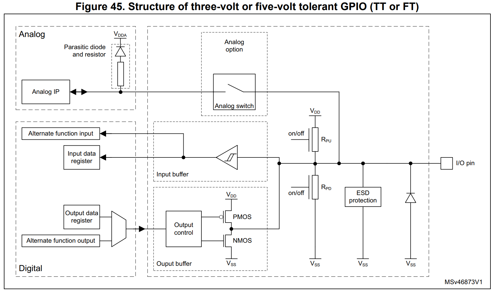

The MCU pins are exposed through the board connectors. Each GPIO pin can be configured as an input, output, or alternate function to communicate with external peripherals. The pinout diagram shows the location and names of the available GPIO pins.


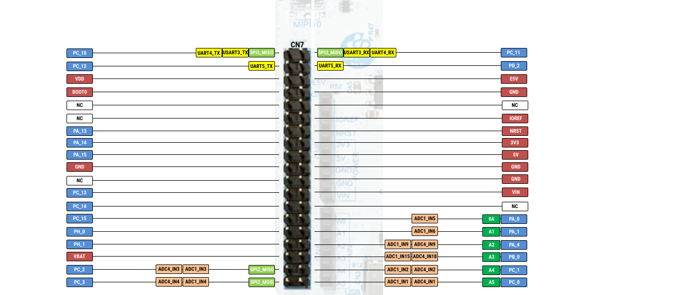
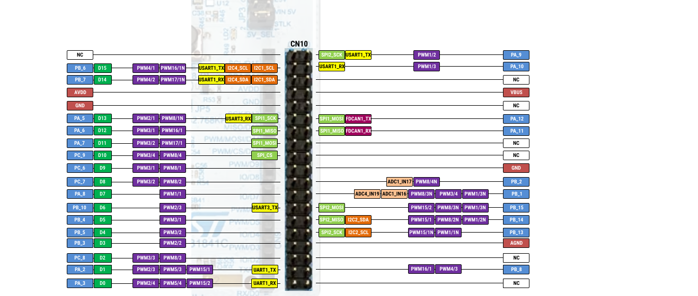

## Hardware access

There are 3 different ways in which the hardware either on the STM32 Nucleo-U545RE-Q or the Raspberry Pi Pico 2 can be used:

1. Embassy framework, with the Embedded HAL implementation
2. Platform Access Crate (PAC)
3. Bare metal

## Embassy Framework

Developing bare metal firmware requires a lot of time. 

In trying to standardize firmware development, The Rust [Embedded devices Working Group](https://www.rust-lang.org/governance/wgs/embedded) has designed 
a set of standard traits (interfaces) for interacting with an MCU. This is called the **Embedded Hardware Abstraction Layer**, or shortly Embedded HAL. The main purpose is to define a common hardware interface that
frameworks, libraries and operating systems can build upon. Regardless of what MCUs the device is using, the upper level software should be as portable as possible.

There are several crates that implement the Embedded HAL traits for the STM32U545 MCUs. These
crates are called *HAL Implementations*.
- [embassy-stm32](https://docs.embassy.dev/embassy-stm32/git/stm32u545re/index.html) - crate implements the Embedded HAL for STM32U545 that is used with the [embassy-rs](https://embassy.dev/) framework

Several frameworks are available on top of the *HAL Implementations* to speed things up. The most common used ones are:
- [RTIC - The hardware accelerated Rust RTOS](https://rtic.rs) - *A concurrency framework for building real-time systems*
- [Embassy](https://embassy.dev) - *The next-generation framework for embedded applications*

### The Software Stack

[Embassy](https://embassy.dev/) is a full fledged embedded framework for Rust embedded development.
Besides the implementation of the embedded HAL for different MCUs (STM32U545 included), Embassy provides
several functions like timers, BLE and network communication.

<div align="center">
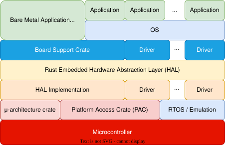
</div>

The crates used by Embassy and their mapping are shown in the table below.

| Crate | Position |
|-------|----------|
| [`embassy-executor`](https://docs.embassy.dev/embassy-executor/git/cortex-m/index.html) | Framework |
| [`smoltcp`](https://docs.rs/smoltcp/latest/smoltcp/), [`defmt`](https://docs.rs/defmt/latest/defmt/) | Libraries |
| [`embassy-net`](https://docs.embassy.dev/embassy-net/git/default/index.html), [`embassy-time`](https://docs.embassy.dev/embassy-time/git/default/index.html), [`embassy-usb`](https://docs.embassy.dev/embassy-usb/git/default/index.html), [`embassy-usb-logger`](https://docs.embassy.dev/embassy-usb-logger/git/default/index.html) | Framework Driver |
| [`embassy-usb-driver`](https://docs.embassy.dev/embassy-usb-driver/git/default/index.html), [`embassy-time-driver`](https://docs.embassy.dev/embassy-time-driver/git/default/index.html) | Embassy HAL (API) |
| [`cyw43`](https://docs.embassy.dev/cyw43/git/default/index.html), [`cyw43-pio`](https://docs.embassy.dev/cyw43-pio/git/default/index.html) | Driver (WiFi) |
| [`embedded-hal`](https://docs.rs/embedded-hal/latest/embedded_hal/), [`embedded-hal-async`](https://docs.rs/embedded-hal-async/latest/embedded_hal_async/)| **Rust Embedded HAL (Standard)** |
| [`embassy_stm32`](https://docs.embassy.dev/embassy-stm32/git/stm32u545re/index.html), [`embassy_rp`](https://docs.embassy.dev/embassy-rp/git/rp2040/index.html) | HAL Implementation |
| [`cortex-m`](https://docs.rs/cortex-m/latest/cortex_m/), [`cortex-m-rt`](https://docs.rs/cortex-m-rt/latest/cortex_m_rt/) | μ-architecture crates |
| [`stm32-metapac`](https://github.com/embassy-rs/stm32-data-generated), [`rp_pac`](https://docs.embassy.dev/rp-pac/git/default/index.html) | Platform Access Crate |

:::info

The name *Embassy* is derived from **Emb**edded **Asy**nchronous Rust.

:::

### *Empty* Embassy Firmware

The Embassy Framework is a collection of crates. Building an *empty* firmware that uses
embassy requires:
- adding the Embassy HAL Implementation for a specific board, in this case STM32U545 or RP2350;
- adding the core Embassy crates, that provide the executor, timers and futures;
- adding the `cortex-m-rt` and `defmt` crates that Embassy requires.

abItem value="stm32u5" label="STM32 Nucleo-U545RE-Q" default>
    ```toml
[dependencies]
embassy-stm32 = { version = "0.4.0", features = ["defmt", "stm32u545re", "unstable-pac", "memory-x", "time-driver-tim4", "exti", "chrono"] }

# Embedded HAL utilities
embassy-embedded-hal = { version = "0.5.0", features = ["defmt"] }

# Synchronization primitives and data structures with async support
embassy-sync = { version = "0.7.2", features = ["defmt"] }

# Async/await executor
embassy-executor = { version = "0.9.0", features = ["arch-cortex-m", "executor-thread", "defmt"] }

# Utilities for working with futures, compatible with no_std and not using alloc
embassy-futures = "0.1.2"

# Timekeeping, delays and timeouts
embassy-time = { version = "0.5.0", features = ["defmt", "defmt-timestamp-uptime", "tick-hz-32_768"] }

# USB device
# embassy-usb = { version = "0.5.1", git = "https://github.com/embassy-rs/embassy", rev = "3e8d8fe", features = ["defmt"] }

# Defmt support
defmt = "1.0.1"
defmt-rtt = "1.1.0"

# Low level access to Cortex-M processors
cortex-m = { version = "0.7.7", features = ["inline-asm", "critical-section-single-core"] }

# Boostrap crate for Cortex-M Processors
cortex-m-rt = "0.7.5"

# Panic handler that exits `probe-run` with an error code
panic-probe = { version = "1.0.0", features = ["print-defmt"] }
    ```
The `embassy-stm32` crate provides support for the STM32 Nucleo-U545RE-Q microcontroller within the Embassy framework. It includes features such as `defmt` for efficient debugging, `unstable-pac` for accessing low-level peripherals, and time-driver for handling `time-related` operations. The crate also implements `critical-section` for safe concurrency and supports STM32U545RETxQ and `binary-info` for additional STM32U545-specific functionality.  

The `embassy-embedded-hal` crate provides embedded-hal-compatible utilities for asynchronous embedded development. It enables easy interaction with hardware peripherals, such as GPIO, SPI, and I2C, while integrating with the Embassy async runtime. It includes `defmt` for lightweight debugging. 

The `embassy-sync` crate offers synchronization primitives and data structures designed for async environments. It includes mutexes, signal primitives, and channel-based communication for safe, cooperative multitasking. The crate is optimized for `no_std` systems and supports `defmt` for debugging. 

The `embassy-executor` crate provides an async/await executor tailored for embedded systems. It supports multitasking via interrupt-based and thread-based execution models, with optimizations for Cortex-M microcontrollers. Features include configurable task arena sizes and `defmt` for debugging.

The `embassy-futures` crate supplies utilities for working with Rust futures in embedded environments. It is designed to be compatible with `no_std` and avoids dynamic memory allocation, making it lightweight and efficient for constrained devices.

The `embassy-usb` crate provides a USB device stack for embedded systems. It supports USB control, bulk, and interrupt transfers, making it useful for implementing HID, CDC, and other USB classes. It integrates with `defmt` for debugging and logging.

### Entry

Embassy is a framework built on top of `cortex-m-rt` and provides its own method of defining
the entrypoint and bootloader.


```rust
#![no_main]
#![no_std]

use embassy_executor::Sp    awner;

#[embassy_executor::main]
async fn main(_spawner: Spawner) {
    let peripherals = embassy_stm32::init(Default::default());
}
```

The `embassy_stm32::init` function takes care of the peripheral initialization so that developers can jump
right in and use them.  

:::note

Embassy is designed to work in an asynchronous way and this is why the `main` function is defined as `async`. For the time being, just take it as a must and ignore it.

:::

### Configure GPIO Output

Embassy provides one single function that returns the GPIO `Output` pin and hides the configuration
details from developers.

The `pin` variable implements the embadded HAL [`OutputPin`](https://docs.rs/embedded-hal/latest/embedded_hal/digital/trait.OutputPin.html) trait.

```rust
use embassy_stm32::gpio::{Level, Output, Speed};

// initialize PXn
//   - replace X with the port letter(A, B, C, D, E, etc.)
//   - n with the pin number
//   ... see the datasheet, e.g. PA5 
// and set its default value to LOW (0)
let mut pin = Output::new(peripherals.PXn, Level::Low, Speed::Medium);

// set the pin value to HIGH (1)
pin.set_high();

// set the pin value to LOW (0)
pin.set_low();
```

:::tip

While the device initialization is specific to each hardware family, the pin initialization and usage is mostly portable. The same basic API applies across MCUs, but STM32 devices require an additional parameter for pin speed, since their GPIOs expose configurable slew rates.

:::

### Configure GPIO Input

Using a pin as input is very similar to using it as output.

```rust
use embassy_stm32::gpio::{Input, Pull};

let pin = Input::new(peripherals.PXn, Pull::Up);

if pin.is_high() {
    // Do something if the pin value is HIGH (1)
} else {
    // Do something if the pin value if LOW (0)
}
```

:::warning 

For a correct use of the buttons, use pull-up, pull-down resistors depending on the mode of operation of the button. 

:::

### Waiting for GPIO Input

Embassy provides a set of functions that are able to suspend the execution of the task
until a change is detected in the input if a GPIO pin.

  When working with microcontrollers like the **STM32U5**, the processor needs a way to respond immediately to external events—such as a button press, a sensor trigger, or a signal change on a pin.
This is where the **Extended Interrupt** and **Event Controller**, or `EXTI`, comes in.

The EXTI (Extended Interrupts and Events Controller) is a hardware peripheral inside the STM32 that:

- Detects external events on certain pins (like buttons or sensors).
- Generates interrupts or wake-up signals to alert the CPU.
- Can wake the MCU from low-power modes (like Stop or Sleep modes).

The EXTI peripheral uses something called the EXTI multiplexer (EXTI MUX) to connect external pins to EXTI lines.

- There are 16 EXTI lines (0–15) that can be linked to GPIO pins.
- The connection is configured through registers (EXTI_EXTICR), where you select which port (A, B, C, etc.) connects to each EXTI line.

:::warning

Not every pin can have its own interrupt line!
There are only 16 EXTI lines for all GPIOs, so:

- `PA0`, `PB0`, `PC0`, `PD0`, etc. all share EXTI line 0.
- `PA1`, `PB1`, `PC1`, `PD1`, etc. all share EXTI line 1
-  and so on

So if you use `PB0` and `PC0` simultaneously, they will share the same interrupt line, and your code must check which pin actually triggered the interrupt.

:::

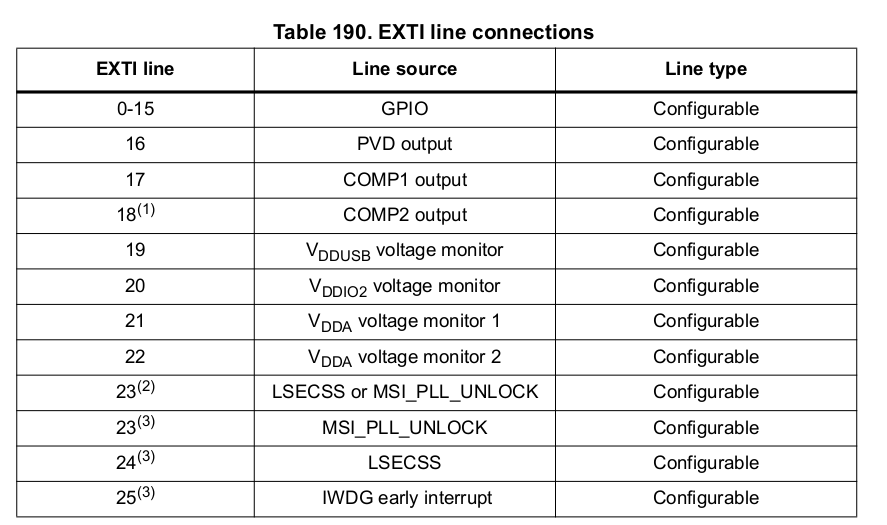
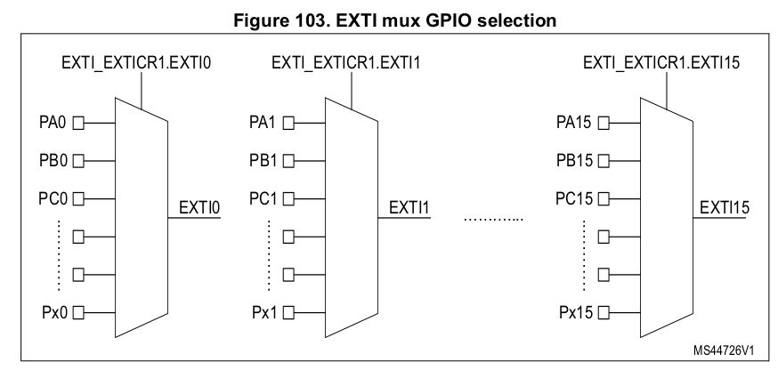

| Function | Description |
|-|-|
| [`wait_for_high`](https://docs.embassy.dev/embassy-stm32/git/stm32f042k6/exti/struct.ExtiInput.html#method.wait_for_high) | Suspends the execution until the pin state becomes `Level::High`. If the pin state is already `Level::High`, it returns immediately. |
| [`wait_for_low`](https://docs.embassy.dev/embassy-stm32/git/stm32f042k6/exti/struct.ExtiInput.html#method.wait_for_low) | Suspends the execution until the pin state becomes `Level::Low`. If the pin state is already `Level::Low`, it returns immediately. |
| [`wait_for_any_edge`](https://docs.embassy.dev/embassy-stm32/git/stm32f042k6/exti/struct.ExtiInput.html#method.wait_for_any_edge) | Suspends the execution until the pin state switches. |
| [`wait_for_rising_edge`](https://docs.embassy.dev/embassy-stm32/git/stm32f042k6/exti/struct.ExtiInput.html#method.wait_for_rising_edge) | Suspends the execution until the pin state switches from `Level::Low` to `Level::High` |
| [`wait_for_falling_edge`](https://docs.embassy.dev/embassy-stm32/git/stm32f042k6/exti/struct.ExtiInput.html#method.wait_for_falling_edge) | Suspends the execution until the pin state switches `Level::High` to `Level::Low` |

### Waiting

Embassy provides support for suspending the execution of the software for an amount of time. It uses
the [`Timer`](https://docs.rs/embassy-time/0.3.0/embassy_time/struct.Timer.html) structure from the
[`embassy_time`](https://docs.rs/embassy-time/latest/embassy_time/) crate.

```rust
// suspend the execution for a period of time
use embassy_time::Timer;

Timer::after_secs(1).await;
```

:::tip

If the MCU provides timers, the Embassy framework will use them to suspend the software. This is very efficient.

:::

## The lab board

This lab makes use of the hardware available on the lab board. The board provides:
- Nucleo U545RE-Q Slot / Board
- 4 buttons
- 5 LEDs
- potentiometer
- buzzer
- photoresistor
- I2C EEPROM
- MPU-6000 accelerometer & Gyro
- BMP 390 Pressure sensor
- SPI LCD Display
- SD Card Reader
- servo connectors
- stepper motor

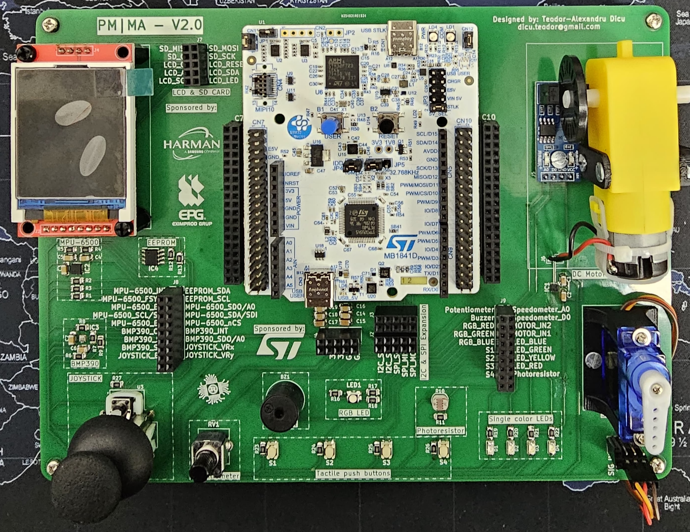

:::danger
Please make sure you use the **USB-C connector(USB STLK)** to connect the board to the computer.
:::

### Wiring

All the electronic components, sensors and actuators, have the power pins hard wired
to the board. This means that all the components receive power from the board
and do not have to be powered separately.

The data pins of the components are not wired and have to be connected to the
STM32 Nucleo-U545RE-Q/Raspberry Pi Pico using [jumper wires](https://en.wikipedia.org/wiki/Jump_wire).

### STM32 Nucleo‑U545RE‑Q Pins

Each pin on the **STM32 Nucleo‑U545RE‑Q** is accessible through **Arduino‑compatible headers** and **ST morpho connectors** placed along the sides of the board. The Arduino headers are labeled with familiar names like **D0–D15** and **A0–A5**, while the morpho connectors (CN7, CN8, CN9, CN10) expose the full set of STM32 pins. To identify the exact STM32 signal (e.g., **PA5**, **PB14**), you refer to the official pinout diagram in the board’s documentation. These connectors provide flexible access to the **GPIO (General‑Purpose Input/Output)** pins of the Nucleo board for prototyping and interfacing.

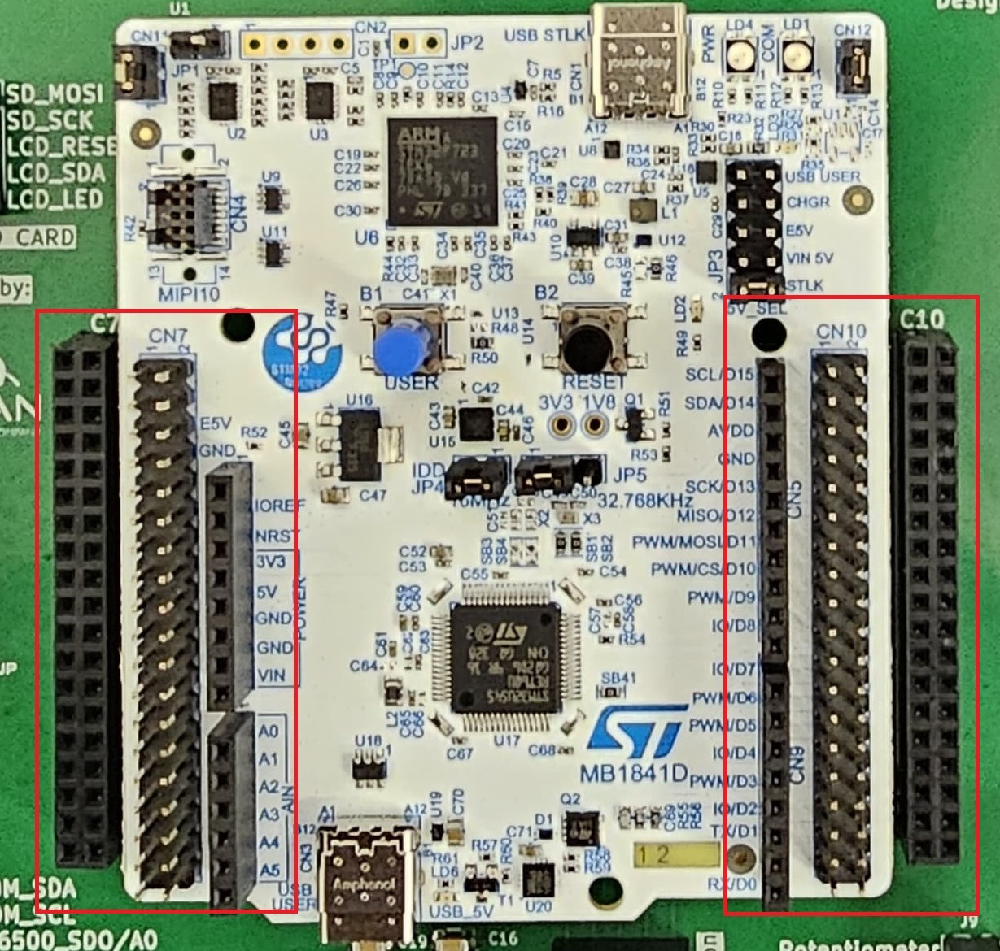


You have to use jumper wires to interface with the STM32 Nucleo‑U545RE‑Q GPIO pins as follows:
1. Insert a **male jumper wire** into one of the pin holes corresponding to the desired GPIO pin.
2. Connect **the other end** of the jumper wire to an external circuit, such as a breadboard, 
    another microcontroller, or a peripheral device. In this case, it will be LEDs or Switches.
3. Use the **second hole** of the same pin as an additional connection point, 
    allowing multiple devices to share the same GPIO.


### LEDs and Switches

The board provides four single colored LEDs, red, green, blue and yellow. Each one of them
uses one pin for control. Each LED connector has one single hole on the board,
marked with `RED`, `GREEN`, `BLUE` and `YELLOW` respectively. These are located in the **Connectors**
section of the board.

:::warning

The LEDs are connected so they will light up if the pin is set to `Level::Low` and turn off if the pin is set to `Level::High`.

:::

The four switches that the lab board provides are signaled with labels
`S1`, `S2`, `S3` and `S4` in the connectors section.


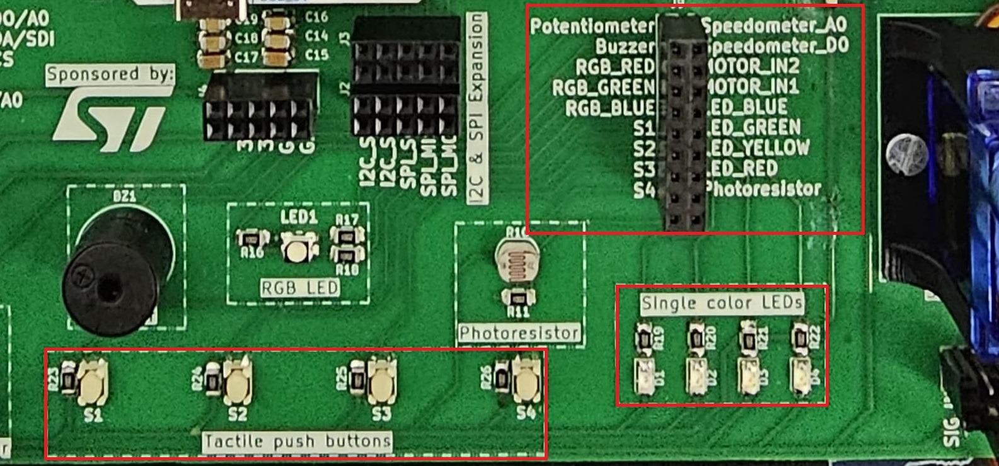

:::warning
Switches on the lab board have a pull-up resistor. This means that:
1. The values it provides may be counter-intuitive:

| Position | Value |
|-|-|
| Pressed | `Level::Low` |
| Released | `Level::High` |

2. Pins that connect to switches have to be set up as `Pull::None` to disable the STM32 Nucleo‑U545RE‑Q's
    internal pull resistor.
:::

### Example

To wire the blue LED to pin PC7 of the STM32 Nucleo‑U545RE‑Q, a jumper cable is required
between holes `LED_BLUE` and `IO/D8`.

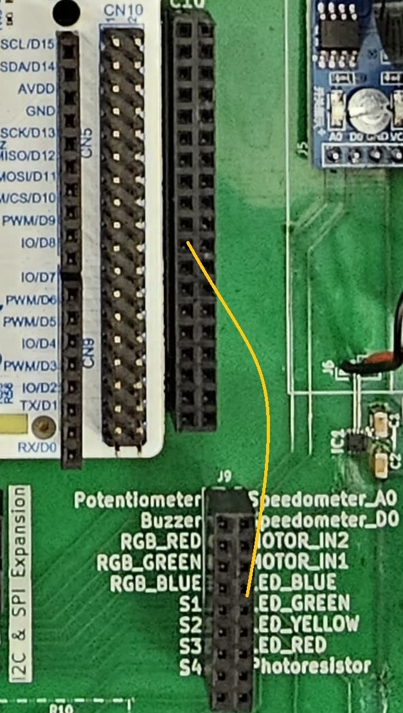


## Exercises

1. Write an *empty* firmware that uses the Embassy Framework and `defmt`. (**1p**)
Make sure you follow these steps:
- create a new Rust project using `cargo init`;
- add the `.cargo/config.toml` file that instructs `cargo` to cross-compile for the `thumbv8m.main-none-eabihf`
  architecture, add `probe-rs run` as a runner and set `defmt` messages filtering to `DEBUG`;
- add the `linker script` file called `memory.x`;
- add the `build script` file called `build.rs`;
- add the required *Embassy* dependencies - take a look at *Empty* Embassy Firmware;
- use `defmt_rtt` as a logger, make sure you import it even if you are not using it directly `use ... as _`;
- use `panic_probe` to provide a panic handler, make sure you import it even if you are not using it directly `use ... as _`;
- ask the Rust compiler not to depend on the standard library, 
    not to provide a main function and 
    add the *Embassy* entry;
- write the code to print the `info!` message "Device started".

Please make sure you comment out (using `#` in from of the line) all the Embassy's crates 
that you do not plan to use.

:::warning

Please make sure the `embassy_stm32` crate is included in your build either:
- by importing it with `use embassy_stm32 as _;`
- or by initialising the peripherals

This crate provides the **startup and linker sections** required for the STM32U545 to boot correctly.

:::


2. Write a program using Embassy that set on LOW the LED connected to IO/D8 (PC7). (**1p**)

:::note

Please make sure you to put a `loop {}` at the end of the `main` function, otherwise Embassy will reset the
pins at the end of the function and you will not see the LED turn on.

:::danger 

Please make sure the lab professor verifies your circuit before it is powered up.

:::

3. Write a program using Embassy that blinks the LED connected to IO/D8 (PC7) 
every 300ms. (**1p**)

:::note

For the purpose of this lab, please use `await` as is, think that for 
using the `Timer`, you have to add `.await` after the `after` function.

:::

4. Write a program using Embassy that will write the
message "The button was pressed" to the console every time button S1 is pressed. 
Make sure you connect the switch S1 to a STM32 Nucleo-U545RE-Q pin. (**1p**)

5. Write a Rust program using Embassy that toggles the LED every time button S1 is pressed.
The message might be printed many times for one press? Why? (**1p**)

:::tip
Read the value of S1 in a `loop` and print the message if the value is `LOW`.
:::

6. Instead of constantly sampling for the button value, use the `wait pin functions` to 
wait for the value to change. Why is the message printed only once? (**1p**)

:::tip
Do not forget to write the `.await` keyword at the end of an `async` function call.
:::

7. Build a traffic light using the `LED_GREEN`, `LED_YELLOW` and `LED_RED` LEDs. (**1p**) The flow of the colors
is:

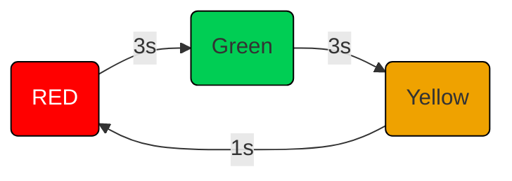

8. Extend the traffic light to include a flashing blue LED for pedestrians.
 When the pedestrian button is pressed, the traffic light switches to yellow
 and waits one second. After that, it switches on the red light and flashes
 the blue pedestrian light. After 5 seconds, the traffic light switches back
 to green and stops the blue flashing. (**2p**)

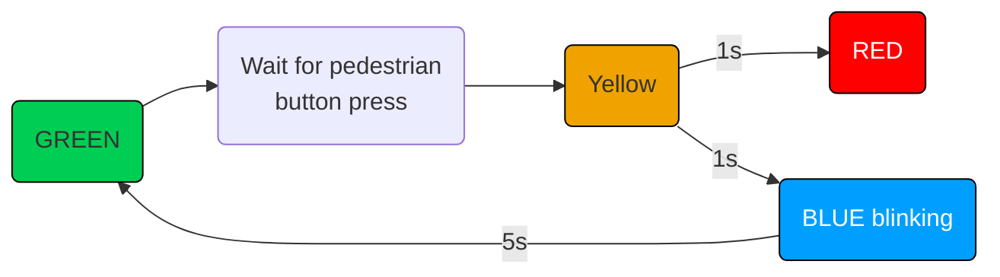

9. Display letters in Morse Code.
    1. Write a function that takes as an argument a letter and displays
    it in Morse Code using three LEDs. For a dot light up the middle LED,
    for a line light up all three. (**1p**)
    2. Write a firmware that displays a text in Morse Code. (**1p**)


:::note
Letters in Morse Code are case insensitive. You can use the [`char::to_ascii_uppercase`](https://doc.rust-lang.org/beta/core/primitive.char.html#method.to_ascii_uppercase)
 or [`u8::to_ascii_uppercase`](https://doc.rust-lang.org/std/primitive.u8.html#method.to_ascii_uppercase) functions to convert a `char` or `u8` to uppercase.
:::

:::tip
You can use an array of `&str`s to store the format of the morse code.

```rust
const CODES: [&str; 26] = [
    ".-", // A
    // ...
];
```
:::
