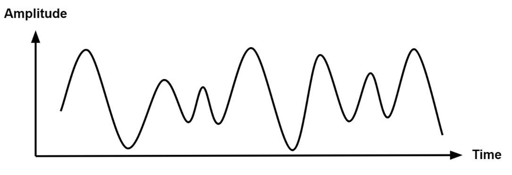
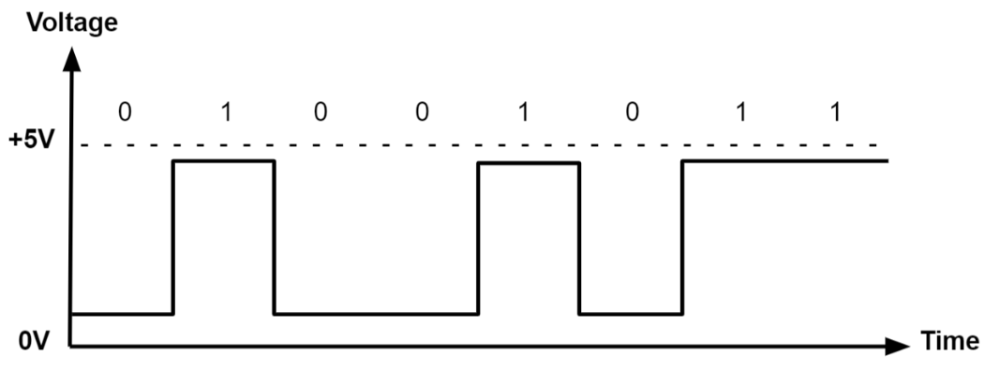
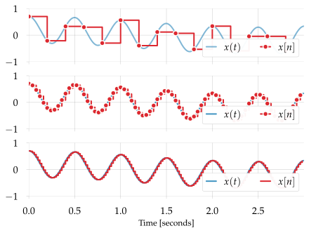
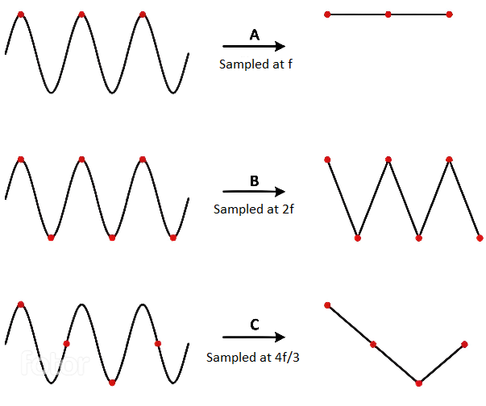
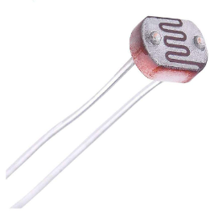
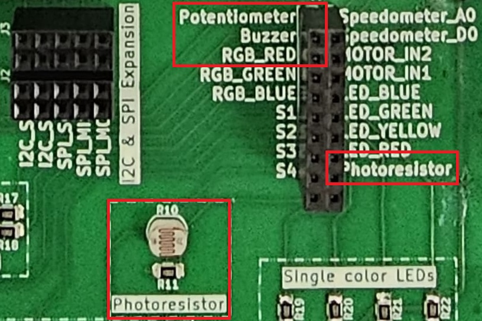
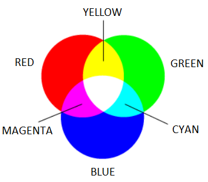

# Analog-to-Digital Converter (ADC)

The purpose of this lab is to help you learn about different types of signals in electronics and how to work with them.

## Concepts 

- Understanding digital vs. analog signals;
- Converting analog signals to digital using Analog-to-Digital Converters (ADC);
- Practical applications of ADC in circuit design.
- How to use the lab board's components.

## Resources

1. **STMicroelectronics**, *[STM32U545 Datasheet](https://www.st.com/resource/en/datasheet/stm32u545ce.pdf)*
2. **STMicroelectronics**, *[Nucleo STM32U545 User manual](https://www.st.com/resource/en/user_manual/um3062-stm32u3u5-nucleo64-boards-mb1841-stmicroelectronics.pdf)*

## Analog and Digital Signals

**Analog signals** are a representation of real-world data. They communicate information in a continuous function of time. They are smooth and time-varying waves, and contain an infinite number of values within the continuous range. An example of an analog signal would be sound, or the human voice.



**Digital signals** are a discrete representation of data. They are represented by a sequence of binary values, taken from a finite set of possible numbers. They are square and discrete waves. In most cases, they are represented by two values: 0 and 1 (or 0V and 5V). Digital representation of signals is usually used in hardware.



## Signal Properties

Signals can be described using four important properties: amplitude, frequency, period, and phase.

### Amplitude

The amplitude represents the strength or size of a signal. For an electrical signal, it is usually measured in volts.

:::warning 

A higher amplitude means a higher signal voltage. The amplitude of a signal connected to an ADC pin must stay within the voltage range supported by the microcontroller.

:::

### Frequency

The frequency represents how many complete cycles a signal performs in one second.

Frequency is measured in hertz (`Hz`).

For example, a signal with a frequency of `50 Hz` completes 50 cycles every second.

### Period

The period is the time required for a signal to complete one full cycle.

It is represented by $T$ and is related to frequency by:

$ T = \frac{1}{f} $

### Phase

The phase represents the position of a periodic signal within one complete cycle.

Two signals with the same frequency may be shifted in time. This shift is called a phase difference and is usually measured in degrees.

:::info

A phase difference of $0^\circ$ means that the signals are aligned, while a phase difference of $180^\circ$ means that they are opposite.

:::

### Bandwidth

A signal may contain one frequency or a combination of multiple frequencies.

The frequency indicates how quickly a signal changes and is measured in hertz (`Hz`). Signals with a higher frequency change more rapidly than signals with a lower frequency.

The bandwidth represents the range of frequencies contained in a signal:

$$
bandwidth = f_{maximum} - f_{minimum}
$$

:::info

The maximum frequency contained in a signal is important when selecting the ADC sampling rate. A signal with a larger bandwidth generally requires a higher sampling rate to be represented correctly.

:::

### Signal Noise and Signal-to-Noise Ratio

Noise is an unwanted variation that modifies the original signal. It can be caused by electrical interference, unstable power supplies, nearby components, or the sensor itself.

When an ADC measures a noisy signal, the digital value may change slightly even if the actual input remains constant.

The Signal-to-Noise Ratio (SNR) compares the strength of the useful signal with the strength of the noise:

$$
SNR = \frac{signal\ power}{noise\ power}
$$

A higher SNR means that the useful signal is clearer and the ADC readings are more reliable. A lower SNR means that the noise has a greater effect on the measurements.

:::info

Noise in ADC readings can be reduced by averaging multiple samples, using stable power connections, and keeping analog wires away from sources of electrical interference.

:::

## Analog-to-Digital Converter (ADC)

Now we know how to represent an analog signal using digital signals. There are plenty of cases in which we need to know how to transform an analog signal into a digital one, for example a temperature reading, or the voice of a person. This means that we need to correctly represent a continuous wave of infinite values to a discrete wave of a finite set of values.
For this, we need to sample the analog signal periodically, in other words to measure the analog signal at a fixed interval of time. This is done by using an **Analog-to-Digital converter**.

The ADC has two important parameters that define the quality of the signal representation:

| Parameter | Description | Impact on quality |
|-----------|-------------|-------------------|
| Sampling Rate | Frequency at which a new sample is read | The higher the sampling rate, the more samples we get, so the more accurate the representation of the signal |
| Resolution | Number of bits which we can use in order to store the value of the sample | The higher the resolution, the more values we can store, so the more accurate the representation |

:::info
For example, a resolution of 8 bits means that we can approximate the analog signal to a value from 0 to 255.
:::



### The ADC Conversion Process

An Analog-to-Digital Converter (ADC) converts an analog voltage into a digital number that can be processed by the microcontroller.

The ADC conversion process can be divided into four main steps:

1. Sampling
2. Holding
3. Quantization
4. Encoding

#### Sampling

During sampling, the ADC measures the input voltage at a specific moment in time.

Because an analog signal changes continuously, the ADC must repeat this measurement periodically. Each measurement is called a sample.
The number of samples taken every second is called the sampling rate and is measured in samples per second or hertz (`Hz`).

:::info

Signals that change quickly require a higher sampling rate. Signals such as the voltage from a potentiometer or photoresistor usually change slowly, so they can be sampled at a lower rate.

:::

#### Holding

After measuring the input voltage, the ADC temporarily holds the sampled value constant while the conversion is performed.

This is necessary because the input signal may continue changing while the ADC is determining its digital value.

The combination of these first two steps is usually called **sample-and-hold**.

#### Quantization

The ADC cannot represent every possible analog voltage exactly. Instead, it approximates the sampled voltage using one of a limited number of digital levels.

This process is called quantization.

The number of available levels depends on the resolution of the ADC:

$ NumberOfLevels = 2^{resolution} $

:::info

Because the analog voltage is rounded to the nearest available digital level, the converted value may not represent the input voltage exactly. The difference between the real voltage and the represented voltage is called quantization error.

:::

A higher-resolution ADC provides more digital levels and can therefore represent smaller changes in voltage.

#### Encoding

After selecting the closest quantization level, the ADC represents it as a binary number.

For example, an 8-bit ADC may convert an analog voltage into the following digital value:

10110110

The microcontroller usually reads this binary value as an unsigned integer.

### Nyquist-Shannon Sampling Theorem

The [Nyquist-Shannon sampling theorem](https://en.wikipedia.org/wiki/Nyquist%E2%80%93Shannon_sampling_theorem) serves as a bridge between continuous-time signals and discrete-time signals. It establishes a link between the frequency range of a signal and the sample rate required to avoid a type of distortion called *aliasing*. Aliasing occurs when a signal is not sampled fast enough to construct an accurate waveform representation.

For an analog signal to be represented without loss of information, the conversion needs to satisfy the following formula:

$$
sampling_f > 2 \times max_{f}
$$

The analog signal needs to be sampled at a frequency greater than twice the *maximum frequency* of the signal.
In other words, we must sample at least twice per cycle.



### Examples of analog sensors

- temperature sensor
- potentiometer
- photoresistor

A **photoresistor** (or photocell) is a sensor that measures the intensity of light around it. Its internal resistance varies depending on the light hitting its surface; therefore, the more light there is, the lower the resistance will be. 



#### How to wire a photoresistor

The photoresistor that the board provides is signaled with the label `PHOTORESISTOR` in the connectors section.



### ADC in Embassy-rs

 On the STM32, the ADC peripheral does not use a FIFO interrupt like the RP2. Instead, each ADC (ADC1, ADC2, etc.) can be configured directly, and Embassy provides a driver that handles resolution, averaging, and sample time for you. All we need to do is create the ADC driver, configure it, and then bind it to the pin we want to read from.

| Arduino connector | STM32 pin |ADC|
|-----------|----------|----------|
| `A0` |`PA0` |`ADC1_IN5`(ADC1 Channel 5) |
| `A1` | `PA1`|`ADC1_IN6` (ADC1 Channel 6) |
| `A2` |`PA4`|`ADC1_IN9` (ADC1 Channel 9) |
| `A3` |`PB0`|`ADC1_IN15` (ADC1 Channel 15) |
| `A4` |`PC1`|`ADC1_IN2` (ADC1 Channel 2) |
| `A5` |`PC0`|`ADC1_IN1` (ADC1 Channel 1)|


  ```rust
  // ---- fn main() ----

let p = embassy_stm32::init(Default::default());

// Create ADC driver on ADCx
let mut adc = adc::Adc::new(p.ADCx);

// Configure resolution, averaging, and sample time
adc.set_resolution(adc::Resolution::BITS14);
adc.set_averaging(adc::Averaging::Samples1024);
adc.set_sample_time(adc::SampleTime::CYCLES160_5);

const MAX_VALUE: u32 = adc::resolution_to_max_count(adc::Resolution::BITS14);
  ```

  :::warning 
When reading the ADC, it is important to distinguish between the maximum digital count and the maximum input voltage. The function

```rust
const MAX_VALUE: u32 = adc::resolution_to_max_count(adc::Resolution::BITS14);
```
returns the largest integer code that the ADC can produce for a 14‑bit conversion.

- For a 14‑bit ADC, the digital output spans from 0 to `2^14 - 1 = 16383`.
- `MAX_VALUE` will therefore hold the value `16383`.
- This is not the maximum voltage that the ADC can measure. The maximum voltage is determined by the reference voltage (e.g., 3.3 V), while `MAX_VALUE` simply represents the highest possible digital code.
:::

Once we have the ADC and pin set up, we can start reading values from the pin. Here’s a simple loop that reads the raw ADC value, converts it to a voltage, and prints it:
```rust
loop {
    // Read a raw ADC value (blocking read)
    let level: u16 = adc.blocking_read(&mut adc_pin);
    let voltage = 3.3f32 * level as f32 / MAX_VALUE as f32;

    info!("Light sensor reading: {}, voltage: {}", level, voltage);

    // Wait a bit before reading again
    embassy_time::Timer::after_secs(1).await;
}
```

:::info
Cortex‑M33 cores include a hardware Floating Point Unit (FPU), but **only for single precision (`f32`)**.  
Double precision (`f64`) is emulated in software and runs much slower.  
Cortex‑M0 cores have **no FPU at all**, so all floating‑point math is emulated.

For clarity, examples here use volts represented as `f32` instead of millivolts.  
On RP2040 (Cortex‑M0+), floating‑point operations are **very slow**.  
For efficiency, prefer **integer arithmetic in mV** expressed as `u32` in performance‑sensitive code.
:::

## Exercises

:::info

Remember that LEDs are wired so they light up on `Level::Low` and turn off on `Level::High` and buttons return `Level::Low` when pressed and `Level::High` when not pressed.
:::

:::danger 
Please make sure the lab professor verifies your circuit before it is powered up.
:::

1. Write a program using Embassy that adjusts the brightness of an LED connected to GPIO pin by changing the PWM duty cycle. 
    - Light up the LED at 25% intensity. (**1p**)
    - Make the LED change intensity from 0% to 100% in 10% increments every 1 second. (**1p**)

:::info
Embassy will reset all the peripherals when the `main` function exits, that means `PWM` and `ADC` will stop. Make sure the `main` function never exits so you can see how the circuit behaves.
:::

:::tip

The LEDs on the lab board are active‑low. This means they turn ON when the pin is driven LOW and turn OFF when the pin is driven HIGH.

Because of this wiring, using PWM directly will have the inverse effect:

- A 0% duty cycle (always LOW) → LED fully ON
- A 100% duty cycle (always HIGH) → LED fully OFF

To make the duty cycle behave intuitively (so that a higher percentage means “brighter”), you must explicitly set the channel polarity to ActiveLow:

```rust
channel.set_polarity(OutputPolarity::ActiveLow);
```

:::

2. Write a program using Embassy to control the led intensity using a potentiometer. The potentiometer is connected to an ADC-capable GPIO pin. The LED should change intensity based on the potentiometer's position. (**2p**) 

:::warning 
Unlike the photoresistor, which requires an external resistor to form a voltage divider, a potentiometer already has an internal voltage divider. You only need to connect its three pins:
    - One leg to VCC.
    - The middle pin to an ADC-capable GPIO pin.
    - One leg to GND.
    
    (The potentiometer that the board provides is signaled with label `POTENTIOMETER` in the connectors section.)
:::

3. Make the RGB LED switch from red -> yellow -> blue every time the button `S4` is pressed. (**2p**)



4. Write a program using Embassy that measures light intensity using a photoresistor connected to ADC.
    - Use `defmt` to display the measured light intensity. (**1p**)
    - Make the RGB LED change color based on the light intensity. Red for low intensity, green for medium intensity, and blue for high intensity. (**1p**)

5. Write a program using Embassy that moves a servo motor smoothly between 0° and 180°, then back to 0°, in a continuous loop. (**2p**)
