# Pulse-Width Modulation(PWM)

The purpose of this lab is to help you learn about different types of signals in electronics and how to work with them.

## Concepts 

- Understanding digital vs. analog signals;
- Converting analog signals to digital using Analog-to-Digital Converters (ADC);
- Practical applications of PWM in circuit design.
- How to use the lab board's components.

## Resources

1. **STMicroelectronics**, *[STM32U545 Datasheet](https://www.st.com/resource/en/datasheet/stm32u545ce.pdf)*
2. **STMicroelectronics**, *[Nucleo STM32U545 User manual](https://www.st.com/resource/en/user_manual/um3062-stm32u3u5-nucleo64-boards-mb1841-stmicroelectronics.pdf)*
3. **Paul Denisowski**, *[Understanding PWM](https://www.youtube.com/watch?v=nXFoVSN3u-E)*

## Timing

In embedded applications, keeping track of time is crucial. Even for the simple task of blinking an LED at a certain time interval, we need a reference of time that is constant and precise. 

### Clocks

A clock is a piece of hardware that provides us with that reference. Its purpose is to oscillate at a fixed frequency and provide a signal that switches from high to low at a fixed interval.

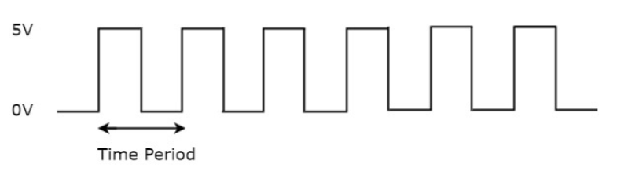

The most precise type of clock on the STM32 Nucleo-U545RE-Q is the *High-Speed External oscillator (HSE)*. The reason why it is so accurate is because it uses the crystal’s natural vibration frequency to generate the clock signal. This oscillator is usually external to the microcontroller itself, requiring a crystal or external clock source connected to the HSE pins.

The processor also provides several *internal RC oscillators* (HSI, MSI, LSI), which are less accurate because they rely on resistor-capacitor timing rather than quartz resonance. These internal clocks are useful when small variations in clock pulses are acceptable, or when minimizing external components is important.

The STM32 Nucleo-U545RE-Q does not have a built-in crystal frequency. Instead, the board designer selects an appropriate crystal (commonly 8 MHz, 16 MHz, or 24 MHz) to drive the HSE, depending on the application requirements.

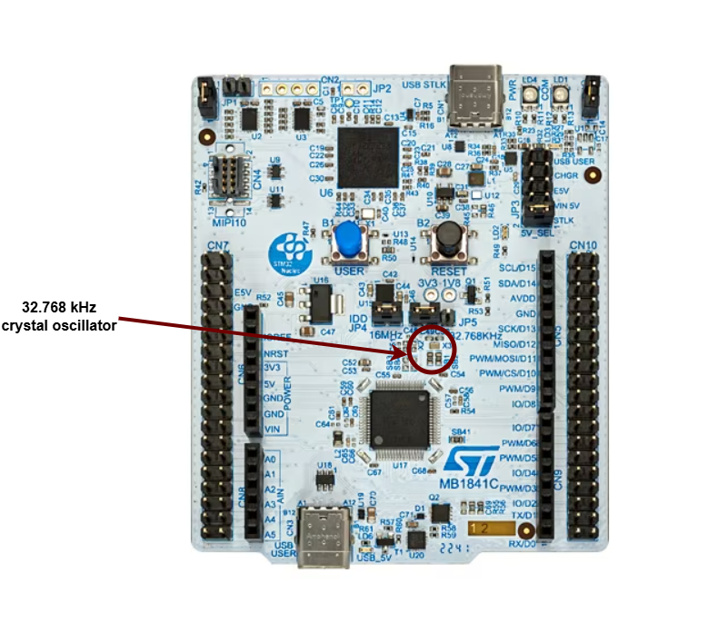

### Counters

A counter in electronics is a tool that tracks numbers, typically by adding or subtracting one each time the clock ticks. When it reaches its maximum (or minimum) value, it resets or wraps around. This reset is called an "overflow" (when counting up) or "underflow" (when counting down). Some counters can also switch between counting up and down based on control signals.

:::info
A regular counter on 8 bits would count up from 0 to 255, then loop back to 0 and continue counting. 
:::

In theory a counter is associated with 3 registers:

| Register | Description |
|-----------|----------|
| `value` | the current value of the counter |
| `direction` | whether the counter is counting UP or DOWN |
| `reset` | if the direction is UP, the value at which the counter resets to 0; if the direction is DOWN, the value at which the counter reset after reaching 0 |

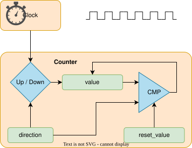

The way the counter works here is that it increments/decrements every clock cycle and checks whether or not it has reached its reset value. If is has, then it resets to its initial value and starts all over again.

#### SysTick

The ARM Cortex‑M33 used by the STM32U545 all provide the SysTick time counter to keep track of time. This counter automatically decrements, and when it reaches 0, it triggers an exception and then resets to the reload value.

- `SYST_CVR` register - the value of the timer itself
- `SYST_RVR` register - the reset value
- `SYST_CSR_SET` register:
	- `ENABLE` field - enable/disable the counter
	- `TICKINT` field - enable/disable exception on reaching 0

### Timers

The simplest way to make a processor wait is to ask the processor to skip a clock cycle a number of times, or by calling the processor instruction `nop` (no operation) in a loop.
:::info
This method is not ideal, since the `nop` instruction stalls the processor and wastes valuable time that could otherwise be used to do other things in the meantime. To optimize this, we can use *alarms*.
:::
An **alarm** is a counter that triggers an interrupt every time it reaches a certain value. This way, an alarm can be set to trigger after a specific interval of time, and while the **alarm** hardware is *running in the background*, the main program can continue executing instructions, and so it is not blocked. When the alarm reaches the chosen value, it goes off and triggers an interrupt that can then be handled in its specific Interrupt Service Routine (ISR).

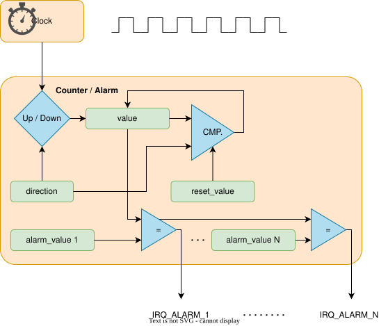

:::info
The **STM32U5**, by contrast, does not use a single 64‑bit monotonic timer. Instead, it provides a set of general‑purpose 16‑bit and 32‑bit timers (TIMx) as well as advanced timers for motor control and low‑power timers for energy‑sensitive applications. These timers can be configured with prescalers and auto‑reload registers to generate periodic interrupts, PWM signals, input capture, or output compare events.
:::

## Pulse-Width Modulation (PWM)
Up to now, we learned to turn an LED on and off, or in other words, set a LED's intensity to 100% or 0%. What if we wanted to turn on the LED only at 50% intensity? We only have a two-level digital value, 0 or 1, so technically a value of 0.5 is not possible. What we can do is simulate this analog signal, so that it *looks* like the LED is at half intensity. 

**Pulse-Width Modulation** is a method of simulating an analog signal using a digital one, by varying the width of the generated square wave. 

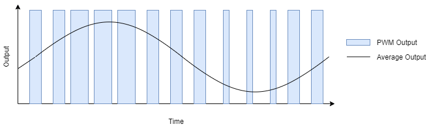

:::note
We can think of the simulated analog signal being directly proportional to the change in digital signal pulse size. The larger the square wave at a given period T, the higher the average analog amplitude output for that period.
:::

The **duty cycle** of the signal is the percentage of time per period that the signal is high.

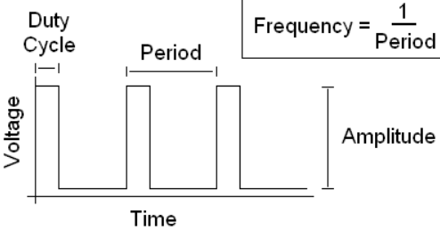

So if we wanted our led to be at 50% intensity, we would choose a duty cycle of 50%. By quickly switching between high and low, the led appears to the human eye as being at only 50% intensity, when in reality, it's only on at max intensity 50% of the time, and off the rest of the time.

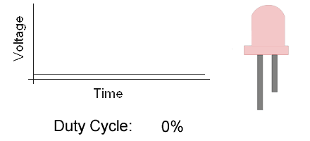

$$

duty\_cycle = \frac{time\_on}{period} \%

$$

*Counters* are used by the STM32U5 to generate PWM signals. On the STM32U545, PWM generation is handled by the timer peripherals (`TIMx`), where each channel uses a counter (`TIMx_CNT`), a compare register (`TIMx_CCRy`), and an auto‑reload register (`TIMx_ARR`) to define the duty cycle and period.

- `TIMx_CNT` - the actual value of the counter
- `TIMx_CCRy` - the compare value for channel y (this sets the duty cycle)
- `TIMx_ARR` - the auto‑reload value, the maximum count before the counter resets (this sets the period)

When `TIMx_CNT` is reset (0), the output signal is set to 1 (active). The counter counts up until it reaches `TIMx_CCRy`, after which the output signal becomes 0 (inactive). The counter continues to count until it reaches `TIMx_ARR`, then it resets to 0 and the signal becomes 1 again.

On STM32U5, PWM signals are generated by the timer peripherals (TIMx). Each timer provides multiple channels, and each channel can be mapped to specific GPIO pins through the alternate function system.

| Arduino connector | STM32 pin |PWMs |
|-----------|----------|----------|
| `D3` |`PB3` |`TIM2_CH2` (Timer 2 PWM Channel 2)|
| `D5` | `PB4`|`TIM3_CH1` (Timer 3 PWM Channel 1) |
| `D6` |`PB10`|`TIM2_CH3` (Timer 2 PWM Channel 3) |
| `D9` |`PC6`|`TIM3_CH1` (Timer 3 PWM Channel 1) |
| `D10` |`PC9`|`TIM3_CH4` (Timer 3 PWM Channel 4) |
| `D11` |`PA7`|`TIM3_CH2`(Timer 3 PWM Channel 2) |

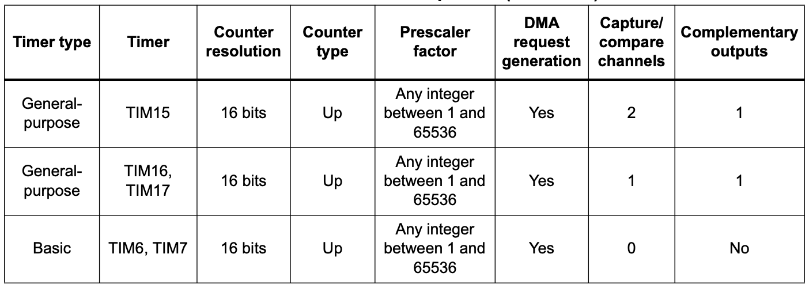

:::info

You can find more details about the pins in the [user manual](https://www.st.com/resource/en/user_manual/um3062-stm32u3u5-nucleo64-boards-mb1841-stmicroelectronics.pdf) of the board(page 33)

:::

### Examples of hardware controlled through PWM

- leds
- motors
- buzzers
- RGB leds (what we will be using for this lab)

An **RGB** LED is a led that can emit any color, using a combination of red, green and blue light. On the inside, it's actually made up of 3 separate leds:
- *R* led - to control the intensity of the *red* light
- *G* led - to control the intensity of the *green* light
- *B* led - to control the intensity of the *blue* light

By using PWM on the R, G and B leds, we can control each of their intensity to represent any color.

:::info
For example, if we wanted to create the color purple, we would set the intensity of red and blue to 100%, and the intensity of green to 0%.
:::

There are two different types of RGB LEDs:

- common cathode: all LED cathodes are connected together. A LOW signal means off, and a HIGH signal means on at max intensity.
- common anode: all LED anodes are connected together. A LOW signal means on at max intensity, and a HIGH signal means off.

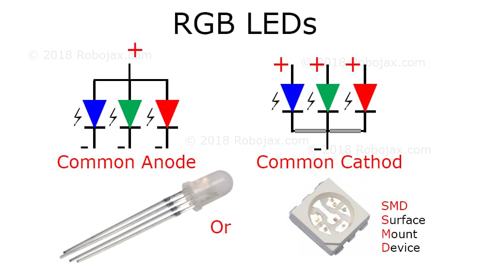

:::warning
For this lab, we will be using **common anode** RGB LEDs, which means that the PWM signal should be *opposite*. 0 will be 100% intensity, and 1 will be 0% intensity.
:::

#### How to wire an RGB LED

The RGB LED that the board provides is signaled with labels `RGB_B` (blue), `RGB_G` (green) and `RGB_R` (red) in the connectors section.

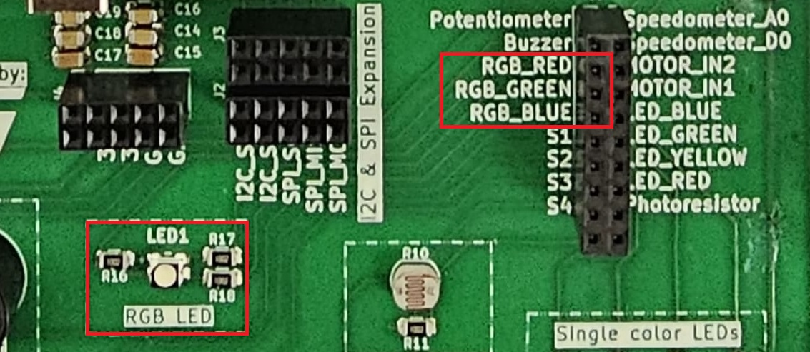

#### How to wire a servo motor

A **servo motor** is a motor that can be controlled with PWM. It has an arm that can be rotated to a specific angle, depending on the PWM signal it receives.

A servo motor has three wires:
- **Power** - usually red, connected to a voltage source (5V)
- **Ground** - usually black, connected to the ground
- **Signal** - usually orange, connected to a PWM pin
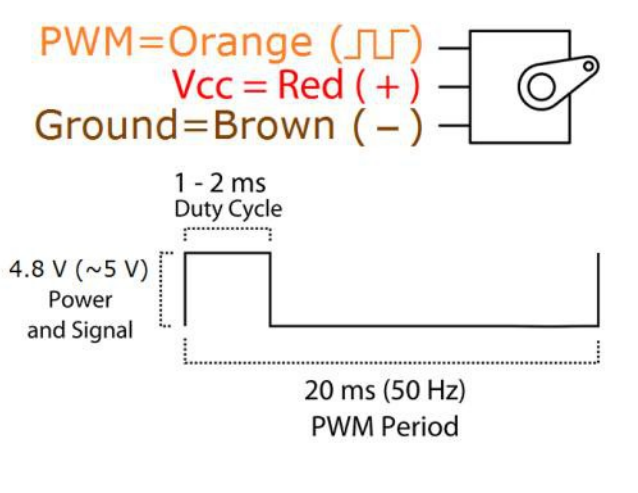

The board provides the connectors for the servo motor. These connectors are labeled `GND`, `PWR`, and `SIG` in the connectors section.

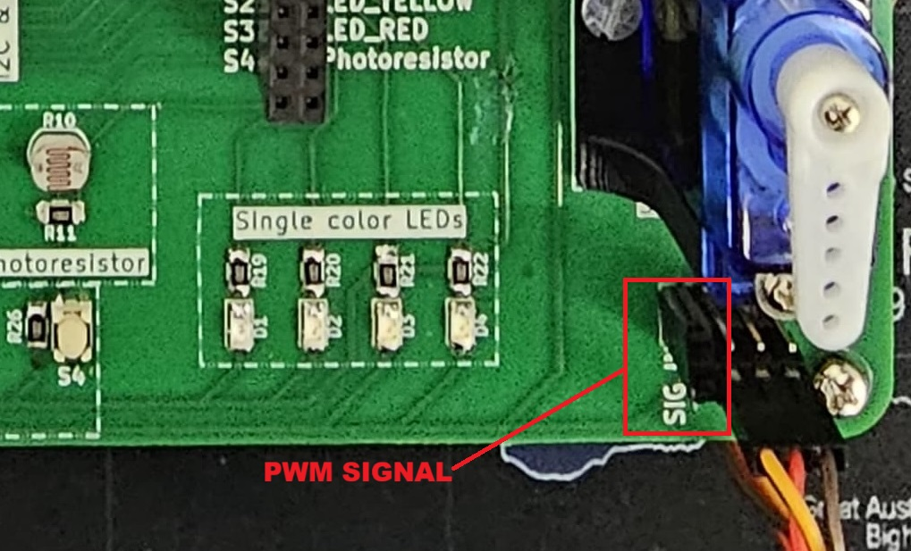

To wire the servo motor to the STM32 Nucleo-U545RE-Q, note that the servo’s `PWR`, `GND`, and `SIG` lines are already connected to the lab board. The only additional step is to place a jumper wire from the SIG connector of the the lab board to a suitable PWM-capable pin on the STM32 Nucleo-U545RE-Q.
### PWM in Embassy-rs

First, we need a reference to all peripherals, as usual.

```rust
// Initialize peripherals
let peripherals = embassy_stm32::init(Default::default());
```

```rust
use embassy_stm32::timer::simple_pwm::{PwmPin, SimplePwm};
use embassy_stm32::peripherals::TIM2;
use embassy_stm32::timer::Ch1;

    // Configure PA0 as TIM2_CH1 PWM output
    let led_pwm_pin: PwmPin<'_, TIM2, Ch1> = PwmPin::new(p.PA0, OutputType::PushPull);
```

    - `PA0` → the physical GPIO pin you want to use.
    - `TIM2` → the timer peripheral that will generate the PWM signal.
    - `Ch1` → the channel of that timer (channel 1).
    - `PwmPin::new_ch1` → ties PA0 to TIM2 channel 1’s output.
    - `OutputType::PushPull` → configures the electrical drive mode of the pin.

```rust
let mut pwm = SimplePwm::new(
    p.TIM2,              // Timer 2 peripheral
    Some(led_pwm_pin),   // Channel 1 output (PA0)
    None,                // Channel 2 not used
    None,                // Channel 3 not used
    None,                // Channel 4 not used
    khz(1),              // PWM frequency = 1 kHz
    Default::default(),  // Default configuration
);
```

:::warning

The code above is an example for PA0 with TIM2_CH1. You need to modify the timer, channel, and pin depending on which PWM‑capable pin you want to use!
:::

If we decide to modify the duty cycle of the PWM, we can update it directly on the channel:

```rust
let mut ch1 = pwm.ch1(); // Get handle for channel 1
ch1.enable();

// Set duty cycle to 50%
ch1.set_duty_cycle_percent(50);

// Later, change duty cycle to 10%
ch1.set_duty_cycle_percent(10);
```

### Controlling a Servo Motor Using PWM

Just like controlling other hardware through PWM, we start by initializing the peripherals.

Servos typically expect a 50 Hz PWM signal, which corresponds to a 20 ms period.

Servos interpret PWM signals based on the pulse width rather than just frequency:

- `Period`: The total time for one PWM cycle, which is 20 ms (50 Hz).
- `Minimum Pulse Width`: Typically **0.5 ms**, which corresponds to a servo position of **0 degrees**.
- `Maximum Pulse Width`: Typically **2.5 ms**, which corresponds to a servo position of **180 degrees**.

```rust
// Initialize peripherals
let peripherals = embassy_stm32::init(Default::default());
```

At 50 Hz, the PWM period is:
$$ 

T = 20ms 

$$

For a given pulse width $$pulse_{width}$$ the duty cycle percentage is:
$$

duty_{cycle} = \left( \frac{pulse_{width} \times 100}{T} \right)

$$

The function `set_duty_cycle_fraction(num, den)` expects a fraction representing the duty cycle.

For example, to generate a $$pulse_{width}$$ of 2.5ms,

$$

duty_{cycle} = \left( \frac{2.5 \times 1000}{20} \right) ‰ = 125 ‰

$$

That means `set_duty_cycle_fraction(125, 1000)`

- For $$pulse_{width}$$ = 0.5ms:
$$

duty_{cycle} = \left( \frac{0.5 \times 1000}{20} \right) ‰ = 25 ‰

$$

That means `set_duty_cycle_fraction(25, 1000)`

:::note
We use ‰ for accuracy, as the PWM works with integer numbers and % is not accurate enough.
:::

Now, let's implement it in Rust:
```rust
// Set the PWM pin
let servo_pin = PwmPin::new_ch1(p.PA0, OutputType::PushPull);

// 50 Hz PWM (20 ms period)
let mut pwm = SimplePwm::new(
    p.TIM2,
    Some(servo_pin),
    None,
    None,
    None,
    hz(50),
    Default::default(),
);

// Enable the PWM channel
    let mut ch1 = pwm.ch1();
    ch1.enable();

const MIN_PERIOD_US: u32 = 500;
const MAX_PERIOD_US: u32 = 2500;
const PERIOD_US: u32 = 20000;

let min_value = (MIN_PERIOD_US * 1000) / PERIOD_US;
let max_value = (MAX_PERIOD_US * 1000) / PERIOD_US;

    // Main loop to move the servo back and forth
    loop {
        // At 50 Hz, T = 20 ms. A 2.5 ms pulse means 2.5/20 = 12.5% duty cycle.
        set_duty_cycle_fraction(max_value as u16, 1000); // sets the servo to set servo to ~180°.
        // Wait 1 second before moving back
        // A 0.5 ms pulse means 0.5/20 = 2.5% duty cycle.
        set_duty_cycle_fraction(min_value as u16, 1000); // sets the servo to set servo to ~0°.
        // Wait 1 second before repeating
    }
```

## Exercises


1. Write a program using Embassy that adjusts the brightness of an LED connected to GPIO pin by changing the PWM duty cycle. 
    - Light up the LED at 25% intensity. (**1p**)
    - Make the LED change intensity from 0% to 100% in 10% increments every 1 second. (**1p**)

:::info
Embassy will reset all the peripherals when the `main` function exits, that means `PWM` and `ADC` will stop. Make sure the `main` function never exits so you can see how the circuit behaves.
:::

:::tip

The LEDs on the lab board are active‑low. This means they turn ON when the pin is driven LOW and turn OFF when the pin is driven HIGH.

Because of this wiring, using PWM directly will have the inverse effect:

- A 0% duty cycle (always LOW) → LED fully ON
- A 100% duty cycle (always HIGH) → LED fully OFF

To make the duty cycle behave intuitively (so that a higher percentage means “brighter”), you must explicitly set the channel polarity to ActiveLow:

```rust
channel.set_polarity(OutputPolarity::ActiveLow);
```

:::

2. Write a program using Embassy that moves a servo motor smoothly between 0° and 180°, then back to 0°, in a continuous loop. (**2p**)
