# Universal Serial Bus

This lab will teach you how to configure and communicate with devices using the Universal Serial Bus (USB) protocol, specifically USB 2.0, in Embassy.

import Tabs from '@theme/Tabs';
import TabItem from '@theme/TabItem';

## Resources

1. **STMicroelectronics**, *[STM32U545RE Reference Manual](https://www.st.com/resource/en/reference_manual/rm0456-stm32u5-series-armbased-32bit-mcus-stmicroelectronics.pdf)*
2. **STMicroelectronics**, *[Nucleo STM32U545 User manual](https://www.st.com/resource/en/user_manual/um3062-stm32u3u5-nucleo64-boards-mb1841-stmicroelectronics.pdf)*
3. **Raspberry Pi Ltd**, *[RP2350 Datasheet](https://datasheets.raspberrypi.com/rp2350/rp2350-datasheet.pdf)*
   - Chapter 12 - *Peripherals*
     - Chapter 12.7 - *USB*
4. **Jan Axelson**, *USB Complete: The Developer's Guide, Fourth Edition*
   - Chapter 1 - *USB Basics*
   - Chapter 2 - *Inside USB Transfers*
   - Chapter 3 - *A Transfer Type for Every Purpose*
   - Chapter 4 - *Enumeration: How the Host Learns about Devices*
   - Chapter 5 - *Control Transfers: Structured Requests for Critical Data*
   - Chapter 14 - *Using WinUSB for Vendor-Defined Functions*
   - Chapter 17 - *Testing and Debugging*
5. **Jan Axelson**, *Serial Port Complete: COM Ports, USB Virtual COM Ports, and Ports for Embedded Systems, Second Edition*
   - Chapter 14 - *Inside USB*
   - Chapter 16 - *Using Generic USB Controllers*
6. **Jan Axelson**, *USB Mass Storage: Designing and Programming Devices and Embedded Hosts*
   - Chapter 2 - *Supporting USB*
   - Chapter 3 - *The USB Mass Storage Class*
7. **BeyondLogic**, *[USB in a NutShell](https://www.beyondlogic.org/usbnutshell/usb1.shtml)*
8. **Ben Eater**, *[How does a USB keyboard work?](https://www.youtube.com/watch?v=wdgULBpRoXk)*
9. **Ben Eater**, *[How does USB device discovery work?](https://www.youtube.com/watch?v=N0O5Uwc3C0o)*
10. **Embassy**, *[embassy-usb documentation](https://docs.embassy.dev/embassy-usb/)*
11. **nusb**, *[Rust host-side USB library](https://docs.rs/nusb/latest/nusb/)*
12. *[USB Examples](https://github.com/UPB-PMRust/usb-examples)*

## Universal Serial Bus 2.0 (USB)

The Universal Serial Bus (USB) is a communication protocol used between a **host** and one or more **devices**.

### Host and devices

The host manages the entire USB bus.

The host is responsible for:

- detecting when a device is connected or removed;
- resetting and enumerating devices;
- assigning a unique address to each device;
- reading descriptors;
- selecting a configuration;
- loading or associating a driver;
- scheduling every transaction;
- supplying and managing bus power;
- detecting errors and retrying transfers when allowed.

A device is responsible for:

- announcing that it has been connected;
- responding to control requests on endpoint zero;
- returning valid descriptors;
- accepting data sent by the host;
- preparing data before the host requests it;
- reporting when it is temporarily not ready;
- entering low-power states when required.

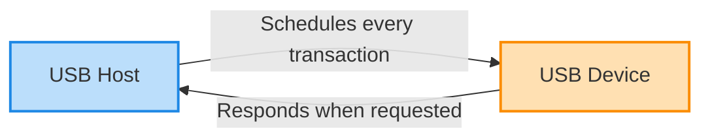

:::note
The words `IN` and `OUT` are always from the perspective of the host:

- `IN` means **device to host**;
- `OUT` means **host to device**.
:::

### Network topology

USB uses a **tiered-star topology**. Devices do not share one long bus wire as they do in some other protocols. Instead, hubs create branches in a tree.

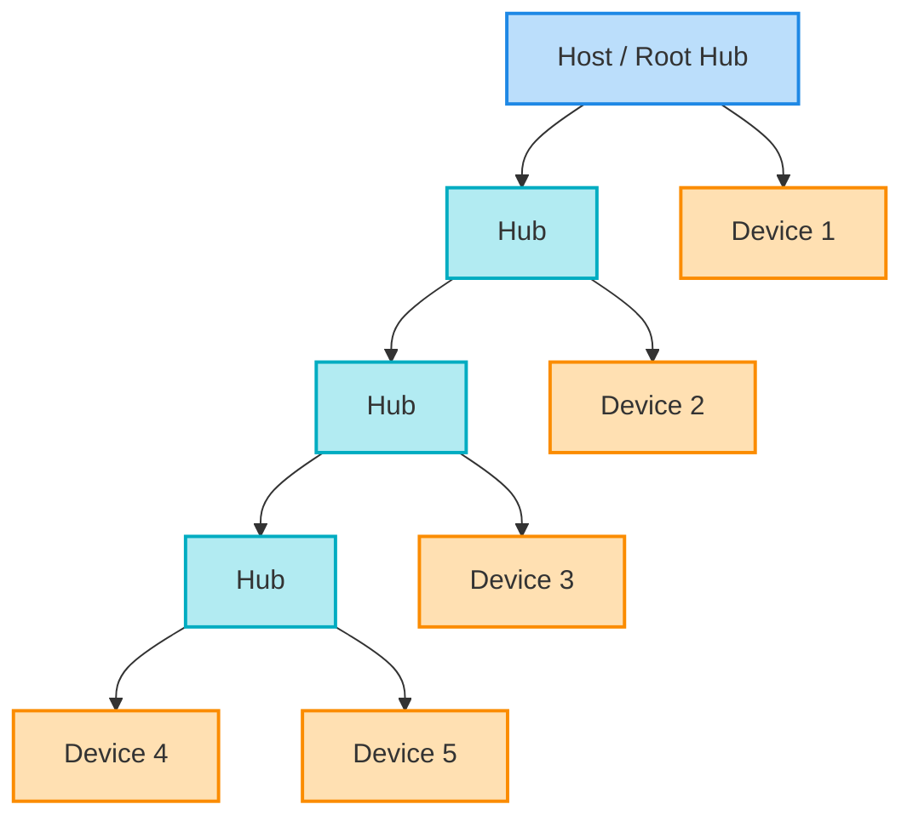

A USB address is 7 bits wide. Address `0` is reserved for a device that has not yet received its final address, so the host can assign addresses from `1` to `127`.

:::note
Hubs are also USB devices and consume addresses. Therefore, a tree containing 127 physical devices is not normally possible once hubs are included.
:::

### Physical connection

A basic USB 2.0 connection contains four signals:

| Signal | Function |
|-|-|
| `VBUS` | Power supplied by the host |
| `D+` | Positive conductor of the differential pair |
| `D-` | Negative conductor of the differential pair |
| `GND` | Ground reference |

The `D+` and `D-` wires form a **differential pair**. The receiver determines the transmitted value by comparing the two wires instead of measuring only one signal relative to ground.

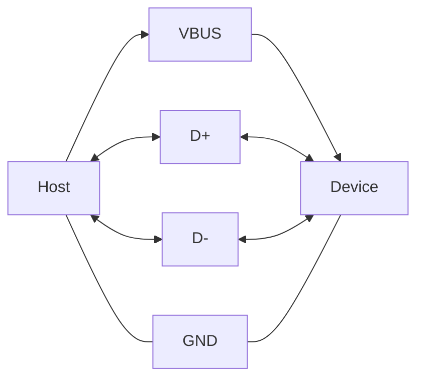

:::info
Firmware does not manually generate USB bits on `D+` and `D-`. The USB peripheral contains hardware usually called the **Serial Interface Engine (SIE)**. It handles synchronization, bit stuffing, packet recognition, CRC calculation and the strict response timing required by the protocol.
:::

### Bus speeds

USB 2.0 defines three bus speeds:

| Speed | Signaling rate | Typical examples |
|-|-|-|
| Low Speed | 1.5 Mbit/s | simple keyboards and mice |
| Full Speed | 12 Mbit/s | microcontrollers, CDC, HID, instrumentation |
| High Speed | 480 Mbit/s | storage, cameras and high-throughput devices |

The STM32U545 and RP2350 examples in this lab operate as **Full-Speed USB devices**.

:::warning
The 48 MHz USB peripheral clock is not the USB data rate. Full-Speed data is signaled at 12 Mbit/s, but the peripheral requires a precise 48 MHz reference clock internally.
:::

:::note
The advertised bus speed is not the same as application throughput. Packet fields, handshakes, frame scheduling, operating-system latency and firmware processing all reduce the useful data rate.
:::

## Endpoints and pipes

A USB device exchanges data using **endpoints**.

An endpoint is a logical source or destination of data inside the device. It is usually backed by a hardware buffer in the USB peripheral.

A useful mental model is to imagine endpoints as numbered mailboxes inside the device:

- an **OUT mailbox** receives bytes sent by the host;
- an **IN mailbox** contains bytes that the host can request;
- endpoint zero is the special mailbox used for setup and configuration.

The host never reads or writes the device's RAM directly. It communicates with a specific endpoint, and the USB peripheral moves bytes between the bus and the endpoint buffer.

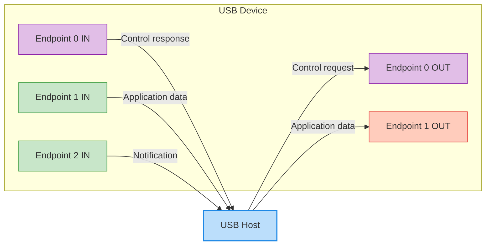

### Endpoint number and endpoint address

An endpoint number is not enough to identify a data path. The direction is part of the endpoint address.

This is one of the most common sources of confusion for beginners. Endpoint `1 IN` and endpoint `1 OUT` share the number `1`, but they are two different endpoint addresses and usually have two different buffers.

For example:

- endpoint `1 OUT` has address `0x01`;
- endpoint `1 IN` has address `0x81`.

The most significant bit stores the direction:

| Bit 7 | Direction |
|-|-|
| `0` | OUT |
| `1` | IN |

Bits `[3:0]` contain the endpoint number.

```text
Endpoint address 0x81 = 1000_0001
                        ^       ^
                        |       +-- endpoint number 1
                        +---------- IN direction
```

A Full-Speed or High-Speed USB device can use endpoint numbers `0` to `15`. Because an endpoint number can have both an IN and an OUT direction, the protocol can represent up to 30 non-control endpoint addresses in addition to endpoint zero.

:::warning
The actual USB peripheral in a microcontroller usually supports fewer endpoints than the protocol maximum. Always check the microcontroller reference manual.
:::

### Endpoint zero

Every USB device must implement endpoint zero, usually written as **EP0**.

EP0 is used for **control transfers**, including:

- `GET_DESCRIPTOR`;
- `SET_ADDRESS`;
- `SET_CONFIGURATION`;
- class-specific requests;
- vendor-specific requests.

Endpoint zero is bidirectional, but it is treated as one control pipe with an IN and OUT direction.

:::info
The host cannot enumerate a device unless endpoint zero works correctly. Even a device whose application uses only Bulk transfers still needs EP0 for discovery and configuration.
:::

### Pipes

A **pipe** is the host-side communication relationship with an endpoint.

The endpoint belongs to the device. The pipe is the host's view of that endpoint. After reading the descriptors, the operating system knows the endpoint address, transfer type, maximum packet size and interval, and can create the corresponding pipe.

The host creates a pipe after it has learned about an endpoint from the descriptors.


There are two broad pipe behaviors:

- **message pipe** - used by endpoint zero for structured control requests;
- **stream pipe** - used by Bulk, Interrupt and Isochronous endpoints.

:::note
A stream pipe does not automatically define application messages. If a program needs to send messages larger than one packet, it must define its own framing rule, such as a length field, delimiter or fixed-size message.
:::

## Packets and data flow

The smallest complete protocol unit transmitted on USB is a **packet**.

Before studying the packet types, it is useful to see how the levels fit together:

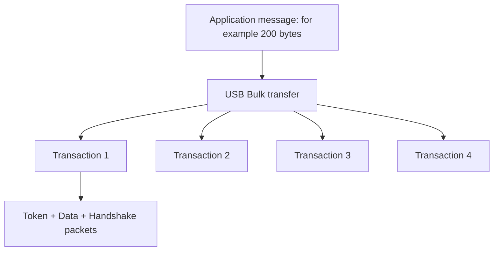

For a Full-Speed Bulk endpoint with a 64-byte maximum packet size, a 200-byte message may be transported as `64 + 64 + 64 + 8` data bytes. USB delivers the bytes reliably, but the application still needs a rule that says where the logical message begins and ends.

A USB 2.0 transaction normally contains:

1. a **Token packet**;
2. an optional **Data packet**;
3. a **Handshake packet**.

Isochronous transactions are an exception because they do not use handshake packets.

:::note
In the tables below, only the 4-bit PID type value is shown. On the bus, a PID byte also contains the complemented value for error checking.
:::

### Token packets

Token packets are sent by the host. They identify what the host wants to do and which device endpoint is involved.

| Token | PID type | Purpose |
|-|-|-|
| `OUT` | `0001` | The host will send data to a device endpoint |
| `IN` | `1001` | The host requests data from a device endpoint |
| `SOF` | `0101` | Start-of-Frame timing marker |
| `SETUP` | `1101` | Starts a control transfer |

A token packet contains fields such as:

- device address;
- endpoint number;
- CRC.


### Data packets

Data packets carry the payload.

Common USB 2.0 data PIDs include:

| Data packet | PID type | Use |
|-|-|-|
| `DATA0` | `0011` | Data toggle value 0 |
| `DATA1` | `1011` | Data toggle value 1 |


The amount of data allowed in one packet depends on:

- the device speed;
- the transfer type;
- the endpoint descriptor.

For the **Full-Speed Bulk endpoints** in this lab, the maximum packet size is `64` bytes.

:::warning
A USB transfer can contain more data than one packet. For example, a 200-byte Bulk transfer requires multiple transactions because one Full-Speed Bulk packet can contain at most 64 data bytes.
:::

### Handshake packets

Handshake packets report the result or current state of a transaction.

| Handshake | PID type | Meaning |
|-|-|-|
| `ACK` | `0010` | The data was accepted successfully |
| `NAK` | `1010` | The endpoint is temporarily not ready |
| `STALL` | `1110` | The request is unsupported or the endpoint is halted |


:::warning
The correct USB term is `NAK`, not `NACK`.
:::

`NAK` does not mean that data was corrupted. It is a normal flow-control response.

Examples:

- an IN endpoint returns `NAK` because it has no data ready;
- an OUT endpoint returns `NAK` because its receive buffer is full;
- the host retries later.

`STALL` is different. It means that normal communication with that endpoint cannot continue until the condition is handled.

For endpoint zero, a new valid `SETUP` packet clears the control endpoint's stalled state. For another endpoint, the host normally sends `CLEAR_FEATURE(ENDPOINT_HALT)` before communication resumes.

### IN transaction

An IN transaction transfers data from the device to the host.

The name is always interpreted from the host's point of view: data comes **IN to the host**.

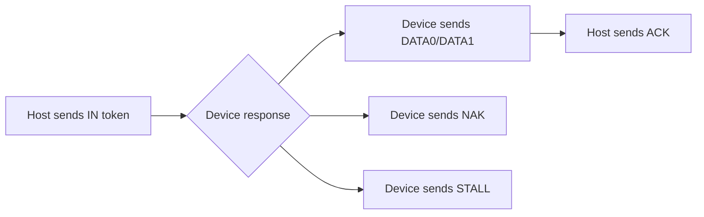

The sequence is:

1. the host sends an `IN` token containing the device address and endpoint number;
2. the USB peripheral checks whether the endpoint has data ready;
3. if data is ready, the device sends a `DATA0` or `DATA1` packet;
4. if no data is ready, the device normally sends `NAK`;
5. if the endpoint is halted, the device sends `STALL`;
6. after receiving valid data, the host sends `ACK`.

Example for endpoint `1 IN`:

```text
Host:    IN token, address 5, endpoint 1
Device:  DATA1, "OK"
Host:    ACK
```

:::info
Firmware must prepare the endpoint data **before** the host sends the IN token. The hardware response time is too short for firmware to receive an interrupt, calculate the data and then answer the same token.
:::

### OUT transaction

An OUT transaction transfers data from the host to the device.

The bytes travel **OUT of the host** and into the device.

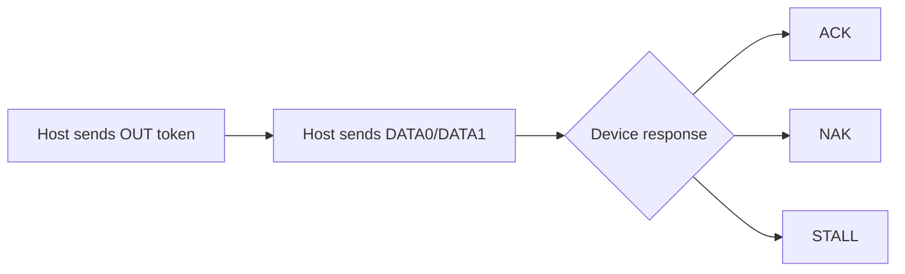

The sequence is:

1. the host sends an `OUT` token containing the device address and endpoint number;
2. the host sends a `DATA0` or `DATA1` packet;
3. the USB peripheral checks the CRC and whether the endpoint buffer can accept the data;
4. the device returns `ACK`, `NAK` or `STALL`;
5. after `ACK`, firmware can process the received bytes.

Example for endpoint `1 OUT`:

```text
Host:    OUT token, address 5, endpoint 1
Host:    DATA0, "LED=1"
Device:  ACK
```

### SETUP transaction

A `SETUP` transaction starts every control transfer.

The data packet of a SETUP transaction always contains exactly eight request bytes. Those eight bytes tell the device what information the host wants or what action it wants the device to perform.


The 8-byte request contains:

| Field | Size | Purpose |
|-|-|-|
| `bmRequestType` | 1 byte | Direction, type and recipient |
| `bRequest` | 1 byte | Request code |
| `wValue` | 2 bytes | Request-specific value |
| `wIndex` | 2 bytes | Request-specific index |
| `wLength` | 2 bytes | Number of bytes in the optional Data stage |

### Data toggle

Bulk, Interrupt and Control transfers use the `DATA0` and `DATA1` PIDs to detect repeated or lost data.

After a successful transaction, the sender changes the toggle value for the next data packet.

```text
DATA0 -> ACK -> DATA1 -> ACK -> DATA0 -> ACK -> ...
```

If an ACK is lost, the sender may repeat the same data packet. The receiver recognizes that the toggle did not change and can ACK the packet without delivering the same payload twice to the application.

:::note
Bulk and Interrupt endpoint toggles are reset after a bus reset and after requests such as `SET_CONFIGURATION`, `SET_INTERFACE` or `CLEAR_FEATURE(ENDPOINT_HALT)`.
:::

### Short packets and zero-length packets

A **short packet** contains fewer bytes than the endpoint's maximum packet size.

A short packet is not an error. It is often an intentional end marker. The receiver asked for a maximum amount of data, and the sender used a smaller packet to say: "this is all the data for this transfer."

For a 64-byte Full-Speed Bulk endpoint, these are short packets:

- 1 byte;
- 17 bytes;
- 63 bytes;
- 0 bytes.

A packet containing zero payload bytes is a **Zero-Length Packet (ZLP)**.

Short packets are important because they can indicate the end of a transfer when the receiver requested more data than the sender needs to provide.

Example:

```text
Host requests up to 256 bytes
Device sends 64 bytes
Device sends 64 bytes
Device sends 21 bytes  <- short packet ends the transfer
```

If the total payload is an exact multiple of 64 and the protocol relies on a short packet to mark the end, the sender may need a ZLP:

```text
Device sends 64 bytes
Device sends 64 bytes
Device sends 0 bytes   <- ZLP ends the transfer
```

:::warning
Do not assume that one endpoint `read()` call is equal to one application message. A large application message can arrive as several packets, and several small writes can sometimes be combined by host-side buffering.
:::

## Transfer types

USB defines four transfer types. Each one has different scheduling, reliability and latency behavior.

| Transfer type | Reliability | Timing | Typical use |
|-|-|-|-|
| Control | error checked | reserved access | enumeration and commands |
| Bulk | error checked | no guaranteed latency | storage and large reliable data |
| Interrupt | error checked | guaranteed maximum polling interval | keyboards, mice, status |
| Isochronous | no automatic retry | reserved bandwidth | real-time audio and video |

### Control transfers

Control transfers are used for structured requests.

They are different from a normal application byte stream. Each control transfer begins with an eight-byte request that describes the operation. The USB stack decodes standard requests automatically, while a class driver or application handler can process class-specific and vendor-specific requests.

Every control transfer has:

1. a **Setup stage**;
2. an optional **Data stage**;
3. a **Status stage**.

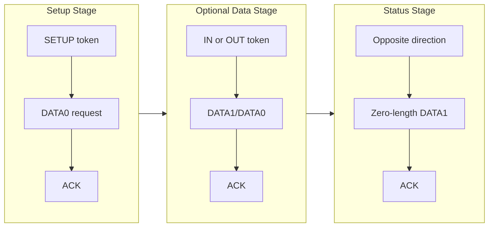

Examples of standard requests are:

- `GET_DESCRIPTOR`;
- `SET_ADDRESS`;
- `SET_CONFIGURATION`;
- `GET_STATUS`;
- `CLEAR_FEATURE`.

:::note
If a control request has a Data stage, the Status stage uses the opposite direction. If the request has no Data stage, the Status stage is an IN transaction.
:::

#### Example: reading the Device Descriptor

When the host requests the Device Descriptor, the control transfer looks conceptually like this:

```text
Setup stage:
    Host -> Device: GET_DESCRIPTOR(Device)

Data stage:
    Device -> Host: descriptor bytes

Status stage:
    Host -> Device: zero-length status packet
```

The host may initially request more bytes than the descriptor contains. The device returns only the descriptor bytes, and the short packet ends the Data stage.

### Bulk transfers

Bulk transfers are used when data must be reliable but timing is not critical.

Typical uses include:

- storage;
- printers and scanners;
- vendor-specific data acquisition;
- firmware upload;
- virtual serial data.

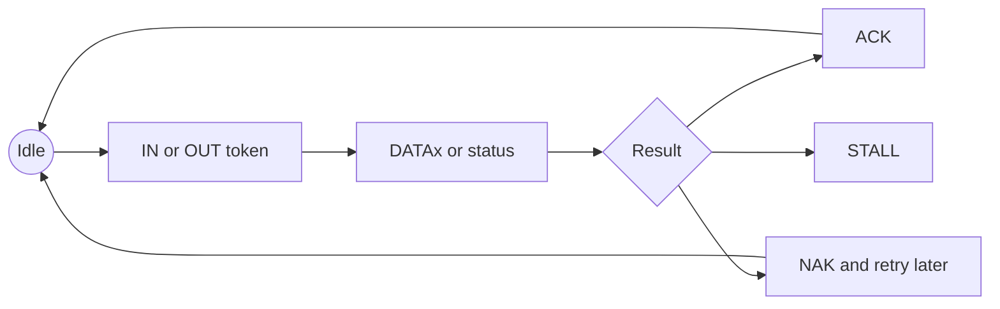

Bulk transfers do not reserve bandwidth. If the bus is busy, Bulk traffic waits for Control, Interrupt and Isochronous traffic.

However, on an otherwise idle bus, Bulk transfers have low overhead and can use most of the available bus time.

:::info
A Full-Speed Bulk endpoint should normally use a maximum packet size of 64 bytes. This provides the best throughput and avoids poor scheduling behavior on some host controllers.
:::

### Interrupt transfers

Interrupt transfers are used for small amounts of data that need a guaranteed maximum polling interval.

Typical uses include:

- keyboards;
- mice;
- game controllers;
- device status notifications;
- hub port-change information.

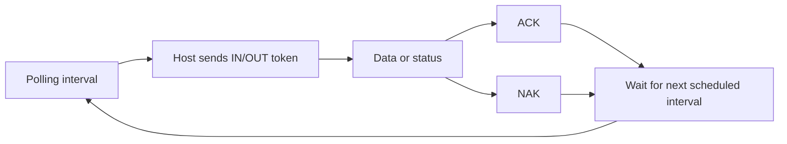

The word *Interrupt* can be confusing. The device does not electrically interrupt the host. The host polls the endpoint according to the interval in its descriptor.

### Isochronous transfers

Isochronous transfers reserve bus time for data that must arrive regularly.

Typical uses include:

- audio streaming;
- video streaming;
- time-sensitive sampled data.


Isochronous transfers do not use ACK/NAK handshakes and do not automatically retry corrupted data. A late audio packet is often less useful than a missing audio packet, so the protocol prioritizes timing over retrying.

:::warning
Low-Speed devices support only Control and Interrupt transfers. They cannot use Bulk or Isochronous transfers.
:::

## Enumeration

**Enumeration** is the process through which the host discovers a newly connected device, assigns an address, reads its descriptors and selects a configuration.

Enumeration is the first major checkpoint in this lab. If enumeration fails, the host application cannot communicate with the Bulk endpoints, regardless of whether the application code is correct.

Think of enumeration as a short conversation:

```text
Host:   Who are you?
Device: Here is my Device Descriptor.
Host:   Use address 5 from now on.
Device: Address accepted.
Host:   What functions and endpoints do you have?
Device: Here is my Configuration Descriptor tree.
Host:   I select configuration 1.
Device: The application endpoints are now enabled.
```

From the user's perspective, enumeration often appears to happen instantly after plugging in the cable. Internally, the host performs several control transfers.

### Device states

During normal enumeration, a USB device passes through these states:

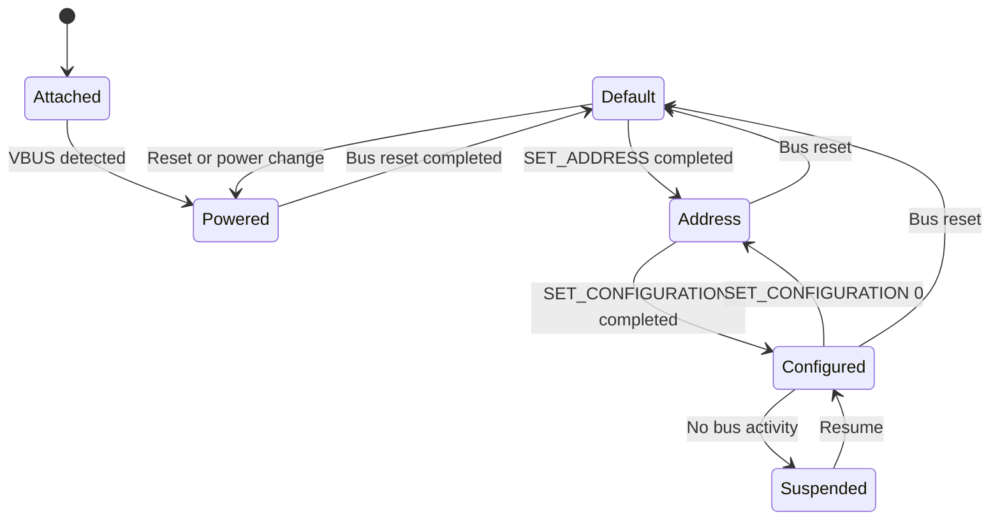

The important states for this lab are:

| State | Meaning |
|-|-|
| Default | Device responds at address 0 and EP0 is active |
| Address | Device has a non-zero address |
| Configured | Host selected a configuration and application endpoints can be used |

### Typical enumeration sequence

A typical enumeration looks like this. The exact order and requested lengths can vary between operating systems, so firmware must respond to valid requests rather than expecting one fixed script.

1. the device is connected and detects `VBUS`;
2. the hub detects the connection;
3. the host resets the port;
4. the device enters the **Default** state and responds at address `0`;
5. the host reads the first bytes of the Device Descriptor to learn `bMaxPacketSize0`;
6. the host sends `SET_ADDRESS`;
7. the device completes the Status stage using address `0`;
8. only after the Status stage, the device starts using the new address;
9. the host reads the full Device Descriptor;
10. the host reads the Configuration Descriptor and all subordinate descriptors;
11. the host may read String, BOS and Microsoft OS descriptors;
12. the host selects a driver;
13. the host sends `SET_CONFIGURATION`;
14. the device enters the **Configured** state.

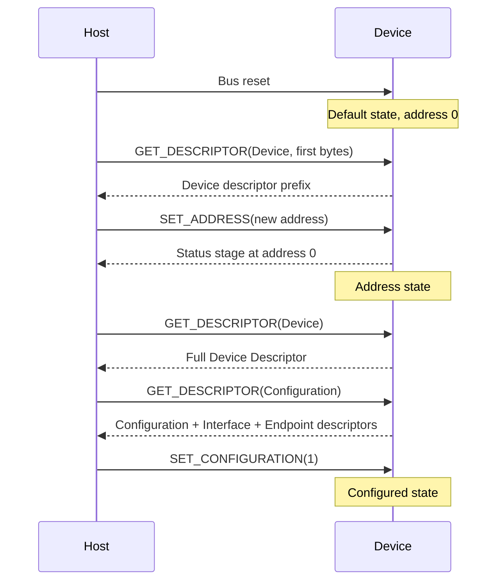

:::warning
A device must not change to the new address before the Status stage of `SET_ADDRESS` is complete. The Status stage is still sent to address `0`.
:::

:::note
Firmware should not assume that every operating system requests descriptors in exactly the same order or with the same requested lengths. A robust device responds correctly to any valid standard request in any legal state.
:::

:::tip[Enumeration checkpoint]
Before continuing to the host application, verify all of the following:

- the device appears in the operating system;
- the VID and PID are correct;
- the interface is visible;
- one Bulk OUT and one Bulk IN endpoint are present;
- both endpoints report a 64-byte maximum packet size;
- the firmware prints a message after the interface becomes enabled.

If one of these checks fails, fix enumeration or descriptors first.
:::

## Descriptors

Descriptors are data structures that describe the device to the host.

The host does not know the source code running on the microcontroller. Descriptors are the contract between the device and the operating system. They describe the identity, functions, endpoint directions, transfer types, packet sizes and power requirements of the device.

A descriptor mistake can cause the operating system to select the wrong driver, reject the configuration or communicate with the wrong endpoint address.

The main descriptor hierarchy is:

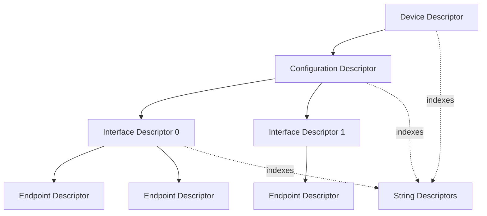

### Device Descriptor

There is normally one Device Descriptor for the whole device.

Important fields include:

| Field | Meaning |
|-|-|
| `bcdUSB` | USB specification version |
| `bDeviceClass` | Class defined at device level, or 0 if interfaces define it |
| `bMaxPacketSize0` | Maximum packet size for EP0 |
| `idVendor` | Vendor ID (VID) |
| `idProduct` | Product ID (PID) |
| `bcdDevice` | Device release number |
| `iManufacturer` | Manufacturer string index |
| `iProduct` | Product string index |
| `iSerialNumber` | Serial-number string index |
| `bNumConfigurations` | Number of configurations |

:::warning
The sample VID and PID values used in a laboratory are for development only. A commercial product must use a properly assigned Vendor ID and managed Product IDs.
:::

### Configuration Descriptor

A configuration describes a complete operating mode of the device.

Important fields include:

| Field | Meaning |
|-|-|
| `wTotalLength` | Total size of this descriptor and all subordinate descriptors |
| `bNumInterfaces` | Number of interfaces in the configuration |
| `bConfigurationValue` | Value used by `SET_CONFIGURATION` |
| `bmAttributes` | Power and remote-wakeup attributes |
| `bMaxPower` | Maximum bus current requested by the configuration |

Only one configuration can be active at a time.

### Interface Descriptor

An interface represents one function of the device.

Examples:

- a keyboard interface;
- a mass-storage interface;
- a CDC communication interface;
- a vendor-specific interface.

Important fields include:

| Field | Meaning |
|-|-|
| `bInterfaceNumber` | Interface number |
| `bAlternateSetting` | Alternate setting number |
| `bNumEndpoints` | Number of non-zero endpoints used by the interface |
| `bInterfaceClass` | Class code |
| `bInterfaceSubClass` | Subclass code |
| `bInterfaceProtocol` | Protocol code |

A class code of `0xFF` means **vendor specific**.

### Endpoint Descriptor

Every non-zero endpoint has an Endpoint Descriptor.

Important fields include:

| Field | Meaning |
|-|-|
| `bEndpointAddress` | Endpoint number and direction |
| `bmAttributes` | Transfer type |
| `wMaxPacketSize` | Maximum packet size |
| `bInterval` | Polling/service interval for periodic endpoints |

For `bmAttributes & 0b11`:

| Value | Transfer type |
|-|-|
| `00` | Control |
| `01` | Isochronous |
| `10` | Bulk |
| `11` | Interrupt |

### String Descriptors

String descriptors can describe:

- manufacturer;
- product;
- serial number;
- configuration;
- interface.

USB strings use Unicode encoding.

A stable and unique serial number helps an operating system identify the same physical device when it is connected to a different port.

### Microsoft OS Descriptors

A vendor-specific USB device does not match a standard USB class. On Windows, it therefore needs a driver association.

In this lab, the Microsoft OS descriptors do not define the normal USB endpoint layout. The standard Device, Configuration, Interface and Endpoint descriptors still do that. The Microsoft descriptors provide extra Windows-specific information that says the interface can use the built-in WinUSB driver.

Microsoft OS descriptors can tell Windows that an interface is compatible with `WINUSB`. Windows can then bind its built-in WinUSB driver without a custom kernel-mode driver.

:::info
Linux and macOS generally allow user-space USB libraries to communicate with vendor-specific interfaces without WinUSB. The Microsoft OS descriptors are specifically useful for Windows driver binding.
:::

## USB in Embassy

### Imports and interrupt binding

The USB peripheral reports events through an interrupt. The interrupt handler allows the asynchronous driver to wake the USB task when a reset, packet, suspend, resume or endpoint event occurs.

<Tabs>
  <TabItem value="stm32u5" label="STM32 Nucleo-U545RE-Q" default>

First, import the required types and bind the USB interrupt.

```rust
use defmt::info;
use defmt_rtt as _;
use embassy_executor::Spawner;
use embassy_futures::join::join;
use embassy_stm32::{
    Config,
    bind_interrupts,
    peripherals::USB,
    usb::{Driver, InterruptHandler},
};
use embassy_usb::driver::{Endpoint, EndpointIn, EndpointOut};
use embassy_usb::{Builder, Config as UsbConfig, msos, msos::windows_version};
use panic_probe as _;

bind_interrupts!(struct Irqs {
    USB => InterruptHandler<USB>;
});
```

  </TabItem>

  <TabItem value="rp2350" label="Raspberry Pi Pico 1 / 2">

```rust
use defmt::info;
use defmt_rtt as _;
use embassy_executor::Spawner;
use embassy_futures::join::join;
use embassy_rp::bind_interrupts;
use embassy_rp::peripherals::USB;
use embassy_rp::usb::{Driver, InterruptHandler};
use embassy_usb::driver::{Endpoint, EndpointIn, EndpointOut};
use embassy_usb::{Builder, Config as UsbConfig, msos, msos::windows_version};
use panic_probe as _;

bind_interrupts!(struct Irqs {
    USBCTRL_IRQ => InterruptHandler<USB>;
});
```

  </TabItem>
</Tabs>

For Windows, we also define a Device Interface GUID. Generate a different GUID for your own device rather than copying a production device's GUID.

```rust
const DEVICE_INTERFACE_GUIDS: &[&str] = &[
    "{AFB9A6FB-30BA-44BC-9232-806CFC875321}",
];
```

### Clock configuration and peripheral initialization

USB timing is strict. The peripheral must receive the clock configuration expected by the hardware driver. A firmware image can run normally while USB still fails completely if this clock is missing or inaccurate.

<Tabs>
  <TabItem value="stm32u5" label="STM32 Nucleo-U545RE-Q" default>

The STM32 USB peripheral needs a precise 48 MHz clock. We enable `HSI48` and use USB Start-of-Frame events to synchronize it.

```rust
#[embassy_executor::main]
async fn main(_spawner: Spawner) {
    let mut config = Config::default();

    {
        use embassy_stm32::rcc::*;

        config.rcc.hsi = true;
        config.rcc.sys = Sysclk::HSI;

        config.rcc.hsi48 = Some(Hsi48Config {
            sync_from_usb: true,
        });

        config.rcc.mux.iclksel = mux::Iclksel::HSI48;
        config.rcc.voltage_range = VoltageScale::RANGE2;
    }

    let p = embassy_stm32::init(config);

    // USB initialization follows here.
}
```


  </TabItem>

  <TabItem value="rp2350" label="Raspberry Pi Pico 1 / 2">


```rust
#[embassy_executor::main]
async fn main(_spawner: Spawner) {
    let p = embassy_rp::init(Default::default());

    // USB initialization follows here.
}
```

  </TabItem>
</Tabs>

### Creating the hardware USB driver


<Tabs>
  <TabItem value="stm32u5" label="STM32 Nucleo-U545RE-Q" default>

The Nucleo board connects the user USB data lines to `PA12` (`D+`) and `PA11` (`D-`).

```rust
let driver = Driver::new(
    p.USB,
    Irqs,
    p.PA12,
    p.PA11,
);
```

  </TabItem>

  <TabItem value="rp2350" label="Raspberry Pi Pico 1 / 2">

The RP driver obtains the USB pins through the dedicated USB peripheral.

```rust
let driver = Driver::new(p.USB, Irqs);
```

  </TabItem>
</Tabs>

### Device configuration

Now create the global USB device configuration. These values become fields in the descriptors that the host reads during enumeration.

```rust
let mut config = UsbConfig::new(0xc0de, 0xcafe);
config.manufacturer = Some("IPWorkshop");
config.product = Some("USB Bulk Example");
config.serial_number = Some("cafe-c0de-0001");
config.max_power = 100;
config.max_packet_size_0 = 64;
```

The first two arguments are:

- Vendor ID: `0xc0de`;
- Product ID: `0xcafe`.

When the host lists the device as `c0de:cafe`, those numbers come directly from this configuration. The manufacturer, product and serial-number strings are also visible in descriptor inspection tools.

`max_power` is expressed in the units expected by the Embassy version used by the course. Check the API documentation and inspect the resulting configuration descriptor to verify the advertised current.

:::warning
VID `0xc0de` and PID `0xcafe` are laboratory values. Do not ship a commercial product with arbitrary USB identification values.
:::

### Descriptor buffers and builder

Embassy writes the descriptors into memory buffers supplied by the application. Because the firmware uses no heap allocator, the application provides fixed-size arrays at compile time.

```rust
let mut config_descriptor = [0; 256];
let mut bos_descriptor = [0; 256];
let mut msos_descriptor = [0; 256];
let mut control_buf = [0; 64];

let mut builder = Builder::new(
    driver,
    config,
    &mut config_descriptor,
    &mut bos_descriptor,
    &mut msos_descriptor,
    &mut control_buf,
);
```

The buffers have different purposes:

| Buffer | Purpose |
|-|-|
| `config_descriptor` | Configuration, interface and endpoint descriptors |
| `bos_descriptor` | Binary Object Store descriptor |
| `msos_descriptor` | Microsoft OS descriptors |
| `control_buf` | EP0 control-transfer data |


:::note
The required sizes depend on how many functions, interfaces and descriptors the device contains. A more complex composite device needs larger buffers.
:::

### Adding WinUSB compatibility

To allow Windows to bind the built-in WinUSB driver, add Microsoft OS descriptors.

```rust
builder.msos_descriptor(windows_version::WIN8_1, 0);
builder.msos_feature(
    msos::CompatibleIdFeatureDescriptor::new("WINUSB", ""),
);
builder.msos_feature(
    msos::RegistryPropertyFeatureDescriptor::new(
        "DeviceInterfaceGUIDs",
        msos::PropertyData::RegMultiSz(DEVICE_INTERFACE_GUIDS),
    ),
);
```

:::note
This step is not required for a standard class such as HID or CDC ACM because those classes already match operating-system drivers. It is useful here because the lab creates a vendor-specific interface.
:::

### Creating the interface and Bulk endpoints

Create a vendor-specific USB function. A **function** is a logical capability of a USB device. In this simple device, the function contains one interface. A composite device could contain several independent functions.

```rust
let mut function = builder.function(0xFF, 0, 0);
```

The arguments identify:

- class `0xFF` - vendor specific;
- subclass `0`;
- protocol `0`.

Create an interface and its default alternate setting.

```rust
let mut interface = function.interface();
let mut alt = interface.alt_setting(0xFF, 0, 0, None);
```

Now allocate one Bulk OUT endpoint and one Bulk IN endpoint.

```rust
let mut read_ep = alt.endpoint_bulk_out(None, 64);
let mut write_ep = alt.endpoint_bulk_in(None, 64);
```

The variable names describe the firmware's action:

- `read_ep` is Bulk OUT, because firmware **reads** bytes that came out of the host;
- `write_ep` is Bulk IN, because firmware **writes** bytes that will go into the host.


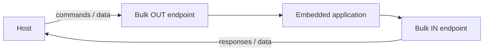

When all descriptors have been added, release the function builder and build the USB device.

```rust
drop(function);
let mut usb = builder.build();
```

:::tip
After flashing the firmware, inspect the descriptors to discover the endpoint addresses selected by the allocator. With this simple layout, they are commonly `0x01` for Bulk OUT and `0x81` for Bulk IN, but the host program should use the addresses actually reported by your device.
:::

### Running the USB stack and application task

The USB stack must run continuously to process bus events and control requests. The application task must run at the same time. If the firmware only waits for application data without running the USB stack, enumeration and endpoint communication stop.

```rust
let usb_task = usb.run();
```

Create a second future for the application data.

```rust
let app_task = async {
    loop {
        read_ep.wait_enabled().await;
        info!("USB configured");

        loop {
            let mut data = [0u8; 64];

            match read_ep.read(&mut data).await {
                Ok(n) => {
                    info!("Received {} bytes: {=[u8]:x}", n, &data[..n]);

                    if write_ep.write(&data[..n]).await.is_err() {
                        break;
                    }
                }
                Err(_) => break,
            }
        }

        info!("USB disconnected or interface disabled");
    }
};
```

The outer loop represents connections. `wait_enabled()` completes after the host selects the configuration and enables the endpoint. The inner loop represents one active connection. A read or write error usually means that the cable was removed, the interface was disabled or the device was reset, so the inner loop ends and the firmware waits for the next connection.

For every successful read:

1. `n` tells us how many bytes are valid;
2. only `data[..n]` belongs to the received transfer;
3. the same slice is written to Bulk IN;
4. the remaining bytes in the 64-byte array must be ignored.

Finally, run both futures concurrently.

```rust
join(usb_task, app_task).await;
```

`join` waits for both futures together. In normal operation, `usb.run()` never finishes, so the program stays inside this call for the lifetime of the device.

The USB task handles:

- reset events;
- standard control requests;
- enumeration;
- endpoint state changes;
- suspend and resume;
- low-level driver events.

The application task handles:

- waiting until the endpoints are enabled;
- receiving Bulk OUT data;
- processing the bytes;
- sending Bulk IN data;
- returning to the connection wait loop after disconnect.


### Expected device log

With the ST-LINK/debug cable connected, a successful run should produce events similar to:

```text
USB firmware started
USB configured
Received 10 bytes: 50 4d 20 55 53 42 20 4c 61 62
USB disconnected or interface disabled
USB configured
```

## Board configuration

<Tabs>
  <TabItem value="stm32u5" label="STM32 Nucleo-U545RE-Q" default>

:::warning
Before running USB device code on the Nucleo board:

1. move jumper **JP3** from the `STLK` position to the `USB USER` position;
2. connect one USB cable to the `ST-LINK` connector for programming and `defmt` logs;
3. connect a second USB cable to the `USB USER` connector for the device under test.

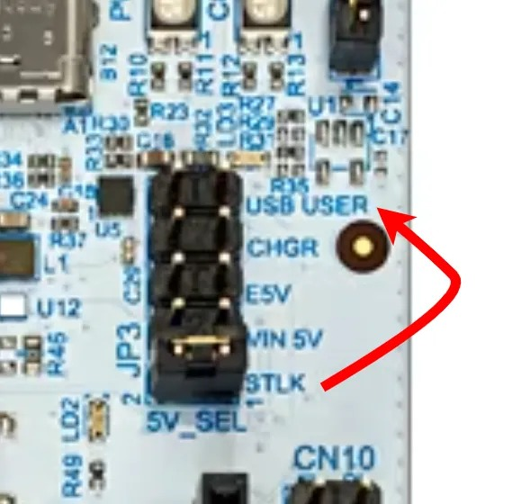
:::

The two cables have different purposes:

| Connector | Purpose |
|-|-|
| ST-LINK | Flashing, debugging and `defmt` output |
| USB USER | The USB device implemented by your firmware |

  </TabItem>

  <TabItem value="rp2350" label="Raspberry Pi Pico 1 / 2">

Connect the Pico's USB connector to the host. The same connector is used for the RP USB device interface.

:::note
The exact flashing procedure depends on the board and project configuration. It may use BOOTSEL/UF2, `probe-rs` or another debug probe.
:::

  </TabItem>
</Tabs>

## USB classes

The example in this lab uses a vendor-specific interface because it exposes the endpoint model directly. Standard USB classes are useful when an operating system already provides the required driver and API.

### HID

Human Interface Device (HID) is commonly used for:

- keyboards;
- mice;
- game controllers;
- simple vendor-defined reports.

HID commonly uses Control and Interrupt transfers.

### CDC ACM

CDC ACM implements a virtual serial port.

A typical CDC ACM device contains:

- one Communication Class interface;
- an Interrupt IN endpoint for notifications;
- one Data Class interface;
- one Bulk OUT endpoint;
- one Bulk IN endpoint.

This structure is described in *Serial Port Complete*, Chapter 16.

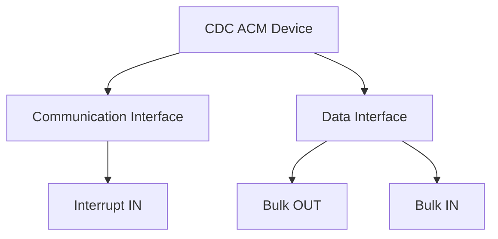

### Mass Storage

A USB Mass Storage Bulk-Only Transport device normally contains:

- class code `0x08`;
- one Bulk OUT endpoint;
- one Bulk IN endpoint;
- class-specific reset and `GET_MAX_LUN` requests;
- Command Block Wrapper (CBW) reception;
- optional data phase;
- Command Status Wrapper (CSW) transmission;
- a supported command set, commonly SCSI transparent commands.

This is much more than changing an interface class value. The device must implement the complete transport and storage command behavior described in *USB Mass Storage*, Chapters 2, 3 and 6.

:::warning
Do not present a normal RAM buffer as a writable disk unless the implementation correctly handles block size, capacity, command status, reset recovery and host caching. A broken storage implementation can corrupt data.
:::

## Exercises

Complete the exercises in order. Each exercise builds on the previous one. Do not start the message-framing exercise until the basic 64-byte Bulk exchange works reliably.

:::warning
Before starting the exercises on the STM32 Nucleo-U545RE-Q:

1. move **JP3** to `USB USER`;
2. connect the ST-LINK cable;
3. connect the USB USER cable.
:::

1. **Enumerate a custom USB device** (**2p**)
   - Configure the USB device with VID `0xABCD` and PID `0x1234`.
   - Set the manufacturer string to your name.
   - Set the product string to `PMRust USB Lab`.
   - Use a serial number that is unique inside your laboratory group.
   - Show the device in `lsusb`, Device Manager/USBView or `system_profiler`.
   - Demonstrate that unplugging removes the device and reconnecting enumerates it again.

   **The exercise is complete when:** the operating system displays the requested VID/PID and strings, and the firmware reaches the configured state without panicking.

:::tip
Use the [Device configuration](#device-configuration) and [Inspecting the device from the host](#inspecting-the-device-from-the-host) sections.
:::

2. **Descriptor report** (**1p**)
   - Record the Device Descriptor's VID, PID and EP0 maximum packet size.
   - Record the interface number, class, subclass and protocol.
   - Record both endpoint addresses, directions, transfer types and maximum packet sizes.
   - Explain why `0x81` is an IN endpoint address.

3. **Bulk reverse device** (**3p**)
   - Create one Bulk OUT and one Bulk IN endpoint.
   - Wait until the interface is enabled.
   - Receive up to 64 bytes from Bulk OUT.
   - Use the returned byte count `n` to select only the valid bytes.
   - Reverse only the bytes that were received.
   - Send the reversed bytes through Bulk IN.
   - Return to `wait_enabled()` after disconnect.

Example:

```text
Host sends:    PM USB Lab
Device sends:  baL BSU MP
```

:::warning
Reverse `data[..n]`, not the complete 64-byte buffer. The unused bytes are not part of the received payload.
:::

4. **Host-side Rust client** (**2p**)
   - Find the device with VID `0xABCD` and PID `0x1234`.
   - Print a clear error when the device is not connected.
   - Open and claim the vendor-specific interface.
   - Send `PM USB Lab` to the Bulk OUT endpoint.
   - Read the response from the Bulk IN endpoint.
   - Verify that the response is the reversed text.
   - Use a finite timeout and report a timeout separately from a missing device.

:::tip
Use the endpoint addresses found in your descriptor report. Do not assume that another group's device uses the same addresses.
:::

5. **Disconnect handling** (**1p**)
   - Log `Host connected` after `wait_enabled()` completes.
   - Log `Host disconnected` when a read or write fails.
   - Return to waiting for a new connection.
   - Demonstrate successful communication after reconnecting without resetting the MCU.

6. **The shouting device** (**1p**)
   - Convert lowercase ASCII letters to uppercase before sending the response.
   - Leave all other bytes unchanged.

```rust
for byte in &mut data[..n] {
    if byte.is_ascii_lowercase() {
        byte.make_ascii_uppercase();
    }
}
```

7. **Packet-boundary testing** (**2p**)
   - Test payload lengths `0`, `1`, `63`, `64`, `65`, `128` and `200`.
   - Record how many reads the device performs for each payload.
   - Explain why 65 and 200 bytes cannot fit in one Full-Speed Bulk packet.
   - Explain what makes the final packet of a 200-byte transfer a short packet.

:::note
Your first 64-byte echo implementation is not enough to preserve a 200-byte application message as one unit. This exercise should expose that limitation.
:::

8. **Length-prefixed messages** (**3p**)
   - Implement a two-byte little-endian length header.
   - Support payloads from `0` to `256` bytes.
   - Collect packets until the full message is received.
   - Reverse the complete message.
   - Return a response with the same two-byte length header.
   - Reject lengths greater than `256` without overflowing a buffer.

:::tip
Use the [Length-prefixed messages](#length-prefixed-messages) and [Receive state machine](#receive-state-machine) sections.
:::

9. **USB GPIO controller** (**2p**)

Transform the board into a PC-controlled I/O device.

- **Device:**
  - accept a one-byte LED bit mask on Bulk OUT;
  - use the lower five bits to control five LEDs;
  - read four buttons and pack their states into the lower four bits of one byte;
  - return that byte through Bulk IN.
- **Host:**
  - ask the user for a value from `0` to `31`;
  - send it to the device;
  - read and print the button state.

10. **Sensor command protocol** (**3p**)

Create these commands:

| Command | Response |
|-|-|
| `T` | temperature from BMP390 |
| `P` | pressure from BMP390 |
| `A` | X, Y and Z acceleration from MPU-6000 |

The host sends one command byte. The device reads the sensor and returns an ASCII response.

Example:

```text
Host -> Device: T
Device -> Host: 23.5 C
```

:::note
The USB task must continue running while the sensor operation is awaited. This is one reason Embassy's asynchronous execution model is useful.
:::

## Bonus at home

1. **Throughput measurement** (**1p**)
   - Send at least 1 MiB from host to device in repeated Bulk transfers.
   - Count the bytes on the device.
   - Measure elapsed time on the host.
   - Calculate useful payload throughput in bytes per second.
   - Repeat with transfer buffers of 64, 256, 1024 and 4096 bytes.

2. **Vendor control request** (**1p**)
   - Add one vendor-specific control request that returns the firmware version.
   - Call it from the host using a control transfer.
   - Return `STALL` for an unsupported vendor request.

3. **CDC ACM device** (**1p**)
   - Replace the vendor-specific interface with Embassy's CDC ACM class.
   - Verify that the operating system creates a serial port.
   - Echo text through a serial terminal.
   - Compare the CDC descriptor tree with the vendor-specific descriptor tree.

4. **Composite device** (**2p**)
   - Create one device that contains both:
     - a CDC ACM function;
     - a vendor-specific Bulk function.
   - Verify that the host loads or exposes both functions independently.

5. **Protocol capture** (**1p**)
   - Capture the device enumeration.
   - Identify `GET_DESCRIPTOR`, `SET_ADDRESS` and `SET_CONFIGURATION`.
   - Capture one Bulk OUT and one Bulk IN transfer.


